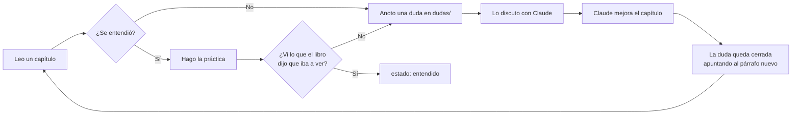

# El método

Cómo se usa este vault, y por qué está armado así. Vale la pena leerlo una vez.

## El ciclo



Las dudas **no son borradores**: son parte del libro. Cada una queda con fecha, y cuando se cierra apunta al párrafo que la resolvió. Así el libro tiene registro de por qué está escrito como está, y vos ves qué ya cerraste — que es la única forma de saber si estás avanzando o releyendo.

Una práctica que no muestra lo que el capítulo prometió **no es una práctica fallida: es una duda**. Casi siempre el libro simplificó algo que no se podía simplificar.

## Las cinco clases de nota

| Carpeta | Qué es | Cómo se lee |
|---|---|---|
| `capitulos/` | El relato. Se lee en orden, una vez. | De principio a fin. |
| `conceptos/` | Una idea, atómica. La ficha que consultás seis meses después. | Salteado, por enlace. |
| `practicas/` | Algo que se corre y se mira. | Con la terminal abierta. |
| `dudas/` | Lo que no entendí, con fecha, y en qué quedó. | Nunca; se escriben y se cierran. |
| `glosario/` | Índices: términos, falsos amigos, síntomas. | Cuando algo no cierra. |

**Un capítulo no explica un concepto: lo enlaza.** Si el concepto está explicado en dos lugares, en tres meses van a decir cosas distintas. El glosario tampoco explica: es una línea y un enlace.

## El molde de un concepto

Todo concepto tiene las mismas seis piezas, porque lo que hace didáctico a un libro de sistemas no es la prosa sino la **comparación**:

1. **Qué problema resuelve** — la incomodidad antes del mecanismo.
2. **Cómo lo hace Linux** — el camino normal, con archivos y funciones reales.
3. **Cómo lo hace Kornelia** — y sobre todo **qué se quitó**, con la decisión (`D*`) y el principio (`P*`) que lo justifican.
4. **Cómo se ve roto** — el síntoma antes de la causa. Esta es la sección que hace que se aprenda.
5. **Práctica** — contra Linux, y contra Kornelia en [[QEMU]] cuando se pueda.
6. **Recordar** — preguntas para el mazo.

La pieza 4 es la que otros libros no tienen, porque lo que se aprende depurando no se escribe. Acá sí: este proyecto viene anotando sus propios bugs caros desde el principio (§ *Cosas que ya costaron caras* en `CLAUDE.md`), y cada uno es material de enseñanza que no se puede inventar.

## Cómo se cita el código

El libro cita el kernel constantemente, y el kernel se mueve. La convención es un código en línea con **ruta, línea y ancla**:

    `kernel-core/src/platform.rs:69#pub trait Platform`

La ruta es relativa a la raíz del repo. El número es informativo. **El ancla —lo que va después del `#`— es lo que manda**: un texto que tiene que seguir apareciendo en esa línea. Cuando el código se mueve, el número queda viejo pero el ancla sigue encontrando el lugar.

Lo verifica `libro/scripts/check-citas.py`:

```bash
./libro/scripts/check-citas.py          # avisa qué citas quedaron viejas o rotas
./libro/scripts/check-citas.py --fix    # corrige los numeros que se corrieron
```

Esto no es prolijidad: es D23 aplicado al libro. **Una regla que no se comprueba es una intención.** Sin el chequeo, en dos meses el libro miente y no hay forma de saber dónde.

> [!warning] El vault no puede enlazar al código
> La raíz del vault es `libro/`, y el código está afuera. Obsidian no enlaza fuera del vault, así que las citas son texto verificado por script, no enlaces clickeables. Desde el editor sí funcionan si abrís el repo entero en tu editor de código.

## El frontmatter

Lo que hace andar los tableros de la portada. Se copia de las plantillas y se toca poco:

```yaml
---
tipo: capitulo        # capitulo | concepto | practica | duda | meta | glosario
parte: 5              # solo en capítulos
estado: pendiente     # pendiente | leido | entendido   (o: abierta | cerrada en dudas)
dificultad: 3         # 1 a 5, cuánto costó
principios: [P4, P5]  # los del proyecto que toca
decisiones: [D12]
practicas: [P03-Ver-las-tablas-de-paginas]
---
```

`estado` lo movés vos, a mano, y es el dato más importante del vault: es la diferencia entre haber leído y haber entendido.

## Las prácticas: tres clases

Cada práctica dice a qué clase pertenece, porque el riesgo no es el mismo.

| Clase | Qué hace | Dónde corre |
|---|---|---|
| **mirar** | Solo lee: `/proc`, `/sys`, `lspci`, `perf`, `bpftrace`. | Tu Debian. No puede romper nada. |
| **romper** | Carga módulos, cuelga la máquina, toca el [[IOMMU]] a propósito. | **VM de QEMU.** Nunca tu máquina. |
| **construir** | Escribís código: un módulo, un blob, un [[Driver|driver]]. | Tu Debian para compilar, VM o Kornelia para correr. |

Y toda práctica declara **qué vas a ver si funciona** antes de los pasos. Es la misma regla que sigue el portón del kernel: una prueba que solo comprueba lo que el sistema dice de sí mismo no prueba nada.

## Los plugins de Obsidian

Ninguno es imprescindible; sin ellos el vault se lee igual, con algunos bloques de código sin renderizar. Se instalan desde *Configuración → Plugins de la comunidad → Explorar*:

| Plugin                | Para qué                                                               | Sin él                                                      |
| --------------------- | ---------------------------------------------------------------------- | ----------------------------------------------------------- |
| **Dataview**          | Los tableros de progreso de la portada.                                | Se ven como bloques de código.                              |
| **Spaced Repetition** | Convierte las preguntas de "Recordar" en un mazo con repaso espaciado. | Las preguntas se leen igual, sin repaso programado.         |
| **Excalidraw**        | Dibujar a mano cuando un diagrama de texto no alcanza.                 | Los diagramas ya hechos son Mermaid y SVG, que son nativos. |

Los diagramas del libro son **Mermaid** (nativo en Obsidian, versionable, editable) y **SVG** cuando hace falta precisión de bits: un mapa de memoria o el formato de un descriptor no se puede dibujar con flechas.

## Las flashcards

Formato del plugin *Spaced Repetition*, en la sección "Recordar" de cada nota:

```markdown
## Recordar #flashcards/parte-05

¿Qué invalida una entrada del TLB?::Nada automáticamente: hay que invalidarla a mano
(`invlpg` / `tlbi`) porque el procesador no sabe que cambiaste la tabla en memoria.
```

El `::` separa pregunta de respuesta. La etiqueta `#flashcards/parte-05` deja armar mazos por parte del libro, así se repasa lo que se está estudiando y no todo junto.

## Cómo se escribe una línea

**Un párrafo es una línea.** No se corta a 80 ni a 90 columnas: se escribe largo y el editor lo dobla solo.

Esto no es gusto. Obsidian, con su configuración por omisión (`strictLineBreaks: false`), renderiza **cada salto de línea simple como un salto visible**. Un párrafo cortado a 90 columnas se lee con las frases partidas al medio:

    ...es el mismo patrón que este proyecto ya pagó con el SMMU: un límite que sobra puede ser
    tan inválido como uno que falta...

Se podría arreglar del otro lado, prendiendo *Strict line breaks* en la configuración. **No alcanza**: el vault se sincroniza a otros [[Aparato|dispositivos]], se lee en el celular, y una regla que depende de un toggle del lector es una intención, no una regla. Se arregla en el archivo.

Donde el salto **sí** significa algo, se usa estructura explícita en vez de un salto suelto: un encabezado, una lista, o una línea en blanco. Un rótulo seguido de su lista no va como `**Rótulo**` y salto — va como `#### Rótulo` y línea en blanco.

> [!warning] Lo que costó esto la primera vez
> Las 70 notas del vault se escribieron con hard-wrap a 90 columnas y hubo que desenvolverlas con un script — 2.875 líneas juntadas. El script tenía un bug: reconocía un bloque de código por `` ``` `` al principio de la línea, y **un bloque adentro de un callout empieza con `> ``` ``**. Tres bloques de código se juntaron en una sola línea ilegible.
>
> Y lo peor: el script traía un chequeo que comparaba la estructura antes y después justamente para detectar eso, y **no lo detectó, porque contaba los bloques con el mismo regex equivocado**. Un chequeo que comparte la implementación con lo que verifica no verifica nada — que es exactamente la razón por la que `scripts/client.py` de este proyecto trae su propio CBOR en 60 líneas en vez de usar una biblioteca.

## Convenciones de escritura

- **Un párrafo, una línea.** Ver la sección de arriba: no hay excusa para el hard-wrap.
- **Los nombres de archivo van sin acentos ni eñes.** Los títulos adentro, con todo.
- El libro está en español. Los identificadores del código que se citan, en inglés, como manda la regla 6 del proyecto — pero eso es el código, no el libro.
- Los términos técnicos se explican la primera vez que aparecen, en dos líneas, y se enlazan al concepto. No hay "como es sabido".
- Cuando algo es una decisión de este kernel y no una verdad general, se dice. La confusión entre "así funciona un kernel" y "así lo hicimos acá" es el peor defecto posible en un libro como este.
