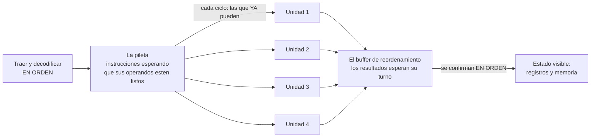

# 03 · Qué hace realmente una instrucción

> [!abstract] Al terminar este capítulo vas a poder
> - Explicar por qué el procesador **ejecuta fuera de orden sin dejar de andar al ritmo del reloj** — que suena a contradicción y no lo es.
> - Medir, en tu máquina, cuántas instrucciones hace tu procesador en un ciclo.
> - Entender por qué hace falta una barrera antes de leer el reloj, y por qué las barreras existen en general.

Este capítulo existe por una pregunta que el capítulo 01 dejó abierta y no debió: si **todo** el procesador avanza al tic-tac de un reloj, ¿cómo puede ejecutar cosas fuera de orden y "adelantar" una lectura?

La respuesta corta, y todo lo demás sale de ahí:

> **El reloj sincroniza etapas, no instrucciones.**

Si creías que un tic del reloj es una instrucción, no era una mala suposición: es lo que dice todo el mundo, y fue verdad durante unos veinte años. Hoy es falso por los dos lados a la vez.

---

## Primero: una instrucción son bytes

Antes de nada, sacarle la magia. Una instrucción no es una idea ni una orden: es **un puñado de bytes en memoria**. Se pueden mirar:

```
   0:	48 8d 44 7f 01       	lea    0x1(%rdi,%rdi,2),%rax
   5:	c3                   	ret
```

Tres columnas: dónde está, **qué bytes son**, y cómo se leen. Los cinco bytes `48 8d 44 7f 01` *son* la instrucción. El texto de la derecha es una traducción para vos, hecha por `objdump`; el procesador nunca la ve.

Adentro de esos bytes hay campos: cuál operación es, qué [[Registro|registros]] usa, qué constante lleva. Y por eso el capítulo anterior decía que el nombre del registro tiene que **caber** en la instrucción — literalmente son unos bits ahí adentro.

En x86 las instrucciones miden entre 1 y 15 bytes; en aarch64 **todas miden exactamente 4**. Esa diferencia no es cosmética: decodificar x86 es un problema difícil —hay que descubrir dónde termina cada una para saber dónde empieza la siguiente— y ARM se lo ahorra entero.

---

## Lo que hace falta para ejecutar una

Ejecutar una instrucción no es un acto: son varios pasos, y cada uno usa un pedazo distinto del procesador.

| Etapa | Qué hace | Qué parte del silicio usa |
|---|---|---|
| **Traer** (*fetch*) | Leer los bytes desde donde apunta el contador de programa. | La caché de instrucciones |
| **Decodificar** | Averiguar qué operación es y qué operandos quiere. | El decodificador |
| **Ejecutar** | Hacer la cuenta. | La unidad aritmética |
| **Memoria** | Si hay que leer o escribir RAM, hacerlo. | La caché de datos |
| **Guardar** (*writeback*) | Dejar el resultado en el registro destino. | El banco de registros |

Cinco etapas, cinco pedazos **distintos** de hardware. Y acá está la observación de la que sale todo:

> Si una instrucción usa el decodificador y después no lo usa más, **el decodificador queda libre**. Dejarlo ocioso mientras la instrucción termina es desperdiciar cuatro quintos de la máquina.

---

## El pipeline: muchas instrucciones a la vez, sin romper el reloj

La solución es la misma que la de un lavadero: mientras la primera tanda está en la secadora, la segunda ya está en el lavarropas.

```
ciclo:      1        2        3        4        5        6
inst A:   traer  decodif  ejecut   memor   guardar
inst B:            traer  decodif  ejecut   memor   guardar
inst C:                     traer  decodif  ejecut   memor
inst D:                              traer  decodif  ejecut
```

En el ciclo 5 hay **cuatro instrucciones adentro del procesador al mismo tiempo**, cada una en una etapa distinta. Y cada flanco del reloj hace exactamente una cosa: **todas avanzan un casillero, a la vez**.

Fijate lo que acaba de pasar, porque es la mitad de la respuesta a tu pregunta: el reloj se respeta perfectamente —nada se mueve entre flancos— y sin embargo ya no hay "una instrucción por vez". Una instrucción tarda 5 ciclos en atravesar la máquina, pero **sale una por ciclo**. Y todavía no reordenamos nada.

> [!important] "Una instrucción por ciclo" es falso por los dos lados
> - **No es una cota superior.** Un procesador *superescalar* tiene varias unidades aritméticas y puede terminar 4 o 6 instrucciones en el mismo ciclo. Lo vas a medir en la práctica de este capítulo: 3,6.
> - **No es una cota inferior.** Una instrucción que necesita un dato que está en RAM puede tardar 250 ciclos. Ver [[Jerarquia-de-memoria]].

---

## Cuando una se traba, ¿esperan todas?

Ahora sí el problema. Mirá estas tres instrucciones:

```asm
mov rax, [rbx]     ; 1. traer un dato de memoria  <- puede tardar 250 ciclos
add rax, 1         ; 2. sumarle uno               <- NECESITA el resultado de 1
add rcx, 5         ; 3. sumar cinco a otra cosa   <- no tiene nada que ver
```

La segunda **no puede** ejecutarse antes que la primera: necesita el dato. Eso no es una convención, es una dependencia real.

Pero la tercera no depende de nada. Si el procesador ejecuta estrictamente en orden, se queda parado 250 ciclos esperando a la primera **con la unidad aritmética libre al lado**, pudiendo haber hecho la tercera mil veces.

**Eso es lo que la ejecución fuera de orden viene a arreglar.** No es una optimización astuta: es no desperdiciar 250 ciclos de silicio por una lectura de memoria.

---

## Cómo lo hace, sin dejar de ser sincrónico

Acá está la parte que faltaba en tu modelo mental. El procesador moderno no tiene una fila: tiene **una pileta y un planificador**.



Lo que pasa **en cada flanco del reloj**, todo junto y de una vez:

1. Se traen y decodifican unas cuantas instrucciones nuevas, **en orden de programa**, y se tiran a la pileta.
2. El planificador mira la pileta y elige las que tienen **todos sus operandos listos**. Manda hasta una por unidad de ejecución libre.
3. Las unidades que terminaron dejan su resultado en el *buffer de reordenamiento*.
4. Del frente de ese buffer se **confirman** los resultados que ya no tienen a nadie más viejo esperando adelante.

Los cuatro pasos ocurren **el mismo ciclo, en distintas instrucciones**. Nada se mueve entre flancos. El procesador sigue siendo tan sincrónico como el flip-flop del capítulo 01.

> [!tip] La inversión que hace clic
> **El reloj no es lo que fuerza a hacer una cosa por vez: es lo que hace manejable hacer doscientas a la vez.** Sin un ritmo común, coordinar cientos de instrucciones en vuelo, con sus dependencias, sería imposible. Que todo el mundo dé un paso al mismo tiempo es justamente lo que permite que cada uno esté en un lugar distinto.
>
> Ser sincrónico y ser secuencial son cosas **independientes**. El silicio es lo primero y hace rato que no es lo segundo.

### La cocina, si el dibujo no alcanza

Los pedidos entran en orden y el mozo los sirve en orden. Pero adentro hay cuatro cocineros trabajando a la vez, y cada uno agarra lo que **ya tiene los ingredientes listos**. Si el plato 1 está esperando el horno, los platos 2 y 3 se cocinan mientras tanto — y esperan en la mesada hasta que salga el 1.

El reloj es la campanada con que todos se pasan el trabajo, no la cantidad de platos por campanada.

---

## Y el cliente nunca se entera: el retiro en orden

Si la máquina ejecuta desordenado, ¿por qué mi programa se comporta como si fuera en orden?

Porque hay dos órdenes distintos, y solo uno se ve:

| | En qué orden |
|---|---|
| **Ejecución** | En el que se van pudiendo. Desordenado. |
| **Retiro** (*commit*) | **Estricto orden de programa.** |

Un resultado calculado antes de tiempo se queda guardado en el buffer de reordenamiento y **no toca el estado visible** hasta que le llega el turno. Si una instrucción anterior falla, todo lo que se adelantó **se tira** como si nunca hubiera pasado.

Eso es lo que da las *excepciones precisas*: cuando un [[Fault|fault]] ocurre, el estado que ve el handler es exactamente el de antes de esa instrucción, ni una después. Sin retiro en orden, P5 —los faults son datos, con los registros adentro— sería imposible: no habría un "estado en el momento del fault" que contar.

**La máquina hace trampa y después borra las huellas.**

---

## Dónde se filtra la ilusión

Casi. Hay cuatro lugares donde el desorden se nota, y los cuatro importan para un kernel.

**1. Cuando medís el tiempo.** Leer el contador de ciclos es una instrucción como cualquier otra, y el planificador la puede adelantar respecto del código que querías cronometrar. Medís de menos. Por eso hay una barrera antes:

```rust
// `lfence` antes de `rdtsc`: sin eso el procesador puede adelantar
// la lectura y dos medidas seguidas salen al reves.
```

Está en el kernel de este libro: `kernel-x86_64/src/main.rs:513#"lfence",`. Lo probaste sin saberlo en [[P02-Medir-el-reloj-y-las-latencias]].

**2. Cuando otro núcleo mira.** El retiro en orden garantiza el orden **para vos**. Otro núcleo puede ver tus escrituras en otro orden. Para eso están las barreras de memoria, y es la razón de fondo de que este proyecto compile las dos arquitecturas: x86 tiene un modelo de memoria fuerte que **esconde** barreras faltantes, y ARM las expone. Ver [[42-Ordenamiento-de-memoria]].

**3. Cuando el que mira es un [[Aparato|aparato]].** Un [[MMIO|registro de un aparato]] no es RAM: escribirle "arrancá" antes de que llegue el dato es un bug real. Por eso esos accesos van marcados `volatile` y con barreras.

**4. Cuando el procesador adivina.** Frente a un `if`, en vez de esperar a saber el resultado, **predice** y sigue ejecutando por el camino probable. Si acertó, ganó decenas de ciclos; si no, tira todo. Casi siempre acierta. Pero el trabajo especulativo **deja rastro en la caché** aunque se descarte, y de ahí salió toda la familia Spectre: adivinar mal, descartar el resultado, y aun así haber dejado una huella medible.

---

## En Kornelia

No hay nada especial que el kernel haga con esto, y ese es el punto: **ejecutar fuera de orden es del silicio, no del sistema operativo**. Ningún kernel lo activa ni lo desactiva.

Lo que sí hay son las tres consecuencias:

- La barrera antes de `rdtsc`, arriba.
- Las barreras de memoria donde el agente y el kernel comparten estructuras — el buzón de [[28-Que-es-un-proceso-y-que-queda-sin-procesos|`listen`]], los índices que se leen desde otro núcleo.
- Y una que no se ve venir: `client.py --kvm` **es una prueba distinta**, no solo más rápida. Emulado, el código lo interpreta un programa que ejecuta estrictamente en orden y nunca especula. Con KVM lo ejecuta el silicio de verdad. Un kernel que anda emulado y se rompe con KVM casi siempre tiene un bug de ordenamiento. Ver [[Maquina-virtual]].

---

## Las prácticas de este capítulo

- [[P04-Ver-al-procesador-desordenar]] — *(construir)* la misma cantidad de sumas, encadenadas y en paralelo. Vas a medir cuántas instrucciones por ciclo hace tu máquina, y a deducir su frecuencia real usando una cadena dependiente como cronómetro.

---

## Recordar #flashcards/parte-01

Si todo el procesador avanza al ritmo del reloj, ¿cómo puede ejecutar fuera de orden?::Porque el reloj sincroniza **etapas, no instrucciones**. En cada flanco todas las instrucciones en vuelo avanzan un paso a la vez; lo que cambia es *cuál* instrucción entra a cada unidad, y eso lo decide un planificador que elige las que ya tienen sus operandos listos.

¿Cuántos ciclos tarda una instrucción?::La pregunta está mal hecha. Tarda varios ciclos en atravesar la máquina (una etapa por ciclo) pero pueden terminar varias por ciclo, o puede tardar 250 si necesita un dato de RAM. "Una instrucción por ciclo" no es cota superior ni inferior.

¿Por qué mi programa se comporta como si fuera secuencial si la ejecución es desordenada?::Porque el **retiro es en orden**: los resultados esperan en el buffer de reordenamiento y solo tocan el estado visible cuando les llega el turno. Si algo anterior falla, lo adelantado se descarta.

¿Qué hace posible que un fault devuelva un estado coherente?::El retiro en orden. Da *excepciones precisas*: el estado que ve el handler es exactamente el de antes de la instrucción que falló.

¿Por qué hay una barrera antes de leer el contador de ciclos?::Porque leerlo es una instrucción como cualquier otra y el planificador la puede adelantar respecto del código que querés medir, así que medís de menos.

¿Por qué el trabajo especulativo importa para la seguridad?::Porque aunque el resultado se descarte, **deja rastro en la caché**. Esa huella se puede medir, y de ahí sale la familia Spectre.

¿Por qué correr con KVM es una prueba distinta y no solo más rápida?::Porque el emulador ejecuta estrictamente en orden y no especula. Un bug de ordenamiento de memoria solo aparece cuando lo ejecuta el silicio de verdad.

## Qué sigue

[[04-El-bus-tocar-algo-que-no-es-memoria]] — y el detalle fino de esta idea está en [[Ejecucion-fuera-de-orden]].
