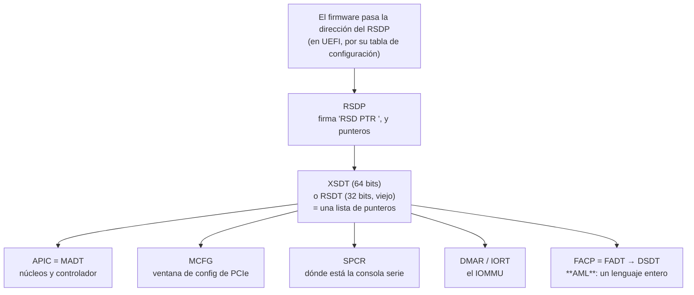

# ACPI

> Las tablas donde el [[Firmware|firmware]] deja escrito **qué tiene la máquina**: cuántos núcleos, dónde está el controlador de interrupciones, dónde se configura el bus.

*Advanced Configuration and Power Interface.* El mapa de memoria dice cuánta RAM hay y nada más. Todo lo demás —lo que un kernel necesita para dar el segundo paso— vive acá.

## Qué problema resuelve

Sin ACPI, un kernel averigua las cosas **probando**: escribe en una dirección donde históricamente había un controlador y mira si contesta; asume que el puerto serie está en `0x3F8` porque la PC de 1981 lo tenía ahí; cuenta núcleos leyendo una tabla que alguien dejó en la memoria baja con una firma de texto.

Eso funcionó veinte años y se rompió con la variedad: dos máquinas del mismo fabricante tienen el controlador de interrupciones en direcciones distintas, y **probar una dirección que no existe puede colgar el bus**. Hace falta que la máquina se describa en vez de que el kernel adivine. Eso es exactamente P4.

Y hay un segundo problema, más viejo, que explica la parte fea de ACPI: **la gestión de energía**. Apagar un ventilador, dormir un puerto o cambiar la frecuencia depende de cómo esté cableado *ese* motherboard, y no hay forma de estandarizarlo con una tabla de datos. La respuesta de ACPI fue meter **un lenguaje de programación** adentro de las tablas.

## Cómo funciona

Es una cadena de punteros que arranca en un solo lugar y se abre en abanico.



Cada tabla arranca con el mismo encabezado de 36 bytes, y los primeros cuatro son una **firma de texto**. Todas llevan un checksum sobre su largo entero: los bytes de la tabla tienen que sumar cero módulo 256. Verificarlo no es prolijidad — cuando se recorre memoria cruda, un puntero que casualmente empiece con cuatro letras conocidas es más fácil de lo que parece.

### Las que importan

| Firma | Nombre | Qué trae | Sin ella |
|---|---|---|---|
| `APIC` | **MADT** | Cuántos núcleos hay, su identificador, y dónde está el controlador de interrupciones (APIC en x86, GIC en ARM). También dónde disparar un [[MSI]] en ARM. | No se puede arrancar un segundo núcleo ni instalar un handler. |
| `MCFG` | — | La dirección base de la ventana de configuración de [[PCIe]] mapeada en memoria, y qué buses cubre. | No se encuentra ningún aparato del bus. |
| `SPCR` | — | Dónde está el puerto serie de consola y por qué interrupción avisa. | Hay que hornear una dirección y rezar. |
| `DMAR` | — | Dónde están los registros del IOMMU de Intel (VT-d). En ARM el equivalente es `IORT`. | No se puede declarar qué memoria alcanza un aparato (D8). |
| `FACP` | **FADT** | Un cajón de sastre: el contador de frecuencia fija, cómo se le pide al firmware que arranque un núcleo en ARM (PSCI), y el puntero al DSDT. | — |
| `DSDT` | — | **AML.** Ver abajo. | — |

> [!warning] Dos nombres por tabla, y no coinciden
> La tabla que trae los núcleos se llama **MADT** y su firma es `APIC`. La que trae el resto se llama **FADT** y su firma es `FACP`. No hay lógica: es historia. Cuando busques archivos en `/sys/firmware/acpi/tables/`, buscá por la firma.

### El DSDT es un programa, y por eso duele

El DSDT no es una tabla de datos: es **bytecode de AML** (*ACPI Machine Language*), un lenguaje entero con variables, condicionales, bucles y llamadas a métodos. Para saber cosas como "qué cable de interrupción le toca a este aparato PCIe", un kernel tiene que **ejecutar** métodos del DSDT (`_PRT`, `_CRS`, `_STA`).

O sea: para enumerar un aparato hace falta un intérprete de un lenguaje de programación adentro del kernel. Linux tiene uno —**ACPICA**, unas cien mil líneas de C heredadas de Intel— y es de las piezas más grandes que arrastra.

Y esto es lo que hace que [[MSI]] no sea sólo una optimización: un aparato que dispara su interrupción **escribiendo en una dirección** no necesita que nadie averigüe qué cable tiene. El dato viaja por el bus, y el AML deja de hacer falta para eso. Ver [[35-MSI-interrupciones-sin-cable]].

## Cómo lo hace Linux

Las tablas están expuestas crudas, tal como las dejó el firmware:

```bash
ls /sys/firmware/acpi/tables/               # una por firma: APIC, MCFG, DSDT, FACP...
sudo cat /sys/firmware/acpi/tables/APIC | xxd | head
sudo cp /sys/firmware/acpi/tables/DSDT /tmp/dsdt.dat
sudo apt install acpica-tools
iasl -d /tmp/dsdt.dat && less /tmp/dsdt.dsl  # el AML, decompilado a algo legible
```

Ese `iasl -d` es la práctica más reveladora del capítulo: lo que sale tiene `If`, `While`, `Method`, `Return`. **Es código.** Ahí se entiende de un vistazo por qué averiguar una interrupción por AML es caro.

Del lado del kernel, el intérprete vive en `drivers/acpi/acpica/`, y las tablas se parsean en `drivers/acpi/tables.c`. Para mirar el resultado:

```bash
sudo dmesg | grep -i acpi | head -40   # qué tablas encontró y cuáles ignoró
cat /proc/interrupts                    # las interrupciones ya resueltas: IO-APIC contra PCI-MSI
ls /sys/firmware/acpi/interrupts/
```

Linux también acepta arrancar con `acpi=off`, que es lo que fuerza el otro camino cuando lo hay. Ver [[Device-tree]].

## Cómo lo hace Kornelia

| | |
|---|---|
| **Decisiones** | D24 (ACPI es formato de la máquina, no del arranque ni de la arquitectura), D8 (el IOMMU sale de DMAR/IORT) |
| **Dónde vive** | `kernel-core/src/acpi.rs:352#match &signature`, `kernel-core/src/tables.rs:55#pub unsafe fn read_acpi` |
| **Se ve con** | `describe {what:["tables"]}` |

El código de ACPI vive en `kernel-core/` y no en los crates de arquitectura, a propósito: **quién encuentra el RSDP depende de cómo se arrancó, pero recorrer las tablas es idéntico en x86_64 y en aarch64.** Lo que cambia es lo que hay adentro —un x86 describe APICs y un ARM describe GICs— y las dos cosas se normalizan al mismo vocabulario (D24).

El recorrido entero es un `match` sobre cuatro letras (`kernel-core/src/acpi.rs:352#match &signature`), y cada tabla tiene su lector chico: `read_madt`, `kernel-core/src/acpi.rs:579#unsafe fn read_spcr`, `kernel-core/src/acpi.rs:660#unsafe fn read_mcfg`, `kernel-core/src/acpi.rs:604#unsafe fn read_dmar`. El checksum se verifica **siempre**, antes de mirar nada.

Tres cosas que salen directo de P4:

1. **El cable se muda.** El kernel arranca con la dirección del UART horneada, porque hay que poder hablar antes de leer nada. Apenas la SPCR dice dónde está la consola de verdad, se muda ahí. Es P4 aplicado a lo más básico que tiene el kernel.
2. **Se publican las firmas de todas las tablas, se lean o no** (`kernel-core/src/protocol.rs:876#acpi_signatures`). Que exista en la máquina algo que este kernel todavía no sabe leer **es más útil que callarlo**: el agente ve la lista y decide.
3. **Lo que no se interpreta se dice.** SMBIOS se informa con su dirección y nada más: inventarle campos sería peor que admitir que no se leyó.

**Qué se quitó, y es enorme: no hay intérprete de AML.** El DSDT no se ejecuta ni se lee. Sin ACPICA no hay gestión de energía, no hay enumeración de aparatos que no estén en el bus PCIe, y no hay forma de averiguar qué cable INTx le toca a un aparato — que es justamente el camino viejo de interrupciones que este kernel **no** implementa. La salida no es una carencia disfrazada: es [[MSI]], donde el aparato escribe un dato en vez de tener cable. Y lo poco de energía que hace falta —arrancar un núcleo en ARM— sale de un campo de datos de la FADT (PSCI), no de un método.

Del mismo espíritu: el contador de frecuencia fija que informa ACPI se usa **para calibrar el otro reloj**, no como reloj (`kernel-core/src/acpi.rs:175#pub const TIMER_HZ`). Y si nadie dice a qué ritmo sube el rápido, el kernel dice que no lo sabe en vez de calcular un tiempo falso.

## Cómo se ve roto

| Síntoma | Causa |
|---|---|
| La máquina no imprime una sola letra. | El cable no está donde el kernel cree. La dirección horneada sirve para el primer byte; la SPCR dice la de verdad. |
| `describe` informa cero núcleos. | No se encontró la MADT, o su checksum no cerró, o el puntero al RSDP era otra cosa. |
| Una tabla "aparece" en cualquier lado. | Se le creyó a la firma sin verificar el checksum. Cuatro letras conocidas en memoria cruda son más comunes de lo que parece. |
| El aparato existe en el bus pero no se lo puede configurar. | Falta la MCFG, o su ventana no está en el mapa de memoria. En aarch64 el firmware no la repite: hay que agregarla. Ver [[Firmware]]. |
| `dma.allow` no tiene a quién hablarle. | No apareció DMAR (x86) ni IORT (ARM). Sin eso no hay IOMMU que programar (D8). |
| Se busca el archivo `MADT` en `/sys` y no está. | Se llama `APIC`. Y la FADT se llama `FACP`. |
| En Linux, un aparato no recibe interrupciones y el `dmesg` habla de `_PRT`. | Es AML: la ruta de interrupción se resuelve **ejecutando** un método del DSDT. |

## Práctica

- [[P15-Decompilar-el-DSDT-con-iasl]] — *(mirar)* sacar el DSDT de `/sys`, decompilarlo, y encontrar un `Method` con un `If` adentro. Ver que es código.
- [[P01-Preguntarle-a-Linux-que-maquina-es]] — *(mirar)* listar las tablas y comparar la MADT con `/proc/cpuinfo`.

## Recordar #flashcards/conceptos

¿Cuál es la cadena de punteros de ACPI?::El firmware pasa la dirección del RSDP; el RSDP apunta al XSDT (o al RSDT, viejo, de 32 bits); el XSDT es una lista de punteros a todas las demás tablas.

¿Cómo se sabe qué es cada tabla, y por qué no alcanza con eso?::Por una firma de texto de cuatro bytes al principio. No alcanza porque cuatro letras conocidas aparecen por casualidad en memoria cruda: hay que verificar el checksum, que suma cero módulo 256 sobre la tabla entera.

¿Qué tiene el DSDT y por qué es caro?::Bytecode de AML, un lenguaje de programación entero. Averiguar qué cable de interrupción le toca a un aparato exige **ejecutar** métodos, o sea meter un intérprete adentro del kernel (en Linux, ACPICA).

¿Por qué MSI vuelve innecesario al AML?::Porque un aparato que dispara su interrupción escribiendo un dato en una dirección no necesita que nadie averigüe qué cable tiene.

¿Qué traen MADT, MCFG y SPCR?::MADT (firma `APIC`): cuántos núcleos y dónde está el controlador de interrupciones. MCFG: la ventana de configuración de PCIe. SPCR: dónde está la consola serie y por qué interrupción avisa.

¿Por qué el código de ACPI de Kornelia vive en `kernel-core` y no en los crates de arquitectura?::Porque recorrer las tablas es idéntico en las dos; lo que cambia es el contenido (APICs contra GICs), y eso se normaliza al mismo vocabulario (D24).

## Ver también

- [[Device-tree]] — el otro dialecto, donde no hay ACPI. Cuál se usa no lo elige el kernel.
- [[Firmware]] · [[UEFI]] · [[PCIe]] · [[MSI]]
- [[15-Enumerar-sin-adivinar-ACPI]] · [[47-IOMMU-VT-d-y-SMMUv3]]
