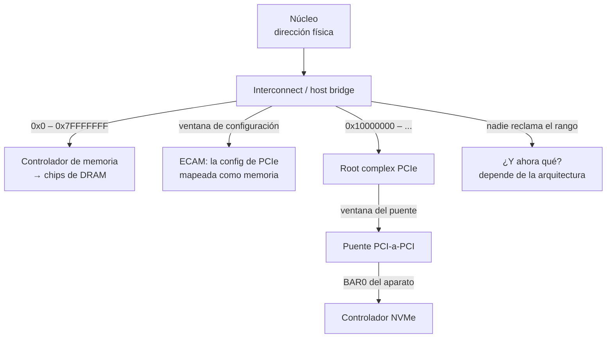

# Bus

> El árbol de ruteo que decide **quién responde** a cada dirección física. La [[MMU]] dice qué dirección sale del núcleo; el bus dice adónde llega.

Un procesador solo sabe leer y escribir direcciones. Que algunas terminen en un chip de RAM y otras en un controlador NVMe no lo decide el procesador: lo decide lo que hay del otro lado del pin.

## Qué problema resuelve

La MMU termina su trabajo con una dirección física, que **no es un chip**: es un número que sale del núcleo. Alguien tiene que resolver tres cosas que el procesador no puede:

1. **Cuál de los muchos [[Aparato|aparatos]] de la máquina se hace cargo de ese número.**
2. **Cómo se le agregan aparatos a una máquina sin cambiar el procesador.** Si cada aparato necesitara su propio cable y su propia instrucción, la máquina sería fija.
3. **Qué hacer cuando no se hace cargo nadie.** Un número siempre se puede emitir; no siempre hay alguien escuchando.

El bus resuelve las tres con **decodificación de direcciones**: cada nodo del árbol tiene ventanas —"de acá a acá es mío"— y pasa la transacción hacia abajo o la ignora.

## Cómo funciona



Tres hechos de ese dibujo:

- **Se rutea por rango, no por identificador.** Nadie le pregunta a los aparatos quién es quién en cada acceso: cada puente compara la dirección contra sus ventanas. Es rápido y es la razón de que un aparato no pueda elegir su dirección.
- **Las ventanas las programa el software.** El [[Firmware|firmware]] (o el kernel) recorre el árbol, reparte rangos y los escribe en los **[[BAR|BARs]]** de cada aparato y en los registros de ventana de cada puente. Ver [[PCIe]].
- **Hay un problema de huevo y gallina**, y se resuelve con una ventana especial: la de **configuración**. Un aparato recién encontrado todavía no tiene dirección, así que `bus:dispositivo:función` se convierte aritméticamente en un desplazamiento dentro de esa ventana, y ahí viven sus BARs. En [[PCIe]] moderno eso es **ECAM**, y dónde empieza lo dice la tabla `MCFG` de [[ACPI]] (o el nodo `pci-host-ecam-generic` del [[Device-tree|device tree]]). Ver [[ACPI]].

## Cuando no responde nadie

> [!danger] El mismo acceso: en una arquitectura miente, en la otra mata
> Un acceso que el bus no puede completar —porque no hay nadie en ese rango, o porque el ancho es inválido para ese registro— **no falla igual en las dos máquinas**: 
> - En **x86_64** el chipset completa la transacción igual, con todos unos o con ceros. El procesador ve `0xFFFFFFFF` o `0x00000000` y **sigue como si nada**. Se ve exactamente igual que si el aparato estuviera pero apagado.
> - En **aarch64** el interconnect responde con un error, que llega como **abort externo**. Es asíncrono, así que ni siquiera apunta prolijamente a la instrucción culpable, y sin punto de recuperación **dejaba la máquina muda**. Está escrito en el propio kernel: `kernel-x86_64/src/guarded.rs:8#el bus lo rechaza con un abort`.

Lo notable de la rama de x86 es que ese silencio **se volvió un protocolo**: en PCI, leer el identificador de fabricante y que devuelva `0xFFFF` es la forma canónica de decir "acá no hay ninguna función". La arquitectura convirtió la ausencia de respuesta en un valor con significado. Es cómodo para enumerar y es terrible para depurar: `0xFFFFFFFF` puede querer decir "no hay nadie", "el aparato está apagado", "el BAR no está mapeado" o "leíste con el ancho equivocado", y las cuatro se ven idénticas.

## El otro espacio: los puertos de I/O de x86

x86 tiene un **segundo [[Espacio-de-direcciones|espacio de direcciones]]**, anterior al MMIO y completamente separado: 65.536 puertos de 16 bits, alcanzables solo con dos instrucciones propias, `in` y `out`.

| | Memoria / MMIO | Puertos de I/O |
|---|---|---|
| Cómo se accede | cualquier instrucción de memoria | solo `in` / `out` |
| Pasa por la MMU | sí | **no** |
| Quién da el permiso | la [[Tabla-de-paginas|tabla de páginas]] | `IOPL` y el bitmap del TSS |
| Se puede cachear | según el atributo | nunca |
| Tamaño del espacio | 2⁶⁴ | 65.536 |
| Existe en ARM / RISC-V | — | **nunca existió** |

Viene del 8080 y es historia, pero **historia que todavía corre**: el [[UART|cable serie]] de una PC está en el puerto `0x3F8`, la configuración PCI vieja se hace con el par `0xCF8`/`0xCFC`, y el contador del reloj de ACPI vive en un puerto. Kornelia usa los tres primeros y el último: `kernel-x86_64/src/uart.rs:6#const COM1: u16 = 0x3F8;` para hablar, y `kernel-x86_64/src/main.rs:460#in eax, dx` para medir la frecuencia del TSC contra el contador de ACPI, que es un puerto y no una dirección. El comentario de al lado lo dice sin vueltas: `kernel-x86_64/src/main.rs:456#Los puertos no son memoria`.

Todo lo nuevo es MMIO. Ver [[MMIO]].

## Cómo lo hace Linux

Linux mantiene **dos árboles de recursos**, uno por espacio, y los publica:

```bash
sudo cat /proc/iomem      # el ruteo de direcciones de memoria, anidado por indentación
cat /proc/ioports         # el ruteo del espacio de puertos de x86
lspci -tv                 # el árbol de PCIe: puentes y qué cuelga de cada uno
sudo lspci -vvv | grep -E "Memory behind bridge|Region [0-9]"
```

La indentación de `/proc/iomem` **es** el árbol del dibujo de arriba: un rango indentado dentro de otro es un aparato detrás de un puente. Y `Memory behind bridge` de `lspci -vvv` es literalmente la ventana que ese puente decodifica.

Del lado del kernel, un [[Driver|driver]] no toca una dirección sin reclamarla primero: `request_mem_region()` para memoria y `request_region()` para puertos. Lo que muestran `/proc/iomem` y `/proc/ioports` es justamente ese registro de reclamos, y su función es que dos drivers no se peleen el mismo rango. Después vienen `ioremap()` y `readl`/`writel` para memoria, o `inb`/`outb` (`<asm/io.h>`) para puertos. Desde el espacio de usuario, los puertos se abren con `ioperm(2)` o `iopl(2)`.

Cuando el bus rechaza algo, el rastro queda acá:

```bash
dmesg | grep -iE "SError|external abort|Unhandled fault|mce|Machine check"
```

En x86 casi siempre **no hay rastro**, que es el punto de la sección anterior.

## Cómo lo hace Kornelia

| | |
|---|---|
| **Decisiones** | D4 (el kernel no tiene drivers), D12 (MMIO no cacheable), P1, P4, P5 |
| **Dónde vive** | `kernel-core/src/memory.rs:109#Unreported,` y `kernel-core/src/protocol.rs:1259#access-refused` |

El kernel **no enumera aparatos ni asigna BARs**: eso es trabajo de driver, y los drivers los escribe el agente (D4). Lo que hace es lo que el agente no puede hacer solo:

1. **Publicar dónde está la ventana de configuración.** `describe {what:["pcie"]}` informa la base, el segmento y el rango de buses, sacados de la `MCFG` de ACPI o del nodo `pci-host-ecam-generic` del device tree. Con eso el agente recorre el árbol él mismo.
2. **Hacer que esa ventana sea alcanzable.** El mapa de memoria de [[UEFI]] **no informa la ventana de configuración en aarch64**; la MCFG sí, así que se suma al mapa donde el mapa se arma. Antes de eso el kernel publicaba una dirección que él mismo hacía inalcanzable.
3. **Mapear lo que cae fuera del mapa.** En aarch64 los BARs de PCIe caen en 512 GiB y el mapa que da el firmware llega a 257, así que el controlador NVMe era **inalcanzable**: el kernel era la razón por la que no se podía usar un aparato, que es exactamente lo que prohíbe P1. Ahora el rango se mapea y se reintenta. Se mapea como dispositivo porque no se sabe qué hay.
4. **Decir que no sabe.** Un rango que cae en un **hueco** del mapa —donde quedan los BARs que el firmware asignó sin listar— se entrega con la clase `unreported`, que **no es `mmio`**. El agente se lleva el rango *y* la advertencia de que la máquina nunca dijo qué hay ahí: alcanzarlo no es enterarse (P4). Ver [[18-Lo-que-la-maquina-no-dice]].
5. **Sobrevivir a un rechazo.** `mem.read` y `mem.write` van con un punto de recuperación armado alrededor de **una sola instrucción** —cuanto más corta la ventana, menos chance de capturar un [[Fault|fault]] que no era—, y el rechazo vuelve como `access-refused` con la dirección que cortó y los números crudos de la máquina (P5). Ver [[MMIO]].

**Qué se quitó:** no hay `request_mem_region`. Reservar un rango para que dos drivers no se peleen no tiene sentido cuando hay **un** agente (D13); el reclamo del agente es `mem.claim`, y el árbitro de verdad —del lado de los aparatos, que es donde el daño es silencioso— es el [[IOMMU|IOMMU]], que hace cumplir lo que el agente declaró con `dma.allow` (D8, P6). El kernel no impone una política de quién toca qué: hace cumplir la declarada.

## Cómo se ve roto

| Síntoma | Causa |
|---|---|
| Leés un BAR y devuelve `0xFFFFFFFF`. | Nadie responde en ese rango. En PCI eso además *significa* "no hay función acá", así que puede ser un aparato ausente o un acceso a la nada. |
| Devuelve ceros. | Ancho equivocado en x86_64, o el rango no está mapeado, o está mapeado como cacheable. Ver [[MMIO]] y [[Cache]]. |
| La máquina se queda muda al tocar un aparato. | Abort externo del bus, en aarch64. Sin punto de recuperación no vuelve nadie. |
| El mismo código anda en x86_64 y mata la máquina en aarch64. | Es el mismo acceso inválido: una arquitectura miente y la otra mata. |
| `lspci` muestra el aparato pero su BAR es inalcanzable. | La ventana de configuración o el BAR no están en el mapa de memoria que dio el firmware. |
| El aparato responde por MMIO pero el [[DMA]] que pide no llega. | Son dos caminos distintos: el MMIO va del procesador al aparato; el DMA va del aparato a la memoria, y pasa por el [[IOMMU]]. Ver [[Falsos-amigos]]. |
| Un `in`/`out` da una excepción de protección general. | Los puertos tienen su propio permiso (`IOPL`, bitmap del TSS), que no es el de la tabla de páginas. |
| El rango existe en `/proc/iomem` y tu driver no lo puede mapear. | Otro driver ya lo reclamó. `request_mem_region` falló; ese archivo es el registro de reclamos. |

## Práctica

- [[P01-Preguntarle-a-Linux-que-maquina-es]] — *(mirar)* `/proc/iomem`, `/proc/ioports` y `lspci -tv`: el árbol de ruteo de tu máquina, con nombres.
- [[P13-Recorrer-el-bus-PCIe]] — *(construir)* recorrer el ECAM a mano en Kornelia con `mem.read`, encontrar un aparato por su clase y leer sus BARs.
- [[P05-Leer-un-registro-de-un-aparato-de-verdad]] — *(construir)* equivocarle el ancho a propósito y ver los dos síntomas opuestos.

## Recordar #flashcards/conceptos

¿Cómo decide el bus quién responde a una dirección?::Por decodificación de rangos: cada puente del árbol tiene ventanas y compara la dirección contra ellas. No se le pregunta a nadie quién es; por eso un aparato no puede elegir su dirección.

¿Cómo se le habla a un aparato que todavía no tiene dirección asignada?::Por la ventana de configuración: `bus:dispositivo:función` se convierte aritméticamente en un desplazamiento dentro de un rango conocido (ECAM). Dónde empieza lo dice la tabla MCFG de ACPI o el device tree.

¿Qué pasa cuando ningún aparato responde a una dirección?::Depende de la arquitectura. En x86_64 el chipset completa igual y devuelve todos unos o ceros, en silencio. En aarch64 el bus responde con un abort externo que puede dejar la máquina muda.

¿Por qué leer `0xFFFF` de un identificador de fabricante PCI no es un error?::Porque la ausencia de respuesta de x86 se convirtió en protocolo: `0xFFFF` es la forma canónica de decir "acá no hay ninguna función". Cómodo para enumerar, terrible para depurar.

¿Qué son los puertos de I/O de x86 y en qué se diferencian del MMIO?::Un segundo espacio de direcciones de 65.536 puertos, alcanzable solo con `in`/`out`, que no pasa por la MMU y tiene su propio permiso (`IOPL`). ARM y RISC-V nunca lo tuvieron.

¿Qué pone Linux en `/proc/iomem` y para qué sirve?::El registro de rangos reclamados con `request_mem_region`, anidado según el árbol del bus. Sirve para que dos drivers no se peleen el mismo rango.

¿Por qué Kornelia no tiene un equivalente de `request_mem_region`?::Porque hay un solo agente (D13), así que no hay dos drivers que se peleen. El árbitro que sí hace falta es el IOMMU, del lado de los aparatos, y hace cumplir lo que el agente declaró (P6).

## Ver también

- [[MMIO]] · [[MMU]] · [[Cache]] · [[NVMe]]
- [[PCIe]] — cómo se encuentra un aparato y quién le asigna su rango.
- [[18-Lo-que-la-maquina-no-dice]] — los huecos del mapa y la clase `unreported`.
- [[Falsos-amigos]] — el bus no es el IOMMU, y MMIO no es DMA.
