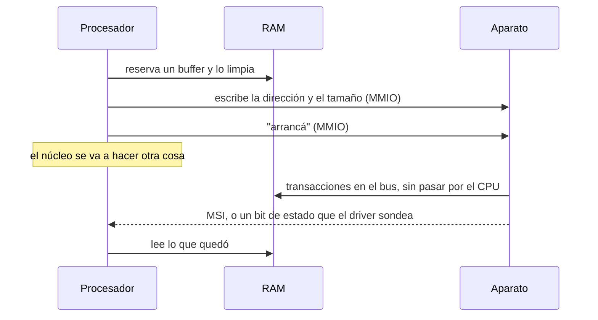

# DMA

> El [[Aparato|aparato]] lee y escribe la RAM **por su cuenta**: el procesador le dice dónde y cuánto, y se va a hacer otra cosa.

*Direct Memory Access.* Es la mitad que falta de [[MMIO]]. En MMIO el procesador va al aparato; en DMA **el aparato va a la memoria**, y es un maestro del [[Bus|bus]] como cualquier otro. Todo el hardware rápido de los últimos treinta años funciona así.

## Qué problema resuelve

La alternativa es PIO (*programmed I/O*): el procesador copia los datos de a pedazos, leyendo un registro del aparato y escribiendo en RAM. Anda, y es carísimo por dos motivos que se ven en la jerarquía de latencias.

| Acceso | Orden de magnitud |
|---|---|
| Un registro del procesador | menos de 1 ns |
| [[Cache|Caché]] L1 | ~1 ns |
| RAM | ~80 ns |
| **Un registro de un aparato por MMIO** | **cientos de ns a 1 µs** |
| Un bloque de un SSD NVMe | ~50 µs |

Un acceso MMIO no se cachea y no se puede reordenar: cada uno es un viaje entero por el bus. Copiar 4 KiB de a 4 bytes son **mil accesos**, y con eso el procesador se pasa cerca de un milisegundo quemado moviendo bytes que él no va a usar. Ver [[02-Registros-y-RAM-no-son-lo-mismo]].

Con DMA, esas mil vueltas se convierten en **cuatro escrituras**: origen, destino, cantidad, arrancá. El aparato hace las transferencias contra la RAM directamente —que es dos órdenes de magnitud más barata que su propio registro— y avisa cuando terminó. El núcleo mientras tanto está libre, que era el punto.

## Cómo funciona



Cuatro condiciones que no se ven en el dibujo y sin las cuales no ocurre nada:

1. **El aparato tiene que tener permiso de iniciar accesos**: el bit de *bus master* de su [[PCIe|espacio de configuración]]. Sin él, escribe sus registros y no hace nada más.
2. **La dirección que se le escribe no es la que usa el programa.** Es una dirección **de bus**, y si hay [[IOMMU]] es una **IOVA**. Los cuatro nombres y en qué se diferencian están en [[Falsos-amigos#4]]: confundirlos es la causa clásica de que un DMA escriba en el lugar equivocado.
3. **El aparato puede no alcanzar toda la memoria.** Emite direcciones de un ancho fijo —28, 32, 64 bits— y lo que no entra, no entra. Es un límite del silicio, no del software.
4. **La memoria y las cachés tienen que estar de acuerdo.** En x86 el DMA es coherente con las cachés por hardware. En muchos ARM no, y hay que vaciar o invalidar la caché alrededor de la transferencia. Ver [[Falsos-amigos#8]].

### Por qué es peligroso

**El aparato no pasa por la [[MMU]].** Un puntero mal puesto en un registro de aparato no da page [[Fault|fault]]: el DMA ocurre, en otro lado, y sigue todo andando hasta que algo lejano se rompe. Es corrupción silenciosa de memoria, el peor bug posible, y no hay forma de atraparlo desde el procesador porque el procesador no participó.

Y es peor que un error: un aparato es una máquina de leer toda la RAM. Cualquier cosa conectada a un puerto que hable PCIe —Thunderbolt, por ejemplo— puede leer las claves de una máquina bloqueada. La respuesta a las dos cosas, el error y el ataque, es el mismo silicio: el [[IOMMU]].

## Cómo lo hace Linux

Hay una API de DMA entera, y su razón de ser es que el [[Driver|driver]] **no** manipule direcciones físicas a mano. Vive en `Documentation/core-api/dma-api.rst` y `kernel/dma/`.

```c
dma_set_mask_and_coherent(dev, DMA_BIT_MASK(64));  // cuántos bits emite el aparato
pci_set_master(pdev);                               // el bit de bus master

// Buffer duradero y coherente: descriptores, colas, anillos.
void *cpu = dma_alloc_coherent(dev, size, &bus_addr, GFP_KERNEL);

// Buffer que ya existe, para una transferencia: streaming.
dma_addr_t d = dma_map_single(dev, buf, len, DMA_FROM_DEVICE);
// ... el aparato escribe ...
dma_unmap_single(dev, d, len, DMA_FROM_DEVICE);
```

Las tres piezas que importan:

- **`dma_alloc_coherent` contra `dma_map_single`.** El primero consigue memoria pensada para que el aparato y el procesador la miren a la vez sin sincronizar nada. El segundo toma un buffer que ya existe, lo prepara y devuelve la dirección **de bus** — y esa dirección deja de valer al desmapear. Usar el puntero del procesador después de mapear, o el de bus antes, son los dos errores clásicos.
- **La máscara.** `dma_set_mask` es el aparato declarando cuánto alcanza. Si el buffer cae fuera, Linux no falla: usa un **bounce buffer** (`swiotlb`), copia a memoria baja y copia de vuelta. Anda, y es lento en silencio: `dmesg | grep -i swiotlb`.
- **La verificación.** Con `CONFIG_DMA_API_DEBUG` aparece `/sys/kernel/debug/dma-api/`, que atrapa mapeos sin desmapear y usos después de desmapear.

## Cómo lo hace Kornelia

| | |
|---|---|
| **Decisiones** | D4 (el driver lo escribe el agente), D8 (IOMMU encendido y vacío) |
| **El verbo** | `dma.allow {device, handle}` — un aparato y un reclamo, nada más |
| **Dónde vive** | `kernel-core/src/protocol.rs:1761#fn dma_allow`, la tabla en `kernel-core/src/dma.rs:16#pub const MAX` |

No hay API de DMA, porque no hay drivers en el kernel (D4). El agente reclama la memoria que quiere con `mem.claim` —él elige la dirección, no hay asignador ([[Falsos-amigos#10]])— y después **declara** que tal aparato puede tocar ese reclamo.

Dos cosas del verbo que son decisiones y no detalles:

- **`device` es el número con el que lo nombra el bus**, no un handle que reparta el kernel: bus, dispositivo y función juntos, que es lo que el silicio ve llegar en cada pedido de DMA (`kernel-core/src/dma.rs:22#pub device: u32`). El kernel no inventa nombres para las cosas que ya tienen uno (P4).
- **Es el único verbo cuyo efecto no se ve desde el procesador.** Lo que cambia es lo que alcanza el **aparato**. Y no es un guardarraíl: el kernel no elige nada, hace cumplir lo que el agente declaró (P6).

El permiso queda **anotado** para poder sacarlo en `release`. Un reclamo devuelto que un aparato sigue alcanzando es justo el agujero silencioso que el IOMMU viene a cerrar: el próximo reclamo cae ahí mismo y el aparato de antes le sigue escribiendo.

**Qué se quitó:** no hay bounce buffers, ni scatter-gather, ni gestión de coherencia, ni máscara de aparato, ni `dma_map_*`. El agente elige la memoria y, si el aparato no la alcanza, es el agente el que tiene que elegir otra. La capa no se reemplazó por una más chica: se dejó vacía (P2).

Y se prueba contra un aparato de verdad: las máquinas de `scripts/run-*.sh` llevan `-device edu`, que es un motor de DMA que se maneja con cuatro escrituras. Sin él, `dma.allow` no se podría probar contra nada.

## Cómo se ve roto

| Síntoma | Causa |
|---|---|
| El aparato "no hace nada". La memoria queda intacta. | Falta el bit de *bus master*, o el rango no está declarado en el IOMMU (D8: sin declarar, no llega). |
| El DMA parece funcionar y una estructura lejana aparece corrupta. | Se le escribió al aparato una dirección virtual, o la de otro reclamo. El aparato no pasa por la MMU: no hay fault, hay memoria distinta. |
| El destino nunca se toca, y no hay error en ningún lado. | El aparato no **alcanza** esa dirección. El `edu` de [[QEMU]] recorta la dirección a 28 bits si no se le dice otra cosa, y en aarch64 la RAM arranca en 1 GiB: ningún destino podía llegar. En x86_64 no se veía, porque ahí la RAM arranca en cero. |
| El bloqueo del IOMMU "funciona" desde la primera prueba. | Cuidado: **"bloqueado" y "nunca pasó nada" se ven idénticos desde afuera**. Antes de creerle a un bloqueo hay que comprobar que la cosa bloqueada ocurre — booteando sin IOMMU y mirando. Ver [[58-Una-prueba-que-no-puede-pasar-por-accidente]]. |
| El aparato escribió, pero el procesador sigue leyendo lo viejo. | La caché. En x86 el DMA es coherente; en ARM hay que invalidar antes de leer. |
| El aparato lee basura de una cola recién armada. | El buffer no se limpió antes de declararlo, o la escritura del procesador todavía está en el buffer de escritura y falta una barrera. |
| Un aparato sigue escribiendo en memoria que el agente ya soltó. | El permiso no se revocó al hacer `release`. Por eso el kernel anota cada `dma.allow` en una tabla en vez de solo programar el silicio. |

## Práctica

- [[P15-Ver-un-DMA-bloqueado-por-el-IOMMU]] — *(romper)* con el aparato `edu` en QEMU: hacer el DMA sin declarar y ver la memoria intacta, declararlo y ver que llega, soltarlo y ver que se corta. Y bootear sin IOMMU para comprobar que la escritura sí ocurre.
- [[P12-Mirar-las-colas-de-un-NVMe-de-verdad]] — *(mirar)* el DMA que hace un aparato de todos los días para buscarse sus propios pedidos.

## Recordar #flashcards/conceptos

¿Qué es DMA en una frase?::Que el aparato lee y escribe la RAM por su cuenta, como maestro del bus, sin que el procesador copie los datos. Es el reverso de MMIO: ahí el procesador va al aparato, acá el aparato va a la memoria.

¿Por qué existe el DMA?::Porque un acceso MMIO cuesta cientos de nanosegundos y la RAM ~80. Copiar 4 KiB de a 4 bytes son mil viajes al aparato; con DMA son cuatro escrituras y el núcleo queda libre.

¿Por qué un DMA mal apuntado es peor que un puntero mal en un programa?::Porque el aparato no pasa por la MMU: no hay page fault. La escritura ocurre en otro lado, en silencio, y el síntoma aparece lejos de la causa.

¿Qué diferencia hay entre `dma_alloc_coherent` y `dma_map_single` en Linux?::El primero consigue memoria pensada para que aparato y procesador la miren a la vez (colas, descriptores). El segundo prepara un buffer que ya existe para una transferencia y devuelve una dirección de bus que deja de valer al desmapear.

¿Qué es un bounce buffer?::La copia intermedia que hace Linux (`swiotlb`) cuando el aparato no alcanza la dirección donde está el buffer. Anda y es lento en silencio.

En Kornelia, ¿qué es el `device` de `dma.allow`?::El número con el que **el bus** nombra al aparato —en PCIe, bus, dispositivo y función juntos—, que es lo que el silicio ve llegar en cada pedido de DMA. No un identificador que invente el kernel (P4).

¿Por qué el kernel anota los permisos de DMA en una tabla?::Para poder sacarlos al soltar el reclamo. Memoria devuelta que un aparato sigue alcanzando es el agujero que el IOMMU viene a cerrar: el próximo reclamo cae ahí mismo.

## Ver también

- [[IOMMU]] — quién hace cumplir lo que `dma.allow` declara.
- [[MMIO]] — la otra mitad: el procesador yendo al aparato.
- [[BAR]] · [[PCIe]] · [[NVMe]] · [[MSI]]
- [[Falsos-amigos#4]] — física, virtual, de bus e IOVA: cuatro nombres para "un número que apunta a algo".
