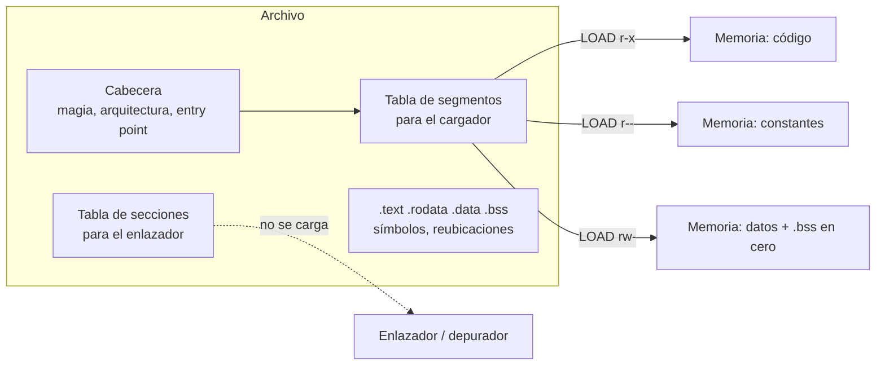

# ELF y PE

> Los dos formatos con los que un archivo dice **dónde va cada pedazo en memoria, con qué permisos y por dónde se empieza**. ELF es el de Unix; PE es el de Windows — y el de [[UEFI]].

*Executable and Linkable Format* y *Portable Executable*. Se parecen mucho más de lo que sugiere la enemistad de sus dueños: los dos resuelven el mismo problema y con las mismas piezas.

## Qué problema resuelve

Un archivo con código es un montón de bytes. Para que corra, alguien tiene que contestar cuatro preguntas que **el montón de bytes no contesta solo**:

1. **¿Cuánto copio y a qué dirección?** No todo el archivo va a memoria, y lo que va no necesariamente va junto.
2. **¿Qué permisos lleva cada pedazo?** El código tiene que ser ejecutable y no escribible; las variables al revés. Eso lo hace la [[MMU]], pero alguien le tiene que decir qué es qué.
3. **¿Por dónde empiezo?** La primera instrucción rara vez es el primer byte.
4. **¿Qué le falta al archivo?** Si el programa no sabe todavía en qué dirección lo van a cargar, hay direcciones adentro suyo que están **mal hasta que alguien las arregle**.

Los formatos viejos no contestaban ninguna: un `.COM` de DOS se cargaba en `0x100` y se saltaba ahí. Eso funciona mientras haya un solo programa, sin MMU y sin permisos. Las cuatro preguntas aparecen todas juntas cuando aparece la [[Memoria-virtual|memoria virtual]].

## Cómo funciona

Un ejecutable moderno es **una cabecera, dos tablas y un montón de bytes**.



### Segmentos contra secciones

Es la distinción que más se confunde, y la que hace entendible todo lo demás:

| | **Secciones** | **Segmentos** |
|---|---|---|
| Para quién | El **enlazador** y el depurador. | El **cargador**. |
| Cuántas | Decenas: `.text`, `.rodata`, `.data`, `.bss`, `.symtab`, `.debug_info`… | Pocas: dos o tres `LOAD`. |
| Qué agrupan | Cosas del mismo tipo. | Cosas del **mismo permiso**, porque el permiso es por página. |
| ¿Van a memoria? | Ni idea: la sección no lo dice. | Sí, y dicen exactamente a qué dirección. |
| ¿Se pueden borrar? | Sí (`strip`), y el programa sigue andando. | No. |

El enlazador junta secciones de muchos archivos objeto y después las **empaqueta en segmentos**: todo lo ejecutable en uno, todo lo escribible en otro. Un binario `strip`eado no tiene tabla de secciones y arranca igual, porque el que carga mira la otra tabla.

`.bss` es el caso que aclara la diferencia: son las variables que empiezan en cero. En el archivo **ocupa cero bytes**; en memoria ocupa lo que diga. Por eso un segmento tiene dos tamaños, el del archivo y el de memoria, y el cargador rellena la diferencia con ceros.

### El entry point

Un número en la cabecera: la dirección de la primera instrucción. **No es `main`**: en un programa de C es `_start`, que arma los argumentos, llama a los constructores y recién después llama a `main`. Confundirlos hace que un depurador parezca mentir.

### Símbolos y reubicación

Un **símbolo** es un nombre pegado a una dirección. Los hay de dos clases: los que el archivo **define** (acá está `printf`) y los que **necesita** y no tiene. El enlazador existe para casar unos con otros.

Cuando casa dos, tiene que **escribir la dirección** adentro del código que la usa, y para saber dónde escribirla el archivo objeto trae una lista de **reubicaciones**: "en el byte tal hay un hueco que se llena con la dirección de tal símbolo, en tal formato". Reubicar es tapar huecos.

Eso pasa en dos momentos distintos, y conviene no mezclarlos:

| Cuándo | Quién | Qué arregla |
|---|---|---|
| Al enlazar | `ld` | Las referencias entre archivos objeto. Queda un ejecutable. |
| Al cargar | El kernel + `ld.so` | Las direcciones que dependen de **dónde** se cargó (PIE, ASLR) y las funciones de las bibliotecas compartidas. |

Un ejecutable "posición independiente" (PIE) es el que se puede cargar en cualquier lado porque trae las reubicaciones necesarias, o porque su código direcciona todo **relativo al puntero de instrucción** y entonces no necesita ninguna. La segunda es más barata y es la normal en 64 bits.

### PE, que es lo mismo con otros nombres

| Idea | ELF | PE |
|---|---|---|
| Cabecera | `Elf64_Ehdr` | Cabecera DOS + firma `PE\0\0` + cabecera opcional |
| Segmentos | *program headers* (`PT_LOAD`) | Las mismas secciones, con permisos adentro |
| Entry point | `e_entry` | `AddressOfEntryPoint` |
| Dirección preferida | (implícita en los `PT_LOAD`) | `ImageBase` |
| Reubicación al cargar | `.rela.dyn` | `.reloc` |
| Símbolos importados | `.dynsym` + `ld.so` | Tabla de importaciones |

PE no separa segmentos de secciones: sus secciones **son** lo que se carga, con permisos propios. Es más simple y menos flexible. Arrastra adelante un programa de DOS que imprime "This program cannot be run in DOS mode", que hoy es puro folclore.

## Cómo lo hace Linux

`execve` mira los primeros bytes, reconoce `\x7fELF` y entra en `fs/binfmt_elf.c`. Ahí recorre los `PT_LOAD` y los mapea (no los copia: `mmap` sobre el archivo), pone `.bss` en cero, y si hay un `PT_INTERP` carga además el intérprete —`/lib64/ld-linux-x86-64.so.2`— y salta **a ese**, no al programa. El que termina de armar el proceso es el intérprete.

```bash
readelf -h /bin/ls              # cabecera: tipo, arquitectura, entry point
readelf -lS /bin/ls             # -l segmentos (cargador), -S secciones (enlazador)
objdump -d /bin/ls | less       # desensamblar
nm -D /bin/ls                   # simbolos dinamicos: los que necesita
ldd /bin/ls                     # que bibliotecas resuelven esos simbolos
cat /proc/self/maps             # el resultado: que quedo mapeado y con que permisos
```

Poné al lado la salida de `readelf -l` y la de `/proc/self/maps` de ese mismo proceso: son la misma lista, una antes y otra después. Ver [[P01-Preguntarle-a-Linux-que-maquina-es]].

## Cómo lo hace Kornelia

**El kernel en x86_64 no es un ELF: es un PE.** Los dos lo son:

```
$ file target/x86_64-unknown-uefi/release/kernel.efi
PE32+ executable for EFI (application), x86-64, 5 sections
$ file target/aarch64-unknown-uefi/release/kernel.efi
PE32+ executable for EFI (application), ARM64, 4 sections
```

No es una rareza: **UEFI carga PE**, porque el estándar lo dice, y por eso el archivo se llama `.efi` y va a `EFI/BOOT/BOOTX64.EFI` (`scripts/run-x86_64.sh:24#BOOTX64.EFI`) o `BOOTAA64.EFI` (`scripts/run-aarch64.sh:24#BOOTAA64.EFI`). Ver [[Firmware]].

> [!danger] Y de ahí sale uno de los bugs más caros del proyecto
> El target es `x86_64-unknown-uefi`, y ese target **no trae solo el formato: trae la ABI de Windows**. `extern "C"` ahí pasa los argumentos por **RCX, RDX, R8, R9** —no RDI y RSI— y además exige que quien llama reserve **32 bytes de pila vacía** antes de la llamada. El síntoma no se parece a la causa: una llamada del blob entraba **a la función correcta** y veía **punteros nulos**. Los cuatro argumentos estaban ahí, en otros cuatro registros. La moraleja: **la convención de llamada la pone el target, no el silicio.** Saber que la máquina es x86_64 no alcanza para saber por dónde pasan los argumentos.

Por eso `ARGUMENTS` vive en cada arquitectura y **se publica** en vez de deducirse (P4): `kernel-x86_64/src/exec.rs:365#pub const ARGUMENTS: &[usize] = &[2, 3]` contra `kernel-aarch64/src/exec.rs:356#pub const ARGUMENTS: &[usize] = &[0, 1]`, y el trait lo exige a las dos (`kernel-core/src/platform.rs:129#const ARGUMENTS: &'static [usize];`). El agente lo lee de `describe {what:["exec"]}`. Ver [[27-La-ABI-la-pone-el-target-no-el-silicio]].

### Qué se quitó: el código del agente no tiene formato ninguno

Y esta es la parte que da vuelta el concepto. El código que sube el agente **no es un ELF, ni un PE, ni nada**: son bytes crudos. Lo mismo el blob (D18): el único que existe es el de prueba que arma `client.py`, y es un `bytearray` con instrucciones adentro.

| Pieza del formato | Qué la reemplaza acá |
|---|---|
| Cabecera con arquitectura | Ya la dijo `describe`: el agente compiló **para esta máquina** (P4). |
| Segmentos con permisos | `mem.claim` y `exec {mode}`: el agente declara privilegio, no el archivo (D27). |
| Entry point | `exec {handle, off}`: el reclamo más un desplazamiento. |
| Reubicaciones | Nada. El kernel le pasa al código **su propia dirección** en el primer registro de argumento (`kernel-core/src/protocol.rs:1526#recibe en el primer registro de argumento su propia direccion`). |
| Símbolos y enlazador | El agente. Ya enlazó él. |

Lo último es P3 en una línea: **el agente es el compilador**. Un formato ejecutable existe porque el que produce el código y el que lo carga son dos programas distintos que se tienen que poner de acuerdo por escrito. Acá el que produce el código sabe la dirección de destino **antes** de compilar, porque la pidió con `mem.claim`. El acuerdo por escrito sobra.

Y lo único que el agente no puede saber por adelantado —dónde quedó— no se lo dice un formato: se lo dice un registro. Es la reubicación reducida a su mínimo posible.

## Cómo se ve roto

| Síntoma | Causa |
|---|---|
| La función correcta ve **punteros nulos**. | La ABI. El target UEFI usa la convención de Windows: los argumentos están en RCX/RDX, no en RDI/RSI. |
| Se corrompe la pila al llamar a algo del [[Firmware|firmware]]. | Faltan los 32 bytes de sombra que la ABI de Windows exige antes de la llamada. |
| `readelf -l` no muestra nada. | Es un archivo objeto (`.o`) o una biblioteca estática: todavía no tiene segmentos, solo secciones. |
| El binario arranca aunque le hiciste `strip`. | Normal: `strip` saca secciones, y el cargador mira segmentos. |
| El archivo pesa 12 KB y el proceso ocupa 4 MB. | `.bss`: ocupa cero en el archivo y lo que diga en memoria. |
| El firmware ignora tu `.efi`. | No está en `EFI/BOOT/BOOTX64.EFI`, o no es PE, o el subsistema de la cabecera no dice "aplicación EFI". |
| El código del agente salta a basura. | Se compiló asumiendo una dirección de carga y se lo cargó en otra. Sin reubicaciones, la dirección hay que sacarla del registro de argumento. |
| El binario carga bien y muere en la primera instrucción de un símbolo importado. | Reubicación sin resolver: el hueco quedó sin tapar. |

## Práctica

- [[P04-Diseccionar-un-ELF-y-un-PE]] — *(mirar)* `readelf -lS` sobre `/bin/ls` y sobre `kernel.efi`, y encontrar la misma información con dos nombres.
- [[P06-Subir-codigo-maquina-y-correrlo]] — *(construir)* compilar unos bytes a mano, subirlos con `mem.write`, correrlos con `exec`, y leer la dirección propia del registro de argumento.

## Recordar #flashcards/conceptos

¿Diferencia entre secciones y segmentos?::Las secciones son para el enlazador y el depurador, y agrupan cosas del mismo tipo (`.text`, `.debug_info`). Los segmentos son para el cargador, y agrupan cosas del **mismo permiso**, porque el permiso es por página. Un binario `strip`eado pierde secciones y arranca igual.

¿Por qué un segmento tiene dos tamaños, el del archivo y el de memoria?::Por `.bss`: las variables que empiezan en cero ocupan cero bytes en el archivo y lo que corresponda en memoria. El cargador rellena la diferencia con ceros.

¿Qué es una reubicación?::Una anotación que dice "en el byte tal hay un hueco que se llena con la dirección de tal símbolo". Reubicar es tapar huecos, y pasa en dos momentos: al enlazar y, para lo que depende de dónde se cargó, al cargar.

¿De qué formato es el kernel de Kornelia en x86_64?::PE32+, el formato de Windows, porque **UEFI carga PE**. No es un ELF aunque se compile en Linux con Rust.

¿Quién decide la convención de llamada, el silicio o el target?::El target. `x86_64-unknown-uefi` usa la ABI de Windows —argumentos por RCX, RDX, R8, R9 y 32 bytes de pila vacía— aunque el procesador sea el mismo que corre Linux con RDI/RSI. El síntoma fue una llamada que entraba a la función correcta y veía punteros nulos.

El código que sube el agente, ¿en qué formato va?::En ninguno: bytes crudos. No hay cabecera, ni entry point, ni reubicaciones. El entry es `exec {handle, off}` y en vez de reubicar, el kernel le pasa al código su propia dirección en el primer registro de argumento.

¿Por qué Kornelia puede prescindir de un formato ejecutable?::Porque un formato existe para que el que produce el código y el que lo carga se pongan de acuerdo por escrito, y acá son el mismo: el agente pide la memoria con `mem.claim` **antes** de compilar (P3).

## Ver también

- [[ELF-y-PE]] · [[27-La-ABI-la-pone-el-target-no-el-silicio]] · [[UEFI]]
- [[MMU]] — quién hace cumplir los permisos que declara un segmento.
- [[Pagina]] — el otro bug de cargador de este proyecto.
- [[51-El-blob-y-la-ventana-de-rescate]] · [[Registro]]
