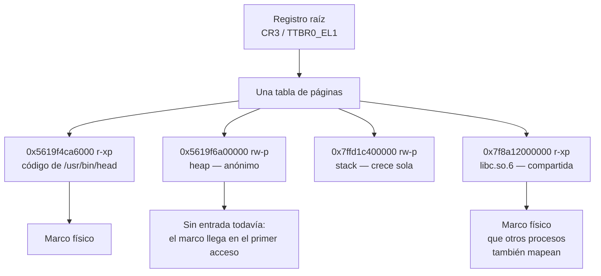

# Espacio de direcciones

> El conjunto de direcciones que un código **puede nombrar**, y a qué apunta cada una.
> Un proceso no tiene memoria: tiene un mapa.

Un espacio de direcciones es exactamente una [[Tabla-de-paginas|tabla de páginas]] —una raíz
y lo que cuelga de ella— vista desde arriba. Cambiar de espacio es cambiar un registro.

## Qué problema resuelve

"¿Cuánta memoria usa este proceso?" no tiene una sola respuesta, y eso no es un defecto de
las herramientas: es que la pregunta está mal hecha.

Un proceso que hace `mmap` de 1 GiB no consumió nada todavía. Dos procesos que cargaron la
misma biblioteca comparten los mismos marcos físicos, así que sumar sus tamaños cuenta la
biblioteca dos veces. Y la mitad alta de todo espacio es el kernel, que está en todos los
procesos y es uno solo.

Sin la noción de espacio de direcciones no se puede decir ninguna de esas tres cosas. Con
ella, cada una es obvia: **lo que un proceso tiene es un mapa, y el mapa no es el
territorio**. Preguntar "cuánta memoria usa" es preguntar por el territorio mirando el mapa.

## Cómo funciona

Un espacio es una lista de rangos. Cada rango tiene una dirección de inicio, un tamaño, unos
permisos y un **respaldo**: qué hay del otro lado. El respaldo puede ser RAM, un archivo, o
nada todavía.



Tres consecuencias que hay que tener claras:

- **La misma dirección virtual en dos espacios apunta a cosas distintas.** Un puntero no
  significa nada fuera de su espacio. Por eso un `printf("%p")` de dos procesos no se puede
  comparar.
- **Dos espacios pueden apuntar al mismo marco.** Ahí sale compartir bibliotecas y el
  *copy-on-write* de `fork`.
- **El kernel vive en el mismo espacio que el proceso**, en la mitad alta, para no tener que
  cambiar la raíz en cada [[Syscall|llamada al sistema]]. Eso es lo que Meltdown obligó a
  deshacer con KPTI. En aarch64 el reparto es más limpio: hay **dos** registros raíz,
  `TTBR0_EL1` para las direcciones bajas y `TTBR1_EL1` para las altas, así que el kernel
  tiene tabla propia sin compartir la del proceso.

## Cómo lo hace Linux

Cada proceso tiene un `mm_struct` con una lista de `vm_area_struct` — un nodo por rango, con
sus permisos y su respaldo. Los hilos de un proceso comparten el mismo `mm_struct`: eso
**es** la definición de hilo en Linux (ver [[Falsos-amigos#6]]).

La lista se lee así:

```bash
cat /proc/self/maps      # el mapa: `cat` mirándose a sí mismo
cat /proc/self/smaps     # el mismo mapa, con cuánto de cada rango está en RAM
pmap -x $$               # lo mismo, más legible
grep -E 'VmSize|VmRSS' /proc/self/status
```

Una línea de `/proc/self/maps` tiene seis campos:

```
5619f4ca6000-5619f4cad000 r-xp 00002000 103:02 263276    /usr/bin/head
└──────── rango ────────┘ └──┘ └──────┘ └────┘ └────┘    └─ respaldo ─┘
                       permisos  offset  disp.  inodo
```

| Campo | Cómo se lee |
|---|---|
| **Rango** | `[inicio, fin)`. El fin **no** pertenece al rango. Siempre alineados a [[Pagina\|página]]. |
| **Permisos** | `r`, `w`, `x`, y la cuarta letra: **`p` privado** (las escrituras no se ven afuera: copy-on-write) o **`s` compartido**. Un `-` es que no. |
| **Offset** | Desde qué byte del archivo empieza este rango. En los rangos anónimos es 0. |
| **Dispositivo** | `mayor:menor` del disco donde vive el archivo. `00:00` si no hay archivo. |
| **Inodo** | El del archivo. `0` si no hay. |
| **Respaldo** | La ruta, o `[heap]`, `[stack]`, `[vdso]`, `[vvar]`, o **vacío**: memoria anónima, que no viene de ningún lado. |

Lo que se aprende leyendo un mapa entero: un solo ejecutable aparece en tres o cuatro líneas
—`r--p` para las constantes, `r-xp` para el código, `rw-p` para las variables— porque cada
pedazo se mapea con permisos distintos. La granularidad de los permisos es la razón por la
que un binario chico ocupa varias líneas.

`smaps` agrega lo que `maps` no dice: `Size` es lo prometido, `Rss` lo que está en RAM de
verdad, y `Pss` reparte lo compartido entre quienes lo comparten. **`Pss` es la única
columna que se puede sumar** entre procesos sin contar dos veces.

## Cómo lo hace Kornelia

| | |
|---|---|
| **Decisiones** | D12 (identity map), D13 (un solo agente), D27 (dos vistas del mismo mapa) |
| **Dónde vive** | El plan en `kernel-core/src/paging.rs:30#pub const GIB: u64 = 1 << 30;`; los reclamos en `kernel-core/src/claims.rs:157#pub fn claim` |

**Hay un solo espacio de direcciones y es el identity map** (D12): virtual igual a física.
Todos los núcleos comparten la misma raíz —`core.claim` arranca núcleos, no espacios— y en
aarch64 la mitad alta ni se recorre: `TTBR1_EL1` está apagado a propósito
(`kernel-aarch64/src/paging.rs:224#EPD1: nadie camina por TTBR1`).

**Y no hay procesos** (D13), así que no hay `mm_struct` porque no hay a quién asignárselo.
Lo que hay es una **tabla de reclamos**, y no es lo mismo: no cambia lo que se puede nombrar,
anota quién pidió qué. Se mira con `describe {what:["claims"]}` y cada reclamo trae `handle`,
`start`, `bytes`, `kind`, `caching` y `user` — que es lo más parecido a `/proc/self/maps` que
hay acá, y **no** es un mapa: es un registro de pedidos.

La diferencia se nota en algo concreto: en Linux, lo que no está en tu mapa **no existe**
desde donde estás parado. Acá, con `exec raw`, el agente puede nombrar toda la máquina haya
reclamado o no — el reclamo es contabilidad, no una frontera. El kernel no está para impedir
lo que el agente decidió (P2).

**Pero el mapa tiene dos vistas, y la elige el agente.** Un bloque de 2 MiB marcado como
alcanzable sin privilegio es lo que hace posible `exec supervised` (D27); uno sin marcar no
se alcanza desde ahí. Así que el espacio *efectivo* de un código depende del privilegio con
el que el agente declaró que corre — y eso lo hace cumplir el hardware, no una política del
kernel (P6). El protocolo lo dice al pie: `exec supervised` sobre memoria sin marcar se
rechaza en vez de prometer algo que el hardware va a negar un microsegundo después.

**Y hay un cuarto interlocutor con espacio propio: el aparato.** Lo que un dispositivo puede
nombrar cuando hace DMA no lo define esta tabla sino el [[47-IOMMU-VT-d-y-SMMUv3|IOMMU]], y
arranca **vacío**: sin declarar nada con `dma.allow`, ningún aparato llega a la memoria (D8).
Son dos mapas distintos de la misma máquina. Ver [[Falsos-amigos#4]].

**Qué se quitó, y qué queda vacío en vez de reemplazado:** no hay reubicación, ni
copy-on-write, ni mapear un archivo, ni una pila que crezca sola, ni la mitad alta reservada
para el kernel. El agente que quiera un espacio propio arma tablas y las carga desde su
código, corriendo en `raw` — con el aviso de que si no mapea el kernel y el UART pierde el
cordón umbilical. La capa está vacía, no tapiada (P2).

## Cómo se ve roto

| Síntoma | Causa |
|---|---|
| En Linux: `VmSize` es enorme y `VmRSS` chiquito. | Están midiendo cosas distintas. `VmSize` es el mapa; `VmRSS` el territorio. Un `mmap` grande no toca memoria física hasta el primer acceso. |
| En Linux: sumás la memoria de todos los procesos y da más que la RAM instalada. | Estás contando lo compartido una vez por proceso. Sumá `Pss`, no `Rss`. |
| Un puntero válido en un proceso apunta a basura en otro. | La misma dirección virtual, distinto espacio. Un puntero no significa nada fuera del suyo. |
| Kornelia: `exec supervised needs memory claimed with user`. | El privilegio declarado y el permiso de la memoria no coinciden. Y **la misma página no puede ser las dos cosas**: una marcada para el agente deja de ser ejecutable con privilegio. |
| Kornelia: el agente cargó tablas propias y la máquina se quedó muda. | No mapeó el kernel ni el UART. La instrucción siguiente se busca en una dirección que ya no existe (D12). |
| Kornelia: `mem.claim` entregaría la pila del kernel. | Pasaría si la pila viviera en memoria que el mapa informa como libre. Por eso es un estático dentro de la imagen: `kernel-core/src/stack.rs:37#struct Stack`. |
| El agente alcanza una dirección pero el DMA que programó ahí no llega. | Ese acceso no pasa por esta tabla: pasa por el IOMMU, que es otro espacio de direcciones con otras tablas y arranca vacío (D8). |
| Un rango se entrega con la clase `unreported`. | La máquina nunca dijo qué hay ahí. Alcanzarlo no es enterarse (P4). Ver [[MMIO]] y [[18-Lo-que-la-maquina-no-dice]]. |

## Práctica

- [[P08-Leer-proc-self-maps]] — *(mirar)* leer el mapa entero de un proceso chico, encontrar las tres líneas del mismo ejecutable y explicar por qué son tres.
- [[P03-Ver-las-tablas-de-paginas]] — *(mirar/construir)* el mismo mapa un nivel más abajo: la tabla que lo implementa, en Linux y en Kornelia.

## Recordar #flashcards/conceptos

¿Qué es un espacio de direcciones?::El conjunto de direcciones que un código puede nombrar y a qué apunta cada una. Concretamente: una tabla de páginas vista desde arriba. Un proceso no tiene memoria, tiene un mapa.

¿Cómo se lee la cuarta letra de los permisos en `/proc/self/maps`?::`p` es privado —las escrituras no se ven afuera, copy-on-write— y `s` es compartido. Es lo que distingue un `mmap` de un archivo que otros ven de uno que solo ves vos.

¿Por qué no se pueden sumar los `Rss` de todos los procesos?::Porque lo compartido se cuenta una vez por proceso. La columna sumable es `Pss`, que reparte cada marco compartido entre quienes lo mapean.

¿Cuántos espacios de direcciones hay en Kornelia?::Uno, identity map, compartido por todos los núcleos (D12, D13). Pero tiene dos vistas: con privilegio se alcanza todo, sin privilegio solo los bloques marcados (D27) — y la vista la elige el agente, no el kernel (P6).

¿La tabla de reclamos de Kornelia es el equivalente de `/proc/self/maps`?::No. Es un registro de quién pidió qué, no un mapa de lo que se puede nombrar: en `exec raw` el agente alcanza toda la máquina haya reclamado o no. El reclamo es contabilidad, no frontera.

¿Un aparato que hace DMA usa el mismo espacio de direcciones que el procesador?::No. Usa el que le arma el IOMMU, con tablas propias, y en Kornelia arranca vacío: sin `dma.allow` no llega a ninguna parte (D8).

## Ver también

- [[Memoria-virtual]] · [[Tabla-de-paginas]] · [[Pagina]] · [[MMU]] · [[Modo-privilegiado]]
- [[28-Que-es-un-proceso-y-que-queda-sin-procesos]] · [[22-Identity-map-la-mentira-mas-simple]]
- [[Falsos-amigos#4]] — física, virtual, de bus e IOVA. · [[Falsos-amigos#6]] — proceso, hilo y tarea.
