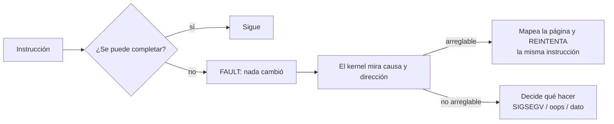

# Fault

> La excepción de la que **se puede volver**: la instrucción no se completó, pero el estado quedó exactamente como antes de intentarla.

Es una de las cinco palabras de [[Falsos-amigos#2]], y la que más importa: un fault se distingue de un abort en que se puede **reintentar la misma instrucción**. Todo P5 cuelga de esa diferencia.

## Qué problema resuelve

Que una instrucción falle no siempre significa que el programa esté mal. A veces significa que **falta algo que el kernel puede poner**.

El caso central es el **fallo de página**: el código toca una dirección que no está mapeada. Eso podría ser un puntero roto, sí — pero también podría ser memoria que el kernel prometió y todavía no entregó (memoria pedida y nunca tocada, una página que fue a swap, un archivo mapeado). Si "no está mapeada" fuera fatal, nada de eso existiría: ni `malloc` perezoso, ni `mmap`, ni copy-on-write, ni `fork` barato.

Así que el silicio ofrece un trato: **te aviso antes de romper nada**. La instrucción no ocurrió. Si arreglás la causa, la reintento y nadie se entera.

## Cómo funciona

La garantía es del hardware, no del software, y es lo que hace posible todo lo demás:

> [!important] El silicio garantiza que el fault no alcanzó a cambiar nada
> Ni registros, ni memoria, ni banderas. Por eso se puede reintentar **la misma** instrucción. Un **abort** no da esa garantía —el estado quedó incierto— y por eso no se puede volver de forma confiable.

Lo que el hardware entrega cuando ocurre:

| | x86_64 | aarch64 |
|---|---|---|
| Qué pasó | El **vector**: 14 es page fault, 6 opcode inválido, 0 división por cero | El **EC** del `ESR_EL1` |
| Detalle | Un *error code* apilado: si fue lectura o escritura, si venía de usuario | El **ISS** del `ESR_EL1` |
| Dónde pasó | El `RIP` apilado en el marco | `ELR_EL1` |
| Qué dirección se tocó | `CR2` | `FAR_EL1` |

Y el flujo:



La rama de abajo es una **decisión de diseño**, no una consecuencia. El hardware no obliga a matar a nadie: se limitó a avisar.

## Cómo lo hace Linux

Linux usa la rama de arriba todo el tiempo, y casi nunca lo notás. Cada `malloc` grande, cada `mmap`, cada `fork`: memoria prometida que se materializa recién cuando la tocás.

```bash
/usr/bin/time -v ./mi-programa   # "Minor (reclaiming a frame) page faults: 12345"
ps -o min_flt,maj_flt,cmd -p $$
perf stat -e page-faults,minor-faults,major-faults ./mi-programa
```

- **Minor fault** — la página se resolvió sin tocar disco (se puso una nueva en cero, o ya estaba en la [[Cache|caché]] de páginas). Son millones y son normales.
- **Major fault** — hubo que ir al disco. Son los caros.

Cuando la rama de abajo se activa en espacio de usuario, es un `SIGSEGV` — que, dicho sea de paso, casi nunca tiene que ver con segmentos: el nombre quedó de un esquema de memoria muerto ([[Falsos-amigos#5]]). Y cuando se activa **dentro del kernel**, es un `oops`:

```
BUG: unable to handle kernel paging request at ffffffffc0123456
```

Ahí Linux mata la tarea, marca el kernel como contaminado y **la máquina sigue, inestable**. Ver [[Oops-y-panic]].

## Cómo lo hace Kornelia

| | |
|---|---|
| **Decisiones** | D7 (faults estructurados), D11 (el kernel no deshace, pero cuenta) |
| **Principios** | **P5 — los faults son datos, no muerte**; P4 (los números crudos viajan sin traducir); P2 |
| **Dónde vive** | `kernel-core/src/fault.rs:24#pub enum Cause`, `kernel-core/src/fault.rs:73#pub struct Fault`, `kernel-core/src/protocol.rs:1693#fn write_outcome` |

El agente **es un generador estocástico de código máquina**: va a estar mal seguido. Si el error se lleva puesta la máquina, el agente no se entera de nada y no puede corregir. Si el error vuelve como un dato, es una iteración más. Toda la nota cabe en esa frase.

Así que un `exec` que falla **contesta**, con `ok: true` — el pedido se atendió; que el código haya fallado es su resultado, no un fallo del pedido (`kernel-core/src/protocol.rs:1654#es su resultado, y va adentro`). La respuesta trae:

- **`cause`** normalizada a algo que significa lo mismo en toda arquitectura (`page-fault`, `invalid-opcode`, `divide-by-zero`, `protection`…).
- **`raw` y `detail`** — los números que usó **esta** máquina, sin traducir. Si el kernel no sabe qué significan, la causa es `unknown` y los números viajan igual: no se le inventa significado (P4).
- **`pc`** y **`address`**, cuando la causa la tiene.
- **`registers`**, con los nombres de esta máquina (D3). Ver [[Registro]].

Y un cuarto campo que **no** es un fault: **`cancelled`**. Si el código no volvió y venció el `deadline_ms` que el agente declaró, se lo corta y vuelve por el mismo camino, pero marcado aparte a propósito: *el código no hizo nada mal, se lo cortaron*, y para el que depura eso es información distinta (`kernel-core/src/fault.rs:162#pub struct Outcome`).

**Lo que el kernel no hace: deshacer.** D11 es tajante y la razón es física, no económica:

> [!important] El rollback verdadero es imposible, no caro
> Un [[DMA]] que ya salió **escribió**. Un registro de GPU ya escrito **cambió el [[Aparato|aparato]]**. Prometer atomicidad sería mentir, y un agente que confía en una atomicidad falsa decide peor que uno que sabe que no la tiene. Si quiere rollback, se lo construye con `mem.read` y `mem.write` (P2).

Dos detalles de implementación que valen por sí solos:

1. **Se puede volver incluso destruyendo el puntero de pila**, porque las excepciones entran en una pila aparte: IST en x86_64, `SP_EL1` en aarch64. Sin eso, romper `RSP` y después fallar escalaba a doble y triple fault. Ver [[31-La-pila-que-sobrevive]].
2. **`Cause::resumable`** dice si tiene sentido seguir después: solo un breakpoint, que es un alto pedido a propósito. Lo demás volvería a fallar en la misma instrucción, para siempre (`kernel-core/src/fault.rs:66#pub fn resumable`). Eso es exactamente la diferencia entre fault y trap.

Y P5 no se cumple solo por existir el mecanismo de `exec`: **el kernel también toca memoria que puede fallar.** `mem.read` y `mem.write` corren en el camino del protocolo, donde no había punto de recuperación, y en aarch64 leer con el ancho equivocado dejaba la máquina muda. Ahora van con el mismo punto que usa `exec`, armado alrededor de **una sola instrucción**, y el rechazo vuelve como `access-refused`. Ver [[33-Recuperar-un-acceso-que-el-bus-rechaza]] y [[MMIO]].

## Cómo se ve roto

| Síntoma | Causa |
|---|---|
| Silencio total, ni una letra. | **Bucle de faults**: el [[Handler|handler]] de excepciones provoca la misma excepción. Caso real: `CPACR_EL1` en cero deja los registros SIMD atrapados, el compilador usa registros anchos para copiar structs, y el handler repite la falla al copiar la suya. |
| La máquina se reinicia sola en vez de reportar. | Triple fault en x86: falló el fault, falló el doble fault, el CPU se rinde. Casi siempre la pila de excepciones. |
| El fault vuelve con la causa correcta y la dirección en cero. | La arquitectura no llenó el campo para esa causa (no toda excepción tiene "dirección tocada"), o se leyó `CR2`/`FAR_EL1` después de que otra cosa lo pisara. |
| El fault informa un registro con el nombre de otro. | El orden de `REGISTERS` y el orden en que el ensamblador apila los valores se desincronizaron. Ya pasó, en aarch64. |
| Vuelve `cancelled` en vez de `faulted`. | No es un error: el código no volvió a tiempo y venció el plazo que el agente declaró. |

## Práctica

- [[P09-Provocar-un-fault-y-leerlo-como-dato]] — *(construir)* subir código con una división por cero y con un puntero roto, y leer las dos respuestas. Después, `./scripts/client.py --recover`, que corta un núcleo cuyo código no vuelve.
- [[P02-Provocar-y-leer-un-oops-en-una-VM]] — *(romper)* el mismo error, del lado de Linux, y comparar qué te queda en la mano.

## Recordar #flashcards/conceptos

¿Qué distingue un fault de un abort?::Que el silicio garantiza que el fault no alcanzó a cambiar nada, así que la misma instrucción se puede reintentar. El abort dejó el estado incierto.

¿Cuál es el fault útil por excelencia?::El fallo de página. Sin él no existirían el `malloc` perezoso, el `mmap`, el copy-on-write ni el `fork` barato: "no está mapeada" es una promesa que el kernel todavía no cumplió, no un error.

¿Qué es un minor fault y qué un major fault en Linux?::El minor se resuelve sin tocar disco (página nueva en cero, o ya en la caché de páginas). El major va al disco y es el caro. Se ven con `/usr/bin/time -v` o `perf stat -e page-faults`.

¿Por qué D11 dice que el kernel no deshace nada?::Porque el rollback verdadero es **imposible, no caro**: un DMA que ya salió escribió, un registro de GPU ya escrito cambió el aparato. Prometer atomicidad sería mentir.

En Kornelia, ¿por qué un `exec` que falla responde con `ok: true`?::Porque el pedido **se atendió**. Que el código del agente haya fallado es el resultado del pedido, no un fallo del pedido — y el fault va adentro de la respuesta (P5).

¿Qué significa `cancelled` y por qué va aparte de `faulted`?::Que el código no volvió antes del plazo que el agente declaró y se lo cortó. Va aparte a propósito: el código no hizo nada mal, y para el que depura eso es información distinta.

¿Por qué se puede reportar un fault aunque el código haya destruido el puntero de pila?::Porque las excepciones entran en una pila aparte: IST en x86_64, `SP_EL1` en aarch64. Sin eso, el marco se apila sobre la pila rota y escala a doble y triple fault.

## Ver también

- [[Oops-y-panic]] · [[Registro]] · [[Modo-privilegiado]] · [[Interrupcion]]
- [[Falsos-amigos#2]] — interrupción, excepción, trap, fault, abort.
- [[31-La-pila-que-sobrevive]] · [[33-Recuperar-un-acceso-que-el-bus-rechaza]] · [[39-Plazos-y-cortes]]
