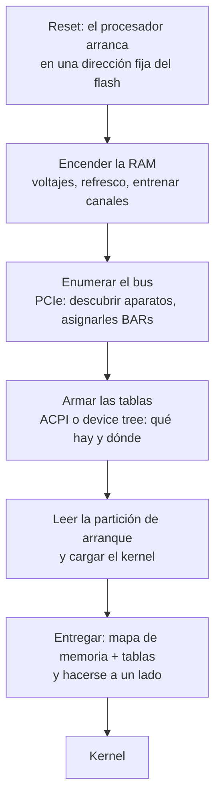

# Firmware

> El código que **ya venía en la máquina**. Corre antes que cualquier sistema operativo, deja el hardware en un estado usable, y después cuenta lo que encontró.

Es el eslabón que ningún libro de kernels puede saltear: cuando tu código empieza a correr, alguien ya hizo un trabajo enorme, y de la calidad de ese trabajo —y de sus mentiras— dependen las primeras mil líneas de cualquier kernel.

## Qué problema resuelve

Al soltar el botón de encendido, **la RAM no anda**. No es una figura: un chip de DDR necesita que alguien le programe voltajes, refresco y decenas de retardos, y que después *entrene* cada canal —mandar patrones y mover la ventana de muestreo hasta que los bits vuelvan enteros—. Antes de eso no hay dónde guardar una variable.

Y ahí está el huevo y la gallina: **el código que enciende la RAM no puede vivir en la RAM.** Se resuelve corriendo desde el chip de flash del motherboard, con la caché del procesador configurada como si fuera memoria (*cache-as-RAM*) para tener unos KB donde apoyar una pila.

Aparte de eso hay un segundo problema, más aburrido y más grande: **la variedad**. Cada motherboard tiene otro chipset, otros módulos de memoria, otros retardos. Si el kernel tuviera que saber todo eso, sería un kernel por motherboard. El firmware existe para que el kernel pueda empezar en una máquina que ya está prendida y **preguntarle cómo es**.

## Cómo funciona



Los cuatro pasos del medio son los que el kernel **no repite**. Sobre todo el tercero: un aparato PCIe no elige su dirección, se la asignan escribiéndole los [[BAR|BARs]], y quien la asigna es el firmware. El kernel se entera leyendo.

### Dos cosas distintas que se llaman igual

| Cuál | Dónde vive | Quién lo ve |
|---|---|---|
| **Firmware de la máquina** | Un chip de flash en el motherboard. Es [[UEFI]] hoy, BIOS antes, y también coreboot o U-Boot. | Corre, entrega la máquina y se aparta. El kernel lo trata como un servicio con horario de atención. |
| **Firmware de un aparato** | Adentro del aparato: la controladora del SSD, la placa de red, la GPU, el Intel ME. | **Nunca se aparta.** Corre en paralelo al kernel, todo el tiempo, y el kernel no lo puede inspeccionar. |

Y hay un tercer caso que confunde a propósito: **firmware que el kernel le carga al aparato en cada arranque**, porque el aparato viene con la memoria vacía para abaratarlo. En Linux eso es `/lib/firmware`, y son archivos binarios que el driver empuja al aparato antes de usarlo. Se los llama "blobs", igual que el `blob.bin` de Kornelia, y **no tienen nada que ver**: ver [[51-El-blob-y-la-ventana-de-rescate]].

## Por qué no se le puede creer todo

El firmware informa un mapa de memoria física. Ese mapa **está incompleto por construcción**, y no por descuido:

1. **Informa lo que configuró, no lo que hay.** Un rango que él no tocó puede no aparecer. El caso concreto de este proyecto: en aarch64 la ventana de configuración de PCIe **no está en el mapa de UEFI**, aunque la tabla MCFG de [[ACPI]] diga exactamente dónde está.
2. **Deja huecos donde viven los [[BAR|BARs]].** Direcciones que responden a un aparato y que el mapa no menciona. Alcanzarlas no es lo mismo que saber qué hay.
3. **Dice "libre" sobre memoria que no lo es del todo.** En UEFI, `BootServicesData` pasa a libre recién *después* de salir — y la pila sobre la que corre el propio código de arranque suele salir de ahí.
4. **Tiene bugs, y son famosos.** Linux mantiene tablas enteras de *quirks* indexadas por fabricante y modelo para desmentir a firmwares concretos.

De acá sale **P4** ("la máquina se describe a sí misma; el agente no asume nada"), y de paso su límite: P4 dice que hay que preguntarle a la máquina en vez de suponer, **no** que lo que la máquina contesta sea completo. Un kernel honesto tiene que poder decir "esto no me lo dijo nadie". Ver [[18-Lo-que-la-maquina-no-dice]].

## Cómo lo hace Linux

El mapa que el firmware entrega en x86 se llama `e820`, y sale crudo en el diario del arranque:

```bash
sudo dmesg | grep -iE 'BIOS-e820|efi:'    # el mapa, tal como lo dio el firmware
sudo cat /proc/iomem                       # el mapa ya digerido, con los aparatos adentro
ls /sys/firmware/                          # acpi/ dmi/ efi/ devicetree/, según la máquina
sudo dmidecode -t bios -t system           # qué firmware es, versión y fecha
```

Adentro del kernel, `arch/x86/kernel/e820.c` lo recibe y lo sanea: hay funciones dedicadas a **recortar** rangos que el firmware informó mal. Los quirks entran por `dmi_check_system`, que compara fabricante y modelo contra una lista y prende parches.

Y para el otro sentido de la palabra:

```bash
fwupdmgr get-devices        # firmware de aparatos actualizable
ls /lib/firmware/           # los binarios que el kernel le carga a los aparatos
sudo dmesg | grep -i 'firmware'
```

## Cómo lo hace Kornelia

| | |
|---|---|
| **Decisiones** | D25 (todo se le pide en una ventana), D24 (el entorno de arranque es un eje propio) |
| **Dónde vive** | `boot-uefi/src/lib.rs:632#unsafe fn normalize`, `boot-uefi/src/lib.rs:662#fn classify`, `boot-uefi/src/lib.rs:497#unsafe fn add_pcie_window` |

Todo el trato con el firmware está en un solo crate, `boot-uefi/`, que **no lleva `asm!` ni `target_arch`**: cómo se le pide el mapa de memoria varía por entorno de arranque, no por arquitectura, y el formato del mapa no varía por ninguno de los dos (D24).

Cuatro cosas que hace, y las cuatro son desconfianza aplicada:

1. **Traduce en vez de copiar.** Los quince tipos de memoria de UEFI se pasan a un vocabulario chico y propio (`classify`): libre, del kernel, del firmware, MMIO, rota, tablas de ACPI. El comentario al lado de `BootServicesCode/Data` deja anotado que son libres *porque ya salimos*, y que la pila del arranque sale de ahí.
2. **La cacheabilidad la toma del atributo, no de la clase.** UEFI informa región por región qué modos de caché soporta, y eso es más preciso que deducirlo (`boot-uefi/src/lib.rs:711#fn caching_of`).
3. **Corrige el mapa donde el firmware calló.** La ventana de configuración de PCIe se agrega al mapa desde la MCFG cuando el firmware no la informó, **antes de que nadie lo lea**. Sin eso, el kernel publicaba una dirección que él mismo hacía inalcanzable —o sea, el kernel era la razón por la que no se podía usar un aparato, que es exactamente lo que prohíbe P1.
4. **Se reserva lo que necesita, en el mapa.** La página baja por la que pasa el trampolín que arranca los otros núcleos está marcada libre por el firmware (`boot-uefi/src/lib.rs:544#pub unsafe fn reserve_for_kernel`). Se arregla en el mapa y **no** con un chequeo al reclamar, porque un chequeo haría que `describe memory` diga "libre" sobre algo que `mem.claim` rechaza: dos respuestas distintas a la misma pregunta.

Y lo que cae en un hueco del mapa no se disfraza: se entrega con la clase `unreported`, que **no es `mmio`** (`kernel-core/src/memory.rs:131#Kind::Unreported`). El agente se lleva el rango y la advertencia de que la máquina nunca dijo qué hay ahí.

**Qué se quitó:** no hay tabla de quirks —una lista de firmwares mentirosos es exactamente el tipo de política que P6 le deja al agente—, no hay drivers de firmware de aparatos, y **los Runtime Services de UEFI no se usan nunca**: el campo existe en la estructura sólo para que los desplazamientos de los demás den bien (`boot-uefi/src/lib.rs:87#runtime_services`). Después de `ExitBootServices` el firmware, para este kernel, dejó de existir.

## Cómo se ve roto

| Síntoma | Causa |
|---|---|
| El aparato aparece en el bus pero su BAR es inalcanzable. | El firmware no puso ese rango en el mapa. En aarch64 pasaba con la ventana de configuración entera. |
| `mem.claim` entrega memoria que el kernel estaba usando. | El mapa la informa libre y lo es *para el firmware*: la pila del arranque, o la página del trampolín. |
| Anda en tu máquina y no en la de al lado, con el mismo binario. | Otro firmware. Otra versión del mismo firmware alcanza. Es la razón de ser de los quirks. |
| Un rango responde valores raros y no está en el mapa. | Es un hueco donde vive un BAR. Alcanzarlo no es enterarse de qué es: por eso existe `unreported`. |
| El kernel arranca, imprime, y muere al tocar algo del firmware. | Se llamó un Boot Service después de `ExitBootServices`. Ver [[UEFI]]. |
| El aparato existe pero no hace nada, y `dmesg` habla de un archivo faltante. | Firmware **del aparato** que el kernel tenía que cargarle y no encontró en `/lib/firmware`. Otro sentido de la palabra. |

## Práctica

- [[P01-Preguntarle-a-Linux-que-maquina-es]] — *(mirar)* `dmesg | grep e820`, `/proc/iomem`, `/sys/firmware/`, `dmidecode`.
- [[P13-Comparar-el-mapa-del-firmware-con-la-realidad]] — *(mirar)* poner lado a lado el `e820` crudo y `/proc/iomem`, y encontrar un BAR que el mapa no menciona.

## Recordar #flashcards/conceptos

¿Por qué el código que enciende la RAM no puede vivir en la RAM?::Porque antes de entrenar los canales de memoria no hay dónde guardar una variable. Corre desde el flash del motherboard, con la caché del procesador configurada como memoria (cache-as-RAM).

¿Qué hace el firmware que el kernel no repite?::Entrenar la memoria, enumerar el bus PCIe y **asignarles los BARs a los aparatos**, y armar las tablas que describen la máquina. Un aparato no elige su dirección: se la asignan.

¿Por qué el mapa de memoria del firmware está incompleto?::Porque informa lo que él configuró, no lo que hay. Los BARs que no listó quedan como huecos, y hay memoria que informa libre y no lo es del todo (la pila del propio arranque).

Firmware de la máquina contra firmware de un aparato: ¿en qué se diferencian?::El de la máquina entrega el hardware y se aparta. El del aparato —SSD, placa de red, ME— no se aparta nunca: corre en paralelo al kernel y el kernel no lo puede inspeccionar.

¿Qué dice P4 y qué **no** dice?::Dice que la máquina se describe a sí misma y que no hay que suponer nada sobre ella. No dice que lo que contesta sea completo: por eso Kornelia tiene la clase `unreported`.

¿Por qué Kornelia arregla el mapa en vez de chequear al reclamar?::Porque un chequeo haría que `describe memory` diga "libre" sobre algo que `mem.claim` rechaza — dos respuestas distintas a la misma pregunta.

## Ver también

- [[UEFI]] · [[ACPI]] · [[Device-tree]] · [[BAR]] · [[PCIe]]
- [[11-Reset-vector-firmware-BIOS-y-UEFI]] — la cadena completa desde el reset.
- [[18-Lo-que-la-maquina-no-dice]] — huecos y `unreported`, que son el límite de P4.
