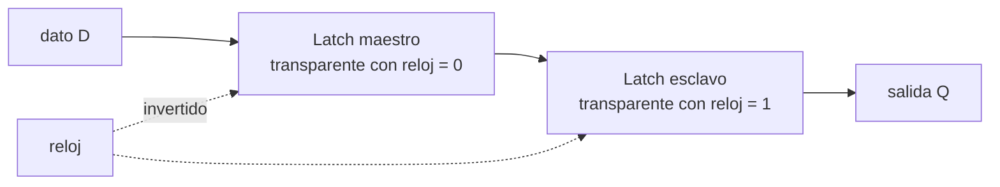

# Flip-flop

> El circuito más chico que se acuerda de algo: dos llaves conectadas en círculo, que se
> sostienen mutuamente en uno de dos estados estables.

Es la pieza que falta para que el [[01-El-reloj-y-el-transistor|capítulo 01]] cierre. Ahí
se dice que "dos llaves conectadas en círculo se acuerdan de algo" y se sigue de largo; esta
nota es esa frase abierta, porque de acá salen tres cosas que se usan en todo el libro: qué
es un [[Registro|registro]], por qué existe un reloj, y por qué el reloj tiene un techo.

## Qué problema resuelve

Un circuito lógico común —un sumador, un comparador— **no se acuerda de nada**. Le entran
señales, salen otras, y si las de entrada cambian, las de salida cambian atrás. Es una
función, no una memoria. Se lo llama *combinacional*: la salida es una combinación de las
entradas de **este** instante.

Con eso solo no se puede hacer una computadora. Se puede hacer una calculadora que hace una
cuenta mientras le sostenés los números con la mano, y nada más. Para que haya un
*programa* —un paso que depende del anterior— hace falta que algo **quede**.

El truco que resuelve esto es una sola idea: **realimentación**. Hacer que la salida vuelva
a la entrada.

## Cómo funciona

### 1. El biestable: dos inversores mordiéndose la cola

Un **inversor** es el circuito más simple que existe: entra 1, sale 0; entra 0, sale 1.
Poné dos en círculo, la salida de cada uno a la entrada del otro:

![[latch-dos-inversores.svg]]

Mirá el estado A: el primer inversor recibe 0, así que emite 1. El segundo recibe ese 1 y
emite 0. Y ese 0 es justamente lo que estaba entrando al primero. **Se sostiene solo.**

El estado B es igual de estable, con todo al revés. Y no hay ninguna ley que elija entre los
dos: el circuito se queda en el que lo dejaste. Eso es acordarse. En dos inversores —cuatro
transistores— hay un bit.

Se llama *biestable* por las dos posiciones estables, y es la razón de que la memoria sea
binaria: no es que el 0 y el 1 sean elegantes, es que **dos es la cantidad de posiciones
estables que tiene un circuito así**.

> [!warning] Falta lo importante: así no se puede escribir
> Ese anillo se acuerda perfecto y es inútil, porque no hay por dónde meterle un valor
> nuevo. Todo lo que sigue es agregarle una puerta de entrada sin perder la propiedad de
> sostenerse.

### 2. El latch SR: la primera puerta de entrada

Se reemplazan los inversores por compuertas **NOR** de dos entradas (un NOR es un inversor
al que le sobra una pata: si cualquiera de sus entradas es 1, la salida es 0). Esa pata que
sobra es la puerta.

| S | R | Qué pasa |
|---|---|---|
| 0 | 0 | **Se acuerda.** Queda como estaba: es el anillo de arriba. |
| 1 | 0 | *Set*: pone Q en 1. |
| 0 | 1 | *Reset*: pone Q en 0. |
| 1 | 1 | **Prohibido.** Las dos salidas se van a 0 y dejan de ser opuestas; al soltar, el estado que queda depende de cuál pata se soltó primero — o sea, del azar. |

Esa última fila es la primera aparición en el libro de algo importante: **hay combinaciones
que el hardware acepta y que no significan nada**. No hay un error; hay un resultado que
depende de tiempos. Es la misma familia de problemas que las
[[42-Ordenamiento-de-memoria|carreras entre núcleos]], varios pisos más abajo.

### 3. El latch D: un dato y un permiso

Tener dos patas (*poné 1*, *poné 0*) es incómodo y permite el estado prohibido. La solución
es derivar las dos de un solo dato: `S = D`, `R = no D`. Ahora hay una entrada de dato (D) y
una de permiso (*enable*):

- Con el permiso en 1, la salida **sigue** al dato. Se dice que el latch está *transparente*.
- Con el permiso en 0, se acuerda del último valor.

Y acá aparece la incomodidad final: mientras el permiso está alto, cualquier cambio del dato
pasa. Si el resultado de una etapa vuelve a entrar en la misma etapa, **puede dar dos o tres
vueltas en un solo pulso de permiso**. Es sensible al **nivel** de la señal, y un nivel dura
un rato.

### 4. El flip-flop D: capturar en el flanco, no durante el nivel

La solución es poner **dos latches D en cascada**, con el permiso invertido entre uno y otro
(*maestro-esclavo*):



Nunca están los dos transparentes a la vez. Mientras el reloj está en 0 el maestro copia el
dato y el esclavo no muestra nada nuevo; cuando el reloj sube, el maestro se cierra —congela
lo que había **en ese instante**— y el esclavo lo deja pasar a la salida.

El resultado es que **el dato se captura en el flanco**, un evento sin duración, en vez de
durante un nivel que dura. Eso es un flip-flop D disparado por flanco, y es la pieza con la
que está hecho todo lo secuencial de un procesador. Es exactamente la regla que enuncia el
[[01-El-reloj-y-el-transistor|capítulo 01]]: *los resultados se guardan solo en el flanco de
subida*.

### 5. Setup y hold: por qué el reloj tiene un techo

Un flip-flop no captura por arte de magia: sus transistores necesitan que el dato esté
**quieto** un ratito antes del flanco (*setup*) y un ratito después (*hold*).

De ahí sale, en una línea, el límite de la frecuencia:

> El período del reloj tiene que ser al menos: lo que tarda un flip-flop en sacar su valor,
> más lo que tarda la lógica combinacional entre medio, más el *setup* del siguiente.

Subir la frecuencia sin acortar el camino combinacional viola el *setup*, y ahí no pasa que
"anda más lento": pasa que **un bit sale mal, a veces**. Esa es toda la teoría del
overclocking y de por qué su síntoma es la inestabilidad aleatoria y no la lentitud.

### 6. Metaestabilidad

¿Y si el dato cambia justo en el flanco? El flip-flop puede quedar un rato **entre 0 y 1**:
ni un valor ni el otro, con la salida en un voltaje intermedio o oscilando, hasta que cae
para algún lado. Se llama *metaestabilidad*, y el tiempo que dura no tiene cota garantizada:
solo una probabilidad que baja muy rápido.

No es una curiosidad académica: **pasa siempre que una señal cruza entre dos relojes
distintos**. Y en esta máquina hay más de un reloj — el [[UART]] tiene el suyo (por eso se
configura una velocidad en baudios) y no está sincronizado con el del procesador. Por eso
las señales que cruzan pasan por dos flip-flops en fila (un *sincronizador*): el primero
puede quedar metaestable, y se le da un ciclo entero para que se decida antes de que alguien
mire el segundo.

## Cómo se relaciona con lo que ya viste

| | Hecho de | Cuánto cuesta | Se olvida |
|---|---|---|---|
| **Un [[Registro\|registro]] del procesador** | Flip-flops D, uno por bit, todos con el mismo reloj | ~20 transistores por bit | No, mientras haya corriente |
| **Una celda de [[Cache\|caché]] (SRAM)** | Un biestable de 6 transistores, sin la maquinaria del flanco | 6 transistores por bit | No, mientras haya corriente |
| **Una celda de RAM (DRAM)** | **No es un biestable**: un capacitor y un transistor | 1 transistor por bit | **Sí**: la carga se escapa, hay que refrescarla cada pocos milisegundos |

Esta tabla explica de una sola vez la [[Jerarquia-de-memoria|jerarquía de memoria]]. Un
registro de 64 bits son 64 flip-flops en paralelo, carísimos y pegados a la unidad
aritmética: por eso hay dieciséis y no dieciséis mil. La DRAM cuesta un transistor por bit,
por eso hay gigabytes — y por eso es lenta y **se olvida**, que es lo que hace que "la
memoria es volátil" sea un hecho físico y no una convención.

## Cómo lo hace Linux

No aplica: esto es silicio, abajo de todo software. Lo que sí se ve desde arriba:

```bash
sudo dmidecode -t memory | grep -iE "type|speed"   # que clase de DRAM tenes
lscpu -C                                            # cuanta SRAM (cache) hay
```

Y el refresco de la DRAM es medible: forma parte de los ~250 ciclos que cuesta un acceso a
RAM en [[P02-Medir-el-reloj-y-las-latencias]]. Un acceso puede caer justo cuando el banco se
está refrescando y esperar.

## Cómo lo hace Kornelia

No aplica tampoco: ningún kernel administra flip-flops. Pero hay un hilo directo que vale la
pena ver, porque cierra el círculo entre este nivel y el protocolo:

**El estado que Kornelia devuelve en un [[Fault|fault]] son literalmente los flip-flops del
núcleo.** Cuando el código del agente se rompe y el kernel contesta con los registros más la
causa, lo que viaja por el cable es el contenido de unos cientos de biestables, copiado. Que
eso quepa en un mensaje —y que por lo tanto P5 sea posible— es una consecuencia de que el
estado visible de un procesador sea chico, y es chico porque cada bit cuesta veinte
transistores.

## Cómo se ve roto

| Síntoma | Causa |
|---|---|
| Una máquina overclockeada falla al azar, en cosas distintas cada vez. | Violación de *setup*: la lógica no llega a asentarse antes del flanco. No se rompe: **un bit sale mal, a veces**. |
| Un dato que cruza entre dos relojes llega corrupto muy de vez en cuando. | Metaestabilidad sin sincronizador. La probabilidad es baja, así que aparece cada millones de eventos: el peor tipo de bug. |
| La RAM pierde datos cuando la máquina se calienta. | El refresco de la DRAM no llega a tiempo: el capacitor se descarga más rápido en caliente. |
| Un circuito con SR queda en un estado impredecible. | Se le puso `S = R = 1` y se soltó; el estado final dependió de cuál pata se soltó primero. |

## Práctica

- [[P06-Simular-un-latch-y-ver-sus-dos-estados]] — *(construir)* cuarenta líneas de Python que simulan el anillo de dos inversores y el latch SR, y muestran los dos estados estables y el prohibido.

## Recordar #flashcards/conceptos

¿Por qué la memoria es binaria?::Porque un circuito realimentado tiene **dos** posiciones estables. No es que el 0 y el 1 sean elegantes: dos es la cantidad de estados en que un anillo de dos inversores se sostiene solo.

¿Qué le falta a dos inversores en círculo para ser útil?::Una forma de escribirle. Se acuerda perfecto pero no hay por dónde meter un valor nuevo; todo lo que sigue (latch SR, latch D, flip-flop) es agregarle una puerta de entrada sin perder la realimentación.

¿Diferencia entre un latch y un flip-flop?::El latch es sensible al **nivel**: mientras el permiso está alto, la salida sigue al dato, y un nivel dura un rato. El flip-flop captura en el **flanco**, que es un instante, y se construye con dos latches en cascada con el reloj invertido entre ellos.

¿Qué son setup y hold?::El tiempo que el dato tiene que estar quieto antes y después del flanco para que el flip-flop lo capture bien. De ahí sale el techo de la frecuencia: período ≥ salida del flip-flop + lógica combinacional + setup del siguiente.

¿Qué pasa si el dato cambia justo en el flanco?::Metaestabilidad: el flip-flop queda entre 0 y 1 por un tiempo sin cota garantizada. Pasa siempre que una señal cruza entre dos relojes distintos, y se mitiga con dos flip-flops en fila.

¿Por qué hay 16 registros y no 16.000?::Porque cada bit de registro son unos 20 transistores de flip-flop pegados a la unidad aritmética. Una celda de SRAM son 6 y una de DRAM es 1 transistor más un capacitor — y por eso la DRAM se olvida y hay que refrescarla.

¿Por qué el síntoma del overclocking es inestabilidad aleatoria y no lentitud?::Porque viola el tiempo de setup: la lógica no se asienta antes del flanco y **un bit sale mal, a veces**. El circuito no tiene forma de "ir más lento": captura lo que haya.

## Ver también

- [[01-El-reloj-y-el-transistor]] — de dónde viene esta nota.
- [[Registro]] · [[Cache]] · [[Jerarquia-de-memoria]]
- [[42-Ordenamiento-de-memoria]] — el mismo problema (un resultado que depende de tiempos), varios pisos más arriba.
