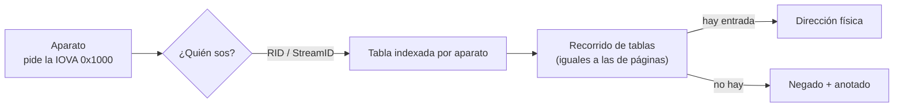

# IOMMU

> Una [[MMU]] para los aparatos: se mete entre el aparato y la RAM, **traduce** la dirección
> que el aparato pide y **niega** la que nadie declaró.

*Input/Output Memory Management Unit.* La idea es la misma que la de la MMU del procesador
—un nivel de indirección por acceso, hecho por hardware, que además puede decir que no— pero
del otro lado del bus, con otras tablas y otro formato.

## Qué problema resuelve

Un [[DMA]] no pasa por la MMU. Eso deja tres cosas sin resolver, y ninguna se puede arreglar
en el software del procesador, porque el procesador no participa del acceso:

1. **Un puntero mal puesto en un registro de aparato es corrupción silenciosa.** No hay
   fault: el DMA ocurre en el lugar equivocado y la máquina sigue. El síntoma aparece lejos
   de la causa, y horas después.
2. **Cualquier aparato puede leer toda la RAM.** No hace falta que sea malicioso de fábrica:
   alcanza con que alguien enchufe algo en un puerto que hable PCIe.
3. **Un aparato de 32 bits no alcanza la RAM alta.** Sin traducción, la única salida es
   copiar (los *bounce buffers* de Linux).

El IOMMU resuelve las tres con el mismo mecanismo. La dirección que emite el aparato deja de
ser física y pasa a ser una **IOVA** ([[Falsos-amigos#4]]), que unas tablas traducen — y lo
que no está en las tablas se niega.

## Cómo funciona



Tres cosas de ese dibujo:

- **La identidad del aparato viene en el pedido.** El bus le pone un número a cada
  transacción, y ese número es el índice de la primera tabla. En PCIe es el mismo BDF de
  siempre. Un aparato no puede hacerse pasar por otro porque no es él quien pone el número.
- **Cada aparato puede tener su propia vista de la memoria.** Dos aparatos que piden la
  dirección `0x1000` pueden terminar en dos lugares distintos, o uno pasar y el otro no.
- **Lo negado queda anotado.** No se pierde: el silicio lo cuenta y guarda la dirección. Eso
  es lo que hace que el IOMMU sea tanto instrumentación como protección — un agente que
  depura su propio driver se entera de a dónde apuntó mal.

### VT-d y SMMUv3: hacen lo mismo y no se parecen en nada

Este es el mejor argumento concreto de D22 —las dos arquitecturas siempre en verde—: no es
portabilidad, es que escribir los dos obliga a separar la idea de la forma.

| | **VT-d** (Intel, x86_64) | **SMMUv3** (ARM, aarch64) |
|---|---|---|
| Cómo se le habla | **Por registros.** Se escribe y se espera a que un bit de estado confirme. | **Por colas en memoria.** Se deja un comando en un anillo y se toca el registro que dice hasta dónde escribimos. Hay un productor y un consumidor. |
| Cómo se lo indexa | Tabla raíz **por bus** → tabla de contexto **por función** → tablas de traducción. | Tabla de **streams** en dos niveles, indexada por el `StreamID` que el bus le pone al aparato. Cada entrada son 64 bytes. |
| Invalidar la caché | Una escritura a un registro y esperar. | Un comando en el anillo, más uno de sincronización. |
| Qué se enteró de lo que negó | Registros de fault. | Una **cola de eventos** en memoria. |
| Dónde lo dice la máquina | Tabla `DMAR` de ACPI. | Tabla `IORT` de ACPI, o el device tree. |
| En este repo | `kernel-x86_64/src/iommu.rs:213#pub unsafe fn install` | `kernel-aarch64/src/smmu.rs:460#pub unsafe fn install` |

Un detalle del lado de ARM que no es un capricho: se usa la traducción de **etapa 2**, la
que existe para virtualizar. No porque haya máquinas virtuales, sino porque es la única de
las dos etapas cuya entrada de stream lleva **directo** la raíz de las tablas del aparato,
sin un descriptor de contexto en el medio.

Y las dos tablas se parten en niveles por la misma razón: en una sola pieza habría que
reservar espacio para cada aparato que la máquina **pueda nombrar** —megabytes— en una
máquina que suele tener tres (`kernel-aarch64/src/smmu.rs:152#struct StreamL1`).

## Cómo lo hace Linux

Linux arma un **dominio** por grupo de aparatos y le cuelga tablas. Los drivers no lo tocan:
la API de DMA ([[DMA]]) programa el IOMMU por debajo, así que `dma_map_single` deja de
devolver una dirección física y devuelve una IOVA.

```bash
dmesg | grep -e DMAR -e IOMMU -e AMD-Vi     # si arrancó, y con qué tablas
ls /sys/kernel/iommu_groups/                 # los grupos
ls /sys/kernel/iommu_groups/*/devices/       # qué aparato cayó en cuál
cat /sys/bus/pci/devices/0000:00:01.0/iommu_group/type
```

Parámetros de arranque que cambian todo: `intel_iommu=on`, `amd_iommu=on`,
`iommu=pt` (*passthrough*: traduce identidad, para no pagar el costo),
`iommu.strict=0` (invalida en lotes, más rápido y con una ventana de riesgo).

> [!important] Los grupos son la granularidad real del aislamiento
> Un **grupo de IOMMU** es el conjunto más chico de aparatos que el silicio puede
> distinguir entre sí. Si dos funciones cuelgan de un puente que no reetiqueta las
> transacciones —o si no hay *ACS*, el mecanismo que impide que dos aparatos se hablen sin
> subir al root complex—, el IOMMU **no puede saber cuál de los dos pidió**, así que los dos
> comparten destino: o pasan los dos, o no pasa ninguno.
>
> Por eso VFIO (`/dev/vfio/`, dar un aparato entero a una máquina virtual) trabaja con
> grupos y no con aparatos: el aislamiento que se puede prometer es el que el hardware puede
> hacer cumplir. Ver [[Maquina-virtual]].

El código vive en `drivers/iommu/intel/iommu.c` y `drivers/iommu/arm/arm-smmu-v3/`.

## Cómo lo hace Kornelia

| | |
|---|---|
| **Decisiones** | D8 (IOMMU encendido por defecto), D22 (las dos arquitecturas desde el primer commit) |
| **El verbo** | `dma.allow {device, handle}`; el estado se mira con `describe {what:["iommu"]}` |
| **Dónde vive** | `kernel-x86_64/src/iommu.rs:213#pub unsafe fn install` · `kernel-aarch64/src/smmu.rs:460#pub unsafe fn install` · `kernel-core/src/protocol.rs:539#if q.iommu` |

**Arranca encendido y vacío.** Vacío quiere decir que cada entrada dice "no presente" y que
**ningún aparato llega a ninguna parte**. Es el punto de partida contra el cual `dma.allow`
significa algo: si el estado inicial fuera "todo pasa", declarar no agregaría información.

**Y no es un guardarraíl.** Esa es la parte que se malinterpreta sola. El kernel no tiene una
política sobre qué debería alcanzar cada aparato, no revisa lo que el agente pide, no le
niega nada. Lo que hace es **poner en el silicio lo que el agente declaró**, que es P6 al pie
de la letra. Y sin él, un DMA mal apuntado sería corrupción silenciosa: es instrumentación
tanto como protección (D8).

Lo que `describe {what:["iommu"]}` publica, y por qué cada campo:

- `kind` y `address` — cómo lo llama la máquina, sin traducir (P4). Es `"vt-d"` o `"smmuv3"`.
- `address_width` — cuántos bits de dirección maneja. Un límite que sobra puede ser tan
  inválido como uno que falta: ver abajo.
- `enabled` — **preguntado al silicio, no supuesto.** Que la máquina tenga IOMMU no quiere
  decir que el kernel se lo esté programando, y decir una cosa por la otra dejaría al agente
  escribiendo drivers contra una garantía que no existe.
- `grants` — cuántos permisos hay declarados ahora mismo, así el agente se puede desconectar
  y volver a mirar (D14).
- `faults` — lo que el silicio anotó. Un DMA negado no se pierde: queda contado. Es P5
  aplicado a lo que hacen los aparatos.

**Qué se quitó:** no hay grupos, ni dominios, ni asignador de IOVA, ni passthrough, ni una
API de DMA que programe esto por debajo. El agente reclama la memoria, declara qué aparato la
alcanza, y la traducción es identidad porque la dirección que declara ya es la que tiene. La
capa quedó vacía, no reemplazada (P2).

## Cómo se ve roto

> [!danger] Los dos bugs que cuestan más caro no se ven como bugs
> **`GCMD` no es una lista de botones: es el estado entero.** El silicio compara lo que se le
> escribe contra lo que había, así que pedirle "tomate la tabla raíz" sin arrastrar el estado
> **apaga la traducción de paso**. Obedece las dos cosas, la pedida y la no pedida. Y el
> síntoma es que todo pasa — o sea que **se ve como si anduviera**. Está escrito al lado de
> la constante: `kernel-x86_64/src/iommu.rs:227#const GCMD_STATE`.
>
> **Una prueba que pasa porque no pasa nada.** El IOMMU bloqueando y el DMA no ocurriendo se
> ven idénticos desde afuera: memoria intacta en los dos casos. Antes de creerle a un
> bloqueo hay que comprobar que la cosa bloqueada **ocurre**, booteando sin IOMMU. Pasó de
> verdad: el aparato `edu` recorta la dirección de DMA a 28 bits si no se le dice otra cosa,
> y en aarch64 la RAM arranca en 1 GiB, así que ningún destino podía llegar nunca. En x86_64
> no se veía porque ahí la RAM arranca en cero. Ver
> [[58-Una-prueba-que-no-puede-pasar-por-accidente]].

| Síntoma | Causa |
|---|---|
| Todo el DMA pasa, con el IOMMU "encendido". | Se escribió una orden sin arrastrar el estado y se apagó la traducción. Ver arriba. |
| El bloqueo funciona desde el primer intento y nunca falló. | Puede que la transferencia no esté ocurriendo. Comprobalo sin IOMMU antes de creerle. |
| Un permiso recién dado no se ve: el aparato sigue rebotando. | Falta invalidar. El silicio se acuerda de haber negado esa dirección y sigue negándola. |
| El SMMU lee ceros una página más abajo de donde escribiste. | Se pidió una alineación mayor que la página y el cargador no la cumplió — y el compilador, dando por cierto que los bits de abajo son cero, simplificó las máscaras. Ver [[24-Alineacion-la-promesa-que-el-cargador-no-cumple]]. |
| Las direcciones que pide el aparato se recortan en silencio. | Se le pidió a la etapa 2 del SMMU un tamaño de entrada **menor** que el de salida. No se rechaza: se reinterpreta. |
| El IOMMU nunca confirma que tomó su tabla. | La dirección de la tabla está mal, o el rango de registros del IOMMU no está mapeado. Por eso el encendido **espera la confirmación**: uno que no ocurrió se ve igual que uno que sí. |
| Un aparato sigue alcanzando memoria que se soltó. | El permiso no se revocó en `release`. |
| En Linux, un aparato no se puede dar solo a una VM. | Está en un grupo con otros: el silicio no puede distinguir quién originó la transacción. |

## Práctica

- [[P15-Ver-un-DMA-bloqueado-por-el-IOMMU]] — *(romper)* en QEMU con `-device edu`: bloqueado sin declarar, permitido al declararlo, bloqueado otra vez al soltar — y sin IOMMU para comprobar que la escritura sí ocurre.
- [[P16-Mirar-los-grupos-de-IOMMU-en-Linux]] — *(mirar)* `/sys/kernel/iommu_groups/`, encontrar dos aparatos que comparten grupo y entender por qué.

## Recordar #flashcards/conceptos

¿Qué es un IOMMU?::Una MMU para los aparatos: traduce la dirección que el aparato pide (la IOVA) a física, y niega lo que no está en sus tablas. Existe porque un DMA no pasa por la MMU del procesador.

¿Cómo sabe el IOMMU quién le está pidiendo?::El bus le pone un número a cada transacción —el RID en VT-d, el StreamID en SMMUv3— y ese número indexa la primera tabla. No lo pone el aparato, así que no se puede falsificar.

¿En qué se diferencian VT-d y SMMUv3?::Al de Intel se le habla por registros; al de ARM por colas de comandos en memoria. Y VT-d se indexa por bus y después por función, mientras que el SMMU tiene una tabla de streams indexada por el número que el bus le pone al aparato.

¿Qué es un grupo de IOMMU en Linux?::El conjunto más chico de aparatos que el silicio puede distinguir. Si dos funciones cuelgan de un puente que no reetiqueta, el IOMMU no sabe cuál pidió: o pasan los dos o no pasa ninguno. Por eso VFIO trabaja con grupos.

¿Por qué en Kornelia el IOMMU arranca encendido y vacío?::Porque vacío significa que ningún aparato llega a ninguna parte, y ese es el punto de partida contra el cual `dma.allow` significa algo. Si todo pasara por omisión, declarar no agregaría información (D8).

¿Es el IOMMU un guardarraíl del kernel?::No. El kernel no tiene política sobre qué debería alcanzar cada aparato: pone en el silicio lo que el agente declaró (P6). Y sin él un DMA mal apuntado sería corrupción silenciosa, así que es instrumentación tanto como protección.

¿Por qué `GCMD` es peligroso?::Porque no es una lista de botones sino el estado entero: el silicio compara lo escrito con lo que había. Una orden sin arrastrar el estado apaga la traducción, y el síntoma es que todo pasa — se ve como si anduviera.

## Ver también

- [[DMA]] — el acceso que el IOMMU vigila.
- [[MMU]] — la misma idea del lado del procesador.
- [[PCIe]] · [[NVMe]] · [[Maquina-virtual]]
- [[Falsos-amigos#4]] — física, virtual, de bus e IOVA.
