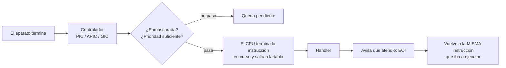

# Interrupción

> El [[Aparato|aparato]] avisa cuando terminó, en vez de que el procesador le pregunte. Es la única forma de que un procesador rápido conviva con un mundo lento.

Ojo con la palabra: **interrupción no es excepción, ni trap, ni fault, ni abort**. Las cinco se distinguen por quién las causa y si se puede volver, y eso está en [[Falsos-amigos#2]]. Esta nota es sobre la primera: algo **de afuera**, asincrónico, sin relación con la instrucción que estabas ejecutando.

## Qué problema resuelve

Mirá la tabla de latencias de [[01-El-reloj-y-el-transistor]]. Ir a buscar un dato a un [[NVMe]] cuesta **~250.000 ciclos**: si un ciclo fuera un segundo, tres días. La alternativa a la interrupción es *sondear* (*polling*): preguntarle al aparato "¿ya está?" en un bucle.

Eso significa quemar 250.000 ciclos de trabajo útil por lectura. Con dos aparatos, quemarlos mirando al que no habla. Con un aparato que puede tardar horas —un byte que llega por el cable serie cuando el operador escribe— no hay número de vueltas que alcance.

La interrupción invierte quién pregunta. El procesador sigue con lo suyo o **se duerme**, y el aparato le toca el timbre.

## Cómo funciona



Tres cosas que hacen que esto sea raro y valga la pena entender:

**1. Enmascarar.** Hay momentos en que el kernel no puede ser interrumpido —mientras toca una estructura que el handler también toca, por ejemplo— y ahí tapa el timbre: `cli` en x86_64, `msr daifset` en aarch64. Enmascarar es **privilegiado**, y por eso es la única cosa de la que un kernel no puede volver: el código que se tapó los oídos y no vuelve se llevó el núcleo. Ver [[Modo-privilegiado]] y [[39-Plazos-y-cortes]].

Hay una que no se puede tapar: el **NMI** de x86. Existe justamente para ese caso.

**2. Prioridades.** El controlador ordena. Y los dos que usa este libro ordenan **al revés**:

| | Cómo se le dice quién manda | Número alto |
|---|---|---|
| APIC de x86_64 | El **vector** mismo: los cuatro bits de arriba son la clase. | Más prioridad |
| GIC de ARM | Un registro de prioridad por interrupción (`GICD_IPRIORITYR`). | **Menos** prioridad |

**3. El contexto del handler es raro.** No corre "en un programa": corre encima de lo que estuviera pasando, con la pila de otro, y a veces con la [[Tabla-de-paginas|tabla de páginas]] de otro. Qué se puede hacer ahí y qué no está en [[Handler]].

Y la contracara de todo esto: si el procesador no tiene nada que hacer, **duerme**. `hlt` en x86_64, `wfi` en aarch64. Una interrupción lo despierta. Ver [[38-Dormir-en-vez-de-girar]].

## Cómo lo hace Linux

Todo lo de arriba se puede mirar sin permisos especiales.

```bash
cat /proc/interrupts     # una fila por IRQ, una columna por núcleo, con la cuenta
watch -n1 'grep -E "ttyS|nvme|eth" /proc/interrupts'
```

Las columnas son **por núcleo**, y ver que una IRQ solo sube en la columna 0 es ver el ruteo del controlador. `cat /proc/irq/24/smp_affinity` dice a qué núcleos se puede mandar.

Del lado del código, un [[Driver|driver]] pide una interrupción con:

```c
request_irq(irq, mi_handler, IRQF_SHARED, "mi-driver", dev);
free_irq(irq, dev);
```

`request_irq` es un nombre honesto: **pedir**. Puede fallar, y con `IRQF_SHARED` el mismo número lo atienden varios drivers en cadena, cada uno mirando si le tocaba a él. Es lo que pasa cuando hay más aparatos que cables, y es una de las razones por las que apareció [[MSI]].

Y para ver cuánto tiempo se va en handlers: `mpstat -P ALL 1` (columna `%irq`), o `bpftrace -e 'tracepoint:irq:irq_handler_entry { @[args->name] = count(); }'`.

## Cómo lo hace Kornelia

| | |
|---|---|
| **Decisiones** | D9 (los handlers los escribe el agente), D17 (el cordón nunca se abandona), D29 (en el núcleo del protocolo manda el kernel) |
| **Principios** | P3 (el agente es un compilador, no un participante), P4, P6 |
| **Los verbos** | `irq.install`, `irq.install_raw` |
| **Dónde vive** | `kernel-core/src/protocol.rs:2066#fn irq_install`, `kernel-x86_64/src/irq.rs:624#const AGENT_VECTOR: u8 = 0x31`, `kernel-aarch64/src/irq.rs:414#const AGENT_PRIORITY: u8 = 0xA0` |

**El kernel no le pasa el evento al agente.** No podría: una interrupción se atiende en microsegundos y el agente, que está del otro lado de un cable, contesta en segundos. Así que el agente **escribe el código que corre sin él** y el kernel solo lo pone en la tabla (P3). Cuántos caben es un número chico y explícito: `kernel-core/src/handlers.rs:38#pub const MAX: usize = 8`.

Tres decisiones que se ven acá:

1. **El número que viaja por el protocolo es el que usa la máquina** —el que informan las tablas y que `describe` ya publica—, no una ranura de tabla. "Vector" es el modelo de x86: en aarch64 el GIC entrega un solo número y el reparto se hace en software. Poner "vector" en el protocolo hubiera sido hornear x86 (D3, P4). Ver [[Falsos-amigos#12]].
2. **Las del agente van abajo del cable, a propósito.** En x86_64 el serie está en el vector `0x40` y las del agente arrancan en `0x31`, que es un grupo más abajo; en aarch64 el serie tiene prioridad `0x00` (la más alta del GIC) y las del agente `0xA0`. Un aparato del agente que se vuelva loco **no puede tapar el cordón** (D17, P6).
3. **El cable serie no se entrega.** Pedir la interrupción del [[UART]] devuelve `is-kernel-interrupt`: sería quedarse sin cordón umbilical.

**Y el cable tiene timbre.** Antes el núcleo que atiende el protocolo giraba preguntándole al UART si había llegado un byte; ahora el UART levanta la mano y el núcleo **duerme** entre pedidos: `kernel-x86_64/src/irq.rs:532#pub fn sleep()` y `kernel-aarch64/src/irq.rs:220#pub fn sleep()`. El kernel lo anuncia al arrancar (`kernel-core/src/lib.rs:397#the core sleeps between requests`).

> [!important] El orden de dos instrucciones es todo el mecanismo
> En x86 se hace `sti; hlt` **pegados y en ese orden**. El bucle corre con el timbre apagado, así que si un byte llegó justo antes, su interrupción quedó pendiente y el `hlt` vuelve enseguida. Al revés —dormir y después habilitar— se pierde ese despertador y la máquina se duerme para siempre con el pedido esperando.

Y D29: en el núcleo que atiende el protocolo, **una interrupción tiene prioridad sobre el código del agente**. Para que eso sea verdad y no una intención, el agente no puede *poder* enmascarar ahí — de ahí sale que en ese núcleo `exec` solo admita `supervised`. Ver [[Modo-privilegiado]].

## Cómo se ve roto

| Síntoma | Causa |
|---|---|
| La interrupción no llega nunca. | Llega como **pulso** y el controlador la trata como **nivel**. Ver [[MSI]] y [[MSI]]. |
| La máquina se duerme con un pedido esperando. | Se durmió **antes** de habilitar el timbre, y el despertador quedó pendiente sin nadie que lo tome. |
| Anda una vez y no vuelve a sonar. | Falta el EOI: el controlador cree que todavía se está atendiendo la anterior. |
| El cordón deja de contestar cuando el aparato del agente habla mucho. | La interrupción del agente quedó con prioridad igual o mayor que la del cable. |
| Se cuelga esperando a otro núcleo y mientras tanto no atiende nada. | Se esperó **con los timbres cerrados**. Estuvo así en Kornelia desde que `exec` acepta `core`, y no lo encontró nadie mirando: apareció cuando una prueba nueva obligó a recorrer ese camino. Ver [[Indice-de-sintomas]]. |

> [!warning] Un camino que ninguna prueba recorre no está andando: está sin probar
> El caso de la fila última es el mejor ejemplo del vault. El código se leía bien, la lógica era correcta, y el bug estaba ahí desde el día uno.

## Práctica

- [[P06-Ver-las-interrupciones-de-una-maquina]] — *(mirar)* `/proc/interrupts` mientras movés el mouse y mientras leés del disco: ver qué fila sube.
- [[P07-Instalar-un-handler-en-Kornelia]] — *(construir)* `./scripts/client.py --handler`, que instala un handler del agente y **lo hace sonar** con la escritura que el kernel publica.

## Recordar #flashcards/conceptos

¿Por qué existe la interrupción, en números?::Porque esperar a un NVMe girando cuesta ~250.000 ciclos por lectura — tres días en escala humana. Sondear es quemar todo eso preguntando "¿ya está?".

¿Qué diferencia una interrupción de una excepción?::La interrupción la causa algo **de afuera** y no tiene relación con la instrucción en curso; se vuelve a la **misma** instrucción. La excepción la causa la instrucción misma.

¿Por qué `sti; hlt` van pegados y en ese orden?::Porque el bucle corre con el timbre apagado. Si un byte llegó justo antes, su interrupción quedó pendiente y el `hlt` vuelve enseguida. Dormir y después habilitar pierde el despertador.

¿Por qué las interrupciones del agente van abajo del cable en Kornelia?::Para que un aparato del agente que se vuelva loco no pueda tapar el cordón umbilical (D17, P6). En x86 el serie está en el vector 0x40 y las del agente en 0x31; en ARM el serie tiene prioridad 0x00 y el agente 0xA0.

En el GIC de ARM, ¿el número de prioridad alto es más o menos prioritario?::Menos. Va al revés que el vector del APIC de x86, donde el número alto manda más. Es una fuente clásica de errores al leer código de las dos.

¿Por qué el agente de Kornelia escribe sus propios handlers?::Porque una interrupción se atiende en microsegundos y el agente contesta en segundos: nunca puede estar en ese lazo (P3, D9). El kernel solo pone su código en la tabla.

## Ver también

- [[Handler]] · [[MSI]] · [[Modo-privilegiado]] · [[Fault]]
- [[Falsos-amigos#2]] — interrupción, excepción, trap, fault, abort.
- [[Falsos-amigos#12]] — IRQ, línea, vector, MSI.
- [[38-Dormir-en-vez-de-girar]] · [[39-Plazos-y-cortes]]
