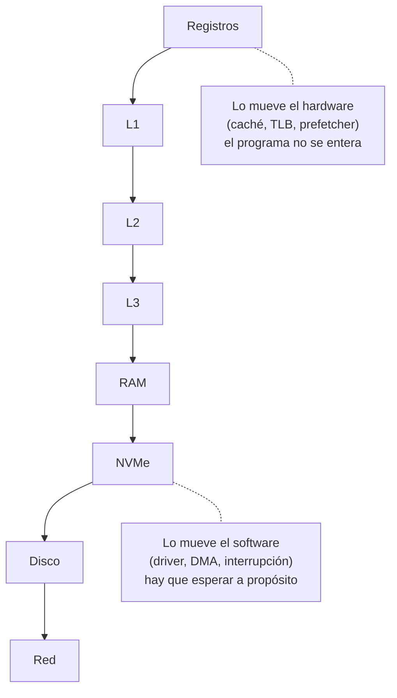

# Jerarquía de memoria

> Registros, cachés, RAM, disco, red: cada escalón es mucho más grande y mucho más lento que el de arriba. **Casi todo lo que hace un kernel se deduce de esa tabla.**

Esta nota es corta en mecanismo y larga en consecuencias. El mecanismo es una tabla de números; lo que importa es que las decisiones de diseño de un kernel —interrupciones, [[DMA]], colas, dormir— dejan de parecer arbitrarias cuando se leen contra ella.

## Qué problema resuelve

No existe memoria que sea grande, rápida y barata al mismo tiempo, y las dos razones son físicas:

1. **La velocidad de la luz.** En un ciclo de 0,502 ns la señal recorre unos 10 cm de cobre ([[P02-Medir-el-reloj-y-las-latencias]], parte 1). Un chip de RAM está a más que eso del núcleo: la distancia sola ya cuesta ciclos, antes de que nadie haga nada.
2. **El costo por bit.** Una celda de SRAM —lo que hay en una caché— son seis transistores. Una de DRAM es un transistor y un capacitor. Por eso hay 32 KiB de la primera y gigabytes de la segunda.

Como no se puede tener las dos cosas, se apilan: chico y rápido arriba, grande y lento abajo, y el hardware (o el kernel) se encarga de que lo que se está usando esté arriba.

## Cómo funciona

La tabla. **Las cinco primeras filas son medidas** en la máquina donde se escribió [[P02-Medir-el-reloj-y-las-latencias]] (1,992 GHz, 0,502 ns por ciclo); las de abajo son órdenes de magnitud típicos, no medidos acá.

| Escalón | Tamaño | ns por acceso | Ciclos (aprox.) | Si un ciclo fuera **un segundo** |
|---|---|---|---|---|
| Registro | ~1 KiB en total | — | 0–1 | ahora mismo |
| **L1d** | **32 KiB** | **2,86** | ~6 | 6 segundos |
| **L2** | **256 KiB** | **15,27** | ~30 | medio minuto |
| **L3** | **8 MiB** | **96,36** | ~190 | 3 minutos |
| **RAM** | GiB | **128,70** | ~260 | 4 minutos y medio |
| NVMe | TiB | ~100.000 (100 µs) | ~200.000 | 2 días y medio |
| Red, mismo edificio | — | ~500.000 (0,5 ms) | ~1.000.000 | 11 días |
| Disco rígido | TiB | ~10.000.000 (10 ms) | ~20.000.000 | 8 meses |
| Red, intercontinental | — | ~150.000.000 (150 ms) | ~300.000.000 | 9 años y medio |

**La RAM está 45 veces más lejos que la L1** (128,70 / 2,86), en la misma máquina, con el mismo programa. Y el NVMe está otras 800 veces más lejos que la RAM.

La columna de la derecha es el truco pedagógico que hace que la tabla se recuerde: si buscar algo en la L1 te costara seis segundos, ir al disco te costaría **ocho meses**. Con esa proporción en la cabeza, ninguna de las decisiones de la sección siguiente parece rara.

### Los escalones se pueden medir

Lo mejor de esa tabla es que no hay que creerle a nadie. Recorriendo una lista enlazada desordenada de tamaño creciente y midiendo ns por acceso, los saltos caen exactamente en 32 KiB, 256 KiB y 8 MiB — los tamaños de L1d, L2 y L3 que informa `lscpu -C`. **Se deduce una propiedad física del chip desde un programa normal.** Los detalles y por qué la lista tiene que estar desordenada están en la práctica.

### Y hacia abajo la tabla cambia de naturaleza

De registro a RAM, quien mueve los datos es el **hardware**, y el programa no se entera. De RAM para abajo, quien los mueve es el **software**: alguien tiene que pedir el bloque, esperar, y hacer otra cosa mientras tanto. Ahí es donde empieza el kernel.



## Lo que se deduce de la tabla

Esta es la sección por la que existe la nota.

**1 · Interrupciones en vez de sondear.** A 115.200 baudios, un byte del cable serie tarda unos 87 µs en llegar: **más de 170.000 ciclos**. Girar preguntando "¿ya llegó?" quema esos ciclos enteros por byte. Por eso el cable tiene timbre y el núcleo duerme. Ver [[38-Dormir-en-vez-de-girar]] e [[Interrupcion]].

**2 · DMA.** Si el procesador copiara del disco palabra por palabra, pagaría la latencia del [[Aparato|aparato]] **y** ocuparía el núcleo el tiempo entero. Que el aparato escriba solo en la RAM convierte una espera de 200.000 ciclos en un aviso al final. Ver [[46-DMA-el-aparato-lee-memoria-solo]].

**3 · Colas en memoria en vez de registros.** Cada escritura a un registro MMIO es un viaje al [[Bus|bus]], sin caché que la amortigüe. Un aparato manejado a razón de un registro por operación está limitado por eso. NVMe deja los comandos en RAM —barata— y toca **un** registro para avisar. Ver [[48-Colas-en-memoria-el-patron-de-NVMe]] y [[NVMe]].

**4 · Buzones e IPI en vez de que el otro núcleo pregunte.** Mandarle trabajo a otro núcleo se hace dejando el pedido en memoria y despertándolo con una interrupción, no haciendo que gire leyendo una variable — girar cuesta tráfico de coherencia sobre esa línea, en cada vuelta, en todos los núcleos que miran. Ver [[44-Mandar-trabajo-buzones-e-IPI]].

**5 · Páginas grandes.** Un recorrido de página son cuatro lecturas; si pegan en RAM, son cuatro por 260 ciclos. De ahí sale que exista el [[TLB]], y que convenga que una entrada cubra 1 GiB en vez de 4 KiB. Ver [[22-Identity-map-la-mentira-mas-simple]].

**6 · Y al revés: lo que no está en la tabla, no hace falta resolverlo.** Un kernel sin escalón debajo de la RAM no necesita demand paging, ni swap, ni page cache, ni readahead. Media docena de subsistemas de Linux existen para administrar **una** flecha de ese dibujo.

## Cómo lo hace Linux

Linux administra explícitamente el escalón RAM ↔ disco, y ese es el grueso de `mm/`.

```bash
free -h                            # la columna "buff/cache" es el page cache
grep -E "^(Cached|Buffers|SwapTotal|Dirty|Writeback)" /proc/meminfo
vmstat 1 5                         # si|so = swap in/out; bi|bo = bloques
ps -o min_flt,maj_flt,cmd -p $$    # faults menores (RAM) contra mayores (disco)
blockdev --getra /dev/nvme0n1      # readahead: cuánto trae de más "por si acaso"
numactl -H                         # la RAM también tiene escalones: NUMA
```

La distinción entre **[[Fault|fault]] menor** y **fault mayor** es exactamente esta tabla: el menor se resuelve en RAM (cientos de ciclos), el mayor va al disco (decenas de millones). Un programa con muchos `maj_flt` no está lento por el procesador.

Arriba de la RAM, Linux no administra casi nada porque no puede: la caché y el TLB los maneja el hardware. Lo que sí hace es **acomodarse a ellos** — `____cacheline_aligned` para no sufrir false sharing, huge pages para bajar la presión del TLB, y el `vDSO` para que leer el reloj no cueste una [[Syscall|syscall]].

Y para medir de arriba abajo, la misma herramienta:

```bash
perf stat -e cycles,instructions,cache-misses,LLC-load-misses,dTLB-load-misses ./programa
```

## Cómo lo hace Kornelia

| | |
|---|---|
| **Decisiones** | D12 (identity map, bloques de 1 GiB), D5 (el [[UART]] es el cordón, no el transporte), D18 (el blob) |
| **Dónde vive** | `kernel-x86_64/src/irq.rs:533#sti; hlt; cli` y `kernel-aarch64/src/irq.rs:209#Duerme hasta que suene algun timbre.` |

Escalón por escalón, qué hay y qué no:

| Escalón | En Kornelia |
|---|---|
| Registros | Los publica `describe`: la máquina informa **cuáles se pueden poner**, sin nombres horneados (P4, regla 3). Ver [[Registro]]. |
| Cachés | Un atributo por bloque de 1 GiB, con dos valores: normal o dispositivo (D12). Ver [[Cache]]. |
| RAM | Identity map de toda la RAM, y `mem.claim` para llevarse un pedazo. No hay asignador. |
| NVMe | **El kernel no tiene [[Driver|driver]]** (D4). El que hay está escrito con los once verbos, del lado del cliente: `scripts/client.py:1739#Le habla a un controlador NVMe`. Ver [[NVMe]]. |
| Disco / swap | No hay, y por eso no hay demand paging: no existe el escalón de abajo al que ir a buscar una página. |
| Red | Tampoco. El transporte rápido que D5 le deja al agente **no lo escribió nadie todavía**; hoy el único camino es el cordón umbilical. |

Tres cosas concretas donde la tabla se ve en el código:

1. **El núcleo que atiende el protocolo duerme.** No gira preguntando si llegó un byte: el cable tiene timbre. Y el orden de las instrucciones importa —`sti; hlt` pegados en x86, porque separarlos abre una rendija donde el despertador se pierde. En ARM el problema no existe porque `wfi` despierta con una interrupción pendiente aunque esté enmascarada.
2. **El reloj sale de una instrucción, sin driver.** `TSC` en x86_64, `CNTPCT_EL0` en aarch64. Que exista es lo que permite que la ventana de rescate del blob dure **dos segundos de verdad** y no un número de vueltas de un bucle (D18, [[51-El-blob-y-la-ventana-de-rescate]]). Ver [[37-El-reloj-contadores-y-no-saber-la-frecuencia]].
3. **`exec {deadline_ms}` es la tabla convertida en contrato.** El agente declara cuánto puede tardar su código porque el kernel no tiene forma de saberlo: leer un sector y leer una variable difieren en cinco órdenes de magnitud, y elegir un valor por omisión sería el kernel opinando sobre eso.

## Cómo se ve roto

| Síntoma | Causa |
|---|---|
| La tabla de latencias sale plana, sin escalones. | Compilaste sin `-O2` (el costo del bucle tapa el de la memoria), o recorriste en orden y midieron el prefetcher. |
| Los números salen absurdamente buenos. | Estás midiendo **ancho de banda**, no latencia: los accesos son independientes y el procesador los solapa. Cada salto tiene que depender del anterior. |
| El TSC informa más GHz de los que `lscpu` dice que existen. | No cuenta ciclos del núcleo: cuenta a ritmo fijo desde un cristal. Es lo que lo hace útil como reloj. |
| Todo va bien y de golpe, al pasar cierto tamaño de datos, se hace lento. | Te caíste al escalón siguiente. El tamaño donde pasa **es** el tamaño de esa caché. |
| Un núcleo al 100% y la máquina sin hacer nada. | Está girando preguntando en vez de dormir. |
| Copiar un buffer desde un registro MMIO tarda una eternidad. | Cada acceso es un viaje al bus y no se puede cachear. Para eso está el DMA. |
| Un programa lento con el procesador casi ocioso. | `maj_flt` alto: está esperando al disco, que en la escala de arriba son meses. |

## Práctica

- [[P02-Medir-el-reloj-y-las-latencias]] — *(mirar)* la tabla de esta nota, medida por vos, en tu máquina. Es **la** práctica de este concepto.
- [[P12-Ver-el-swap-y-los-faults-mayores]] — *(mirar)* el escalón que Kornelia no tiene, funcionando en Linux.

## Recordar #flashcards/conceptos

¿Por qué existe la jerarquía de memoria?::Porque no hay memoria grande, rápida y barata a la vez: la luz tarda en recorrer la distancia, y una celda de SRAM cuesta seis transistores contra uno y un capacitor de la DRAM.

En la máquina de la práctica, ¿cuántas veces más lejos está la RAM que la L1?::Unas 45 veces: 128,70 ns contra 2,86 ns por acceso. Unos 260 ciclos contra 6.

Si un ciclo fuera un segundo, ¿a qué distancia quedan la RAM y el disco?::La RAM a unos cuatro minutos y medio; un disco rígido a unos ocho meses. Un NVMe, a dos días y medio.

¿Dónde cambia de naturaleza la jerarquía?::En la RAM. De ahí para arriba los datos los mueve el hardware y el programa no se entera; de ahí para abajo los mueve el software, y hay que esperar a propósito. Ahí empieza el kernel.

Nombrá tres decisiones de kernel que se deducen de la tabla de latencias.::Interrupciones en vez de sondear, DMA en vez de copiar con el procesador, y colas en memoria con un solo registro de aviso en vez de un registro por operación.

¿Por qué Kornelia no tiene demand paging?::Porque no tiene el escalón de abajo: no hay disco ni swap de dónde traer una página. Media docena de subsistemas de Linux existen para administrar esa única flecha.

## Ver también

- [[Cache]] · [[TLB]] · [[Registro]] · [[MMIO]] · [[NVMe]]
- [[01-El-reloj-y-el-transistor]] — de dónde sale el ciclo con el que se mide todo esto.
- [[38-Dormir-en-vez-de-girar]] — la consecuencia más directa, en una instrucción.
