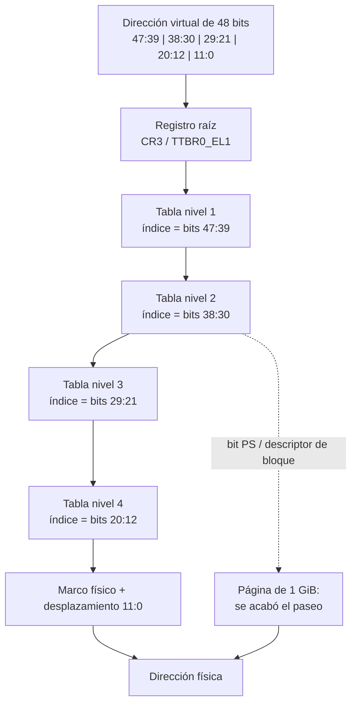

# MMU

> El pedazo de silicio que se mete entre la instrucción y el cable de memoria y
> **cambia la dirección**. Traduce leyendo unas tablas que escribió el software.

*Memory Management Unit.* Es lo único que separa "la dirección que dice el programa" de
"la dirección que llega a los chips", y de eso sale todo lo demás: aislamiento, permisos,
[[Memoria-virtual|memoria virtual]] y la mitad de los bugs de un kernel.

## Qué problema resuelve

Sin MMU, la dirección que emite una instrucción **es** la dirección física. Eso trae tres
incomodidades que no se pueden resolver arriba:

1. **Todo programa tiene que saber dónde lo van a cargar.** Dos programas compilados para
   la dirección `0x400000` no pueden convivir.
2. **Nada impide que uno escriba en la memoria de otro.** No hay a quién pedirle permiso:
   el permiso tendría que estar en el camino del acceso, y ahí no hay nadie.
3. **La memoria libre está en pedazos y los programas quieren pedazos contiguos.**

La MMU resuelve las tres con el mismo truco: un nivel de indirección **por acceso**, hecho
por hardware, que además puede decir "no".

## Cómo funciona

La MMU no traduce dirección por dirección: traduce de a [[Pagina|páginas]]. Los bits de
abajo de la dirección (el desplazamiento dentro de la página) pasan sin tocarse; los de
arriba son un índice.

Y el índice no es uno: son varios, uno por nivel de la [[Tabla-de-paginas|tabla]]. Eso es
el **recorrido de página** (*page walk*): la MMU lee memoria, varias veces, para poder
traducir un acceso a memoria.



Tres cosas de ese dibujo son las que importan:

- **La traducción la hace el hardware, pero las tablas las escribe el software.** La MMU
  no inventa nada: sigue punteros que puso el kernel, en memoria común. Un kernel no
  "le pide" a la MMU que mapee algo; escribe una estructura de datos y le pasa la
  dirección de la raíz.
- **Un recorrido cuesta cuatro lecturas de memoria.** Por eso existe el [[TLB]], que es la
  caché de traducciones ya hechas. Sin él, cada acceso costaría cinco.
- **Los niveles se pueden cortar antes.** Si una entrada intermedia dice "yo *soy* la
  página", el recorrido termina ahí y esa entrada mapea 2 MiB o 1 GiB de una. Menos
  lecturas y menos presión sobre el TLB.

Cuando el recorrido no llega a ningún lado —una entrada sin el bit de presente, o un
permiso que no da— la MMU no devuelve basura: **levanta una excepción**, el
[[32-Los-faults-como-datos|page fault]], y ahí el kernel decide qué hacer.

> [!info] La MMU no es la única
> Un aparato que hace [[46-DMA-el-aparato-lee-memoria-solo|DMA]] no pasa por la MMU del
> procesador. Para eso hay un **segundo** traductor, el
> [[47-IOMMU-VT-d-y-SMMUv3|IOMMU]], con sus propias tablas y sus propios recorridos. Misma
> idea, otro silicio, otro formato.

## Cómo lo hace Linux

Linux mantiene una tabla por proceso y cambia el registro raíz en cada cambio de contexto
(`switch_mm_irqs_off`, en `arch/x86/mm/tlb.c`). El recorrido en C está escrito con una
función por nivel: `pgd_offset`, `p4d_offset`, `pud_offset`, `pmd_offset`,
`pte_offset_map` — los mismos cinco niveles del dibujo, con nombres propios.

El page fault entra por `do_user_addr_fault` (`arch/x86/mm/fault.c`) y termina casi
siempre en `handle_mm_fault` (`mm/memory.c`), que **arregla el fault y reanuda**: trae la
página del disco, la asigna por primera vez, o copia una página compartida. Un page fault
en Linux es, la mayoría de las veces, funcionamiento normal.

Para mirarlo desde afuera:

```bash
grep -E '^(pgfault|pgmajfault)' /proc/vmstat   # cuántos faults lleva la máquina
ps -o min_flt,maj_flt,cmd -p $$                # los de tu shell
sudo dmesg | grep -i "unable to handle page fault"   # los que no se pudieron arreglar
```

En un `oops` por page fault, el registro `CR2` que aparece en `dmesg` es **la dirección que
se quiso tocar**: el hardware la deja ahí para que el kernel sepa qué falló.

## Cómo lo hace Kornelia

| | |
|---|---|
| **Decisiones** | D12 (identity map, páginas de 1 GiB), D27 (bit de usuario por bloque) |
| **Dónde vive** | El plan en `kernel-core/src/paging.rs:1#El plan de mapeo (D12)`; las tablas en `kernel-x86_64/src/paging.rs:111#pub unsafe fn install` y `kernel-aarch64/src/paging.rs:130#pub unsafe fn install` |

La MMU está prendida y las tablas son propias, pero la traducción es **identity map**:
virtual igual a física (D12). O sea que la MMU está haciendo su trabajo entero —recorrido,
permisos, atributos de caché— para devolver la misma dirección que entró. Lo que se usa de
ella no es la indirección: son los **atributos** y el **permiso**.

Tres cosas concretas:

1. **La raíz se relee del registro.** Cargarla y no comprobarla sería suponer:
   `kernel-x86_64/src/paging.rs:190#let read_back` . Un `install` que no hiciera nada se
   vería igual que uno que anduvo, y el síntoma llegaría mucho después.
2. **El identity map se puede extender en caliente.** Si el agente reclama un rango que cae
   más arriba de lo que las tablas cubren, el kernel lo mapea y reintenta
   (`kernel-core/src/platform.rs:146#unsafe fn map_device`). No es comodidad: en aarch64
   los BARs de PCIe caen en 512 GiB y el mapa del firmware llega a 257, así que sin esto el
   kernel era la razón por la que no se podía usar un aparato — justo lo que prohíbe P1.
3. **Un page fault no mata la máquina.** Vuelve como dato, con la causa y la dirección:
   `kernel-core/src/fault.rs:32#PageFault` (P5).

**Qué NO hace la MMU acá, y es lo que más se nota:** no hay una tabla por proceso, porque
no hay procesos (D13); no hay reubicación, porque el agente pone su código donde reclamó; y
no hay demand paging, porque no hay disco de dónde traer. El mecanismo está entero y lo que
se le pide es una fracción. Ver [[Espacio-de-direcciones]] y
[[23-Asignadores-y-por-que-aca-no-hay]].

## Cómo se ve roto

| Síntoma | Causa |
|---|---|
| La máquina se reinicia justo después de cargar el registro raíz. | Las tablas nuevas no mapean el código que está corriendo. La instrucción siguiente se busca en una dirección que no existe. |
| Todo anda pero `mem.claim` entrega memoria del kernel. | El `install` falló y se siguió con las tablas del firmware, que viven en memoria que el mapa informa como libre. Por eso la raíz **se relee**. |
| Un aparato responde por MMIO pero el DMA que pide no llega. | Ese acceso no pasa por la MMU sino por el IOMMU: son dos traductores distintos con dos tablas distintas. |
| El SMMU lee ceros una página más abajo de donde escribiste. | Pediste una alineación mayor que la página y el cargador no la cumplió. Ver [[24-Alineacion-la-promesa-que-el-cargador-no-cumple]]. |
| Las direcciones que pide un aparato se recortan en silencio. | Se le pidió a la etapa 2 del SMMU un tamaño de entrada **menor** que el de salida. No se rechaza: se reinterpreta. Un límite que sobra puede ser tan inválido como uno que falta. |
| Cambiaste una entrada y el procesador sigue usando la vieja. | El [[TLB]]. La MMU no releé la tabla si ya tiene la traducción guardada. |

## Práctica

- [[P03-Ver-las-tablas-de-paginas]] — *(mirar/construir)* recorrer a mano una traducción en Linux con `/proc/self/pagemap`, y mirar el identity map de Kornelia desde el monitor de QEMU.
- [[P01-Preguntarle-a-Linux-que-maquina-es]] — *(mirar)* el otro lado del mismo mapa: las direcciones **físicas** que la máquina informa.

## Recordar #flashcards/conceptos

¿Qué es un recorrido de página (page walk)?::Que la MMU lee memoria varias veces —una por nivel de la tabla— para poder traducir un solo acceso a memoria. Cada nivel aporta unos bits de la dirección como índice.

¿Quién escribe las tablas que lee la MMU?::El software. La MMU solo sigue punteros: el kernel arma una estructura de datos en memoria común y le pasa la dirección de la raíz por un registro (`CR3` / `TTBR0_EL1`).

¿Por qué existen las páginas grandes (1 GiB, 2 MiB)?::Porque una entrada intermedia puede decir "yo soy la página" y cortar el recorrido antes: menos lecturas por traducción y muchísima menos presión sobre el TLB.

En Kornelia la MMU traduce identity map, ¿para qué sirve entonces?::Para los atributos y el permiso, no para la indirección: qué se cachea y qué no (D12), y qué bloques alcanza el agente sin privilegio (D27).

¿Un DMA de un aparato pasa por la MMU?::No. Pasa por el IOMMU, que es un segundo traductor con tablas propias. Confundirlos es un clásico.

## Ver también

- [[Tabla-de-paginas]] · [[TLB]] · [[Pagina]] · [[Memoria-virtual]] · [[Espacio-de-direcciones]]
- [[47-IOMMU-VT-d-y-SMMUv3]] — la misma idea, del lado de los aparatos.
