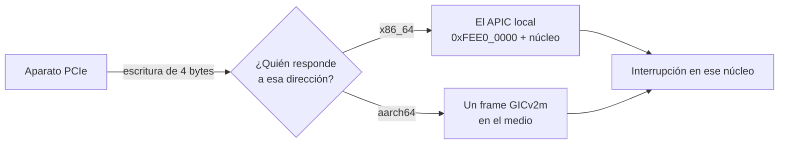

# MSI

> Una [[Interrupcion|interrupción]] sin cable: el aparato **escribe un dato en una
> dirección** y esa escritura se convierte en interrupción.

*Message Signaled Interrupts.* Es como interrumpe todo lo moderno, y entenderlo cambia dos
cosas más: por qué ya casi nadie interpreta AML, y por qué el [[IOMMU]] puede bloquear una
interrupción.

## Qué problema resuelve

El modelo viejo —INTx— es un **cable físico**. Un aparato tiene cuatro pines (`INTA#` a
`INTD#`), los conecta a la placa, y la placa los conecta al controlador. De ahí salen tres
problemas que se acumulan:

1. **Hay pocos cables.** Un PC viejo tenía 16 IRQ. Con más aparatos que cables, hay que
   **compartir**: varios drivers en cadena sobre el mismo número, cada uno preguntando "¿fue
   mío?". Eso es latencia y es código que se equivoca.
2. **No hay forma de decir *cuál*.** Una tarjeta con ocho colas de recepción tiene un solo
   cable: no puede decir "terminó la cola 3".
3. **Y sobre todo: saber qué cable le toca a un aparato es un infierno.** El cable físico no
   está en ninguna tabla simple. En una máquina con ACPI, el ruteo (`_PRT`) está escrito en
   **AML**, que es un *lenguaje entero* metido adentro de ACPI, con variables, condicionales
   y un intérprete. Para averiguar por qué pin interrumpe una placa, un kernel tiene que
   **ejecutar un programa del firmware**.

MSI borra los tres. No hay cable que rutear, hay tantos "números" como el aparato quiera, y
**el kernel no necesita interpretar AML** para nada de esto.

## Cómo funciona

Es asombrosamente simple: el aparato guarda una **dirección** y un **dato**, y cuando quiere
interrumpir, hace una escritura normal de 4 bytes a esa dirección. Alguien del otro lado
convierte esa escritura en una interrupción.



Y de ahí salen las dos consecuencias que hacen a esta nota:

> [!important] Un MSI **es** un DMA
> Es una escritura del aparato a memoria, igual que cualquier otra. Así que el [[IOMMU]] la
> ve, la traduce y **la puede bloquear**. Si el agente no declaró esa dirección, la
> interrupción no llega — y no se ve como un problema de interrupciones, se ve como un
> aparato mudo. Ver [[Falsos-amigos#4]].

> [!important] Un MSI es un **pulso**, no un nivel
> El cable de INTx se **sostiene**: el aparato lo baja y lo deja bajo hasta que lo atiendan.
> Una escritura no se sostiene: ocurre y se termina. Así que la interrupción tiene que estar
> configurada **por flanco**. Si el controlador la trata como nivel, el pulso se pierde.

Dónde vive la conversión cambia entre arquitecturas, y es una diferencia real:

| | Quién convierte la escritura | Hace falta leer una tabla |
|---|---|---|
| x86_64 | El **APIC local** del núcleo, directamente. La dirección se **arma**: `0xFEE0_0000` más el número de núcleo corrido 12 bits. | No |
| aarch64 (GICv2m) | Un **frame** intermedio, un aparato aparte con sus propios registros. | **Sí**: dónde está el frame lo dice la MADT de ACPI |

## Cómo lo hace Linux

Un driver no pide un número: pide **cuántas** quiere y el kernel le devuelve los que
consiguió.

```c
int n = pci_alloc_irq_vectors(pdev, 1, 8, PCI_IRQ_MSIX | PCI_IRQ_MSI);
int irq = pci_irq_vector(pdev, 0);
request_irq(irq, mi_handler, 0, "mi-driver", dev);
pci_free_irq_vectors(pdev);
```

Para mirarlo desde afuera:

```bash
lspci -vv | grep -A3 -E 'MSI|MSI-X'    # si el aparato lo soporta y si está Enable+
cat /proc/interrupts                    # las MSI aparecen con nombres tipo nvme0q1, eth0-TxRx-0
ls /sys/bus/pci/devices/*/msi_irqs/     # los números que le tocaron a cada aparato
```

Fijate en `/proc/interrupts`: las filas con nombre `nvme0q1`, `nvme0q2`… son **una MSI-X por
cola**. Eso es el punto 2 de arriba resuelto, y se ve a simple vista. MSI-X es la versión
grande de MSI: hasta 2048 vectores por aparato, cada uno con su propia dirección y dato en
una tabla en el BAR.

## Cómo lo hace Kornelia

| | |
|---|---|
| **Decisiones** | D9 (el handler lo escribe el agente), D8 (el IOMMU hace cumplir lo declarado) |
| **Principios** | P4 (la máquina se describe), P6 |
| **El verbo** | `irq.install {msi: true}` |
| **Dónde vive** | `kernel-x86_64/src/irq.rs:733#const MSI_BASE: u64 = 0xFEE0_0000`, `kernel-aarch64/src/irq.rs:432#pub unsafe fn install_msi` |

**Con `msi`, el número lo elige el kernel.** Es la única excepción a que el agente diga qué
quiere, y tiene una razón: el número es un recurso de la máquina y el agente no tiene cómo
saber cuál está libre (`kernel-core/src/protocol.rs:2072#let by_write = a.msi.unwrap_or(false)`).
Como la ranura se reserva **antes** de saber el número, hay que corregirla apenas la
arquitectura lo devuelve — si no, el reparto no encontraría nunca ese handler
(`kernel-core/src/protocol.rs:2109#handlers::set_interrupt(slot, interrupt)`).

Y la respuesta trae **la escritura que la dispara**, ahí mismo. No es un lujo: con MSI eso
es exactamente lo que el agente necesita **para configurar su aparato** (la dirección y el
dato que le va a poner en su registro de MSI). Mandarlo a buscarlo a `describe` sería un
viaje de ida y vuelta por un dato que ese mismo pedido acaba de decidir.

Lo que **no** está es INTx, y no es olvido: es el punto 3 de más arriba. Saber qué cable le
toca a un aparato pide interpretar AML, un lenguaje entero adentro de ACPI, y meter un
intérprete de AML en un kernel que no tiene drivers sería absurdo. **MSI lo hace
innecesario.**

## Cómo se ve roto

> [!danger] El bug caro: el pulso que se perdía
> El aparato escribía. El IOMMU dejaba pasar la escritura. Y la interrupción **no llegaba
> nunca**.
>
> La causa: por omisión el GIC trata las interrupciones de aparato como sensibles a
> **nivel**, y el frame GICv2m no sostiene la línea — la sube y la baja. El pulso se perdía
> si nadie lo tomaba en ese instante. Hay que configurarla por flanco escribiendo dos bits
> en `GICD_ICFGR` (`kernel-aarch64/src/irq.rs:410#const GICD_ICFGR: u64 = 0xC00`), el de
> arriba en uno: `kernel-aarch64/src/irq.rs:466#let cfg = GICD_ICFGR`.
>
> **Cómo se encontró:** separando las dos mitades. Hacer sonar la interrupción **a mano**,
> con la escritura que el kernel publica y sin aparato de por medio. Una de las dos mitades
> anda, y ya sabés cuál. Es la técnica general para "A hace X y B no se entera".

| Síntoma | Causa |
|---|---|
| El aparato escribe y la interrupción no llega. | Configurada por nivel en vez de por flanco (arriba). O el IOMMU bloqueó la escritura: un MSI **es** un DMA. |
| El aparato aparece en `lspci` pero `MSI-X: Enable-`. | Nadie lo habilitó; sigue en INTx, o el driver no pidió vectores. |
| Llega la interrupción de una cola y no las de las otras. | Se configuró un solo vector donde el driver esperaba varios: MSI-X tiene una entrada por cola. |
| La interrupción llega al núcleo equivocado. | En x86 el núcleo destino está **en la dirección** (`0xFEE0_0000` más el número corrido 12 bits). Cambiar de núcleo es cambiar la dirección en el aparato. |

## Práctica

- [[P08-Hacer-sonar-un-MSI-a-mano]] — *(construir)* `./scripts/client.py --msi`: instalar el
  handler, tomar la escritura que devuelve, hacerla con `mem.write`, y ver subir el `count`.
  Después, soltar el reclamo de DMA y ver que **deja de sonar**.
- [[P01-Preguntarle-a-Linux-que-maquina-es]] — *(mirar)* buscar las filas `nvme0qN` en
  `/proc/interrupts` y contar cuántas MSI-X tiene tu disco.

## Recordar #flashcards/conceptos

¿Qué es un MSI en una frase?::Una interrupción sin cable: el aparato escribe un dato de 4 bytes en una dirección acordada, y esa escritura se convierte en interrupción.

¿Por qué MSI reemplazó a INTx?::Porque no hay cables que compartir, un aparato puede tener un vector por cola, y sobre todo porque averiguar qué cable físico le toca a un aparato exige interpretar AML — un lenguaje entero adentro de ACPI. MSI lo hace innecesario.

¿Por qué el IOMMU puede bloquear una interrupción MSI?::Porque un MSI **es** un DMA: una escritura del aparato a memoria. Si esa dirección no está declarada, la escritura no llega y la interrupción tampoco.

¿Por qué un MSI tiene que configurarse por flanco y no por nivel?::Porque una escritura no sostiene nada: es un pulso, ocurre y se termina. Si el controlador espera un nivel sostenido, el pulso se pierde. Es el bug que costó caro en aarch64 (`GICD_ICFGR`).

En Kornelia, ¿quién elige el número de una interrupción MSI y por qué?::El kernel. Es la única excepción a que el agente pida lo que quiere: el número es un recurso de la máquina y el agente no tiene cómo saber cuál está libre.

¿Cómo se depura "el aparato escribe pero la interrupción no llega"?::Separando las dos mitades: hacer sonar la interrupción a mano con la escritura que el kernel publica, sin aparato. Una de las dos mitades anda y ya sabés cuál.

## Ver también

- [[Interrupcion]] · [[Handler]] · [[MMIO]]
- [[Falsos-amigos#12]] — IRQ, línea, vector, MSI.
- [[Falsos-amigos#4]] — direcciones física, virtual, de bus, IOVA.
- [[36-Nivel-contra-flanco]] · [[47-IOMMU-VT-d-y-SMMUv3]] · [[46-DMA-el-aparato-lee-memoria-solo]]
