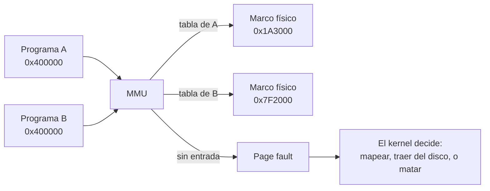

# Memoria virtual

> Que la dirección que dice un programa **no sea** la dirección que llega a los chips. Un nivel de indirección por acceso, hecho por hardware.

Eso es todo. Es un mecanismo de **traducción**, y existe aunque te sobre RAM y aunque no haya disco en la máquina.

> [!warning] No es el swap
> "Memoria virtual" en el Panel de Control de Windows significa *archivo de intercambio*. Son cosas distintas: el swap es una **consecuencia** posible de tener traducción, no su definición. La confusión está tratada en [[Falsos-amigos#7]] y no se repite acá.

## Qué problema resuelve

Sin traducción, la dirección que emite una instrucción es la dirección física, y aparecen tres incomodidades que no se pueden arreglar desde arriba:

**1. Reubicación.** Un programa compilado tiene direcciones adentro: saltos, punteros a constantes, la dirección de sus variables globales. Si esas direcciones son físicas, el programa solo funciona si lo cargás exactamente donde lo compilaron. Dos programas compilados para `0x400000` no pueden convivir, y "compilá cada programa para una dirección distinta" no escala a un sistema donde cualquiera instala cualquier cosa.

**2. Aislamiento.** Si todos comparten el espacio de direcciones, nada impide que uno escriba en la memoria de otro. Y no hay dónde poner el permiso: tendría que estar **en el camino del acceso**, y sin traducción ahí no hay nadie. Un chequeo por software no sirve, porque el programa que querés contener es justamente el que haría el chequeo.

**3. Sobrecompromiso.** Los programas piden mucho más de lo que usan: un `malloc` de 1 GiB que se toca por la puntita, una biblioteca compartida que se mapea entera y se ejecuta a medias. Con traducción, "reservar" y "tener" dejan de ser lo mismo — se puede prometer espacio de direcciones sin gastar memoria, y gastarla recién cuando alguien la toca.

Los tres salen del mismo truco, y ninguno se puede resolver en el compilador ni en la biblioteca. Es hardware o no es.

## Cómo funciona

El nivel de indirección lo hace la [[MMU]] leyendo una [[Tabla-de-paginas|tabla de páginas]] que escribió el software. La granularidad no es el byte sino la [[Pagina|página]]: hay una traducción por página, no una por dirección.



Las tres propiedades salen de ahí sin agregar nada:

| Propiedad | De dónde sale |
|---|---|
| **Reubicación** | Cada programa tiene su tabla, así que la misma dirección virtual puede ir a marcos distintos. Todos pueden creer que viven en `0x400000`. |
| **Aislamiento** | Lo que no está en tu tabla no lo podés nombrar. No es que te lo prohíban: **no existe** desde donde estás parado. |
| **Sobrecompromiso** | Una entrada sin el bit de presente cuesta cero memoria física. El marco se asigna en el primer acceso, que llega como [[Fault|fault]]. |

El sobrecompromiso es el que más se malinterpreta: el kernel promete direcciones y el respaldo puede no existir. Cuando el respaldo se agota **de verdad**, hay dos salidas: se saca alguna página a disco (eso es el swap) o se mata a alguien (eso es el OOM killer). La segunda existe porque la primera es opcional.

## Cómo lo hace Linux

Cada proceso tiene un `mm_struct` con una lista de `vm_area_struct` —los rangos mapeados, cada uno con sus permisos y su respaldo— y una tabla de páginas. La lista de rangos es lo que ves acá:

```bash
cat /proc/self/maps                 # los rangos: dirección, permisos, respaldo
cat /proc/self/smaps                # y cuánto de cada uno está de verdad en RAM (Rss)
grep -E 'Committed_AS|CommitLimit' /proc/meminfo
```

La diferencia entre `Size` y `Rss` en `smaps` **es** el sobrecompromiso, medido.

El primer acceso a una página anónima entra por `handle_mm_fault` (`mm/memory.c`) y termina en `do_anonymous_page`, que asigna un marco recién ahí. Un `mmap(2)` no toca memoria física: crea un `vm_area_struct` y se va.

La política de cuánto se puede prometer se toca a mano:

```bash
sysctl vm.overcommit_memory      # 0 heurística, 1 siempre sí, 2 con límite estricto
sysctl vm.overcommit_ratio
swapon --show ; cat /proc/swaps  # si hay swap, y dónde
grep -E 'pswpin|pswpout' /proc/vmstat   # cuánto se movió de verdad
```

Cuando no alcanza y no hay a dónde sacar, corre `oom_kill_process` (`mm/oom_kill.c`), que elige víctima por `oom_score`. Un proceso muerto por el OOM killer es el precio de haber prometido de más.

## Cómo lo hace Kornelia

| | |
|---|---|
| **Decisiones** | D12 (identity map, páginas de 1 GiB), D13 (un solo agente), D27 (permiso por bloque) |
| **Dónde vive** | El plan en `kernel-core/src/paging.rs:1#El plan de mapeo (D12)`; las tablas en `kernel-x86_64/src/paging.rs:111#pub unsafe fn install` y `kernel-aarch64/src/paging.rs:130#pub unsafe fn install` |

**Hay memoria virtual y está prendida.** El kernel arma tablas propias y las carga: la MMU traduce cada acceso. Lo que pasa es que traduce **identity map** —virtual igual a física— así que hace el trabajo entero para devolver la dirección que entró.

De las tres propiedades de arriba, Kornelia usa una:

- **Reubicación: no.** No hace falta. El agente pide un rango con `mem.claim` y le dicen cuál le tocó; después pone su código ahí. No hay nada compilado para una dirección fija que haya que acomodar.
- **Aislamiento: sí, pero uno solo.** No entre programas —hay un solo agente (D13)— sino entre el **kernel** y el código del agente: un bloque marcado como alcanzable sin privilegio (`kernel-x86_64/src/paging.rs:262#const USER: u64 = 1 << 2;`, `kernel-aarch64/src/paging.rs:289#const AP_USER: u64 = 0b01 << 6;`) es lo que hace posible `exec supervised` (D27). Y eso **no es una política del kernel**: el agente declara con qué privilegio quiere correr y el hardware hace cumplir lo declarado (P6).
- **Sobrecompromiso: no, y a propósito.** Un `mem.claim` devuelve memoria que existe. No hay entrada sin presente que se llene después, porque no hay de dónde llenarla.

### Por qué no hay swap, y por qué no lo va a haber

No es que falte: **falta el piso entero**. El swap necesita tres cosas que este kernel no tiene y que son decisiones, no pendientes:

1. **Un disco que el kernel sepa leer.** El kernel no tiene [[Driver|drivers]] (D4). El único que existe es el del [[UART]]. Un driver de [[NVMe]] es exactamente lo que el agente escribe.
2. **Una política de reemplazo.** Qué página sacar cuando falta memoria es una opinión —LRU, clock, working set— y opinar sobre el uso de la máquina es lo que P2 dice que el kernel no hace. La capa se deja vacía.
3. **Que el fault sea un trámite.** En Linux un page fault mayor es funcionamiento normal: el kernel lo arregla y reanuda. Acá los faults **son datos** (P5): vuelven como respuesta. El kernel no deshace ni completa nada por su cuenta.

**Qué se gana con identity map:** un solo sistema de coordenadas. Los [[Aparato|aparatos]] hablan en direcciones físicas —un [[DMA]] se programa con la física del buffer—, así que con cualquier otro mapeo el agente tendría que llevar dos números para cada cosa mientras escribe un driver. Y el formato de las tablas es lo menos portable que hay: si lo manejara el agente, tendría que saber de x86_64, de aarch64 y de RISC-V para hacer lo mismo.

**Qué se pierde:** la memoria que hay es la que hay. Nada de mapear un archivo, nada de copy-on-write, nada de que dos rangos virtuales apunten al mismo marco, nada de crecer una pila sola. Y **el mecanismo sigue disponible**: el agente que quiera tablas propias las arma y las carga desde su código, siempre que corra en modo `raw` — cargar la raíz es una instrucción privilegiada (P2, D12 enmendado por D27). La capa está vacía, no tapiada.

## Cómo se ve roto

| Síntoma | Causa |
|---|---|
| En Linux: la máquina "tiene RAM libre" y el OOM killer mata igual. | La promesa no era memoria: era espacio de direcciones. `Committed_AS` pasó el límite, o el `vm_area_struct` se quiso respaldar y no había marco. |
| En Linux: todo se pone lentísimo y el disco no para. | *Thrashing*: el conjunto de trabajo no entra en RAM y cada acceso se va al swap. Se ve en `pswpin`/`pswpout` de `/proc/vmstat`. |
| Kornelia arranca y avisa `mem.claim cannot be enabled like this.` | El `install` falló y se siguió con las tablas del [[Firmware|firmware]], que viven en memoria que el mapa informa como **libre**: `mem.claim` se las podría entregar al agente. |
| Kornelia dice `the hardware does NOT enforce it`. | El bit de usuario está puesto pero SMEP no se pudo prender ([[QEMU]] lo deja apagado). El permiso se marca y no separa nada — y se dice, porque una garantía que no se cumple es peor que no tenerla: `kernel-core/src/paging.rs:158#pub struct Mapping`. |
| Pediste 100 bytes alcanzables sin privilegio y te dieron 2 MiB. | No es un bug: el permiso no se puede decir más fino que un bloque de la tabla, así que el pedido redondea (`kernel-core/src/claims.rs:157#pub fn claim`). Ver [[Pagina]]. |
| Un aparato responde por [[MMIO]] pero el DMA que le pediste no llega. | Ese acceso no pasa por la MMU: pasa por el [[47-IOMMU-VT-d-y-SMMUv3|IOMMU]], que traduce aparte y con tablas propias. |

## Práctica

- [[P03-Ver-las-tablas-de-paginas]] — *(mirar/construir)* recorrer una traducción a mano en Linux, y mirar el identity map de Kornelia desde el monitor de QEMU.
- [[P12-Ver-el-swap-y-los-faults-mayores]] — *(romper)* en una VM: reservar más de lo que hay, mirar `Size` contra `Rss`, y provocar el OOM killer a propósito.

## Recordar #flashcards/conceptos

¿Qué es la memoria virtual, en una frase?::Un nivel de indirección por acceso, hecho por hardware: la dirección que dice el programa no es la que llega a los chips. Existe aunque sobre RAM y aunque no haya disco.

¿El swap es lo mismo que la memoria virtual?::No. El swap es una consecuencia posible del sobrecompromiso, que a su vez es una consecuencia de la traducción. Hay memoria virtual sin swap — Kornelia es un ejemplo.

¿Por qué el aislamiento no se puede hacer por software?::Porque el permiso tiene que estar en el camino del acceso, y ahí solo está el hardware. Un chequeo por software lo haría el mismo programa que querés contener.

¿Qué es el sobrecompromiso?::Prometer espacio de direcciones sin respaldo físico. Se ve midiendo `Size` contra `Rss` en `/proc/self/smaps`: la diferencia es lo prometido y no gastado.

Kornelia tiene memoria virtual pero identity map, ¿qué gana y qué pierde?::Gana un solo sistema de coordenadas —los aparatos hablan en físicas— y portabilidad, porque el formato de tablas no se le pasa al agente. Pierde reubicación, sobrecompromiso, copy-on-write y mapear archivos.

¿Por qué Kornelia no va a tener swap?::Le faltan tres cosas que son decisiones: un driver de disco (D4), una política de reemplazo —opinar sobre el uso de la máquina es lo que P2 evita— y que un fault sea un trámite que el kernel arregla solo (P5 dice que vuelve como dato).

## Ver también

- [[MMU]] · [[Tabla-de-paginas]] · [[Pagina]] · [[TLB]] · [[Espacio-de-direcciones]]
- [[22-Identity-map-la-mentira-mas-simple]] · [[23-Asignadores-y-por-que-aca-no-hay]]
- [[Falsos-amigos#7]] — memoria virtual, swap, memoria volátil y `volatile`.
