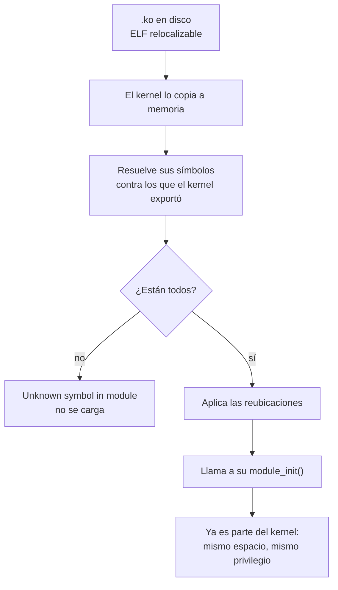

# Módulo de kernel

> Un pedazo de kernel que se carga y se descarga **sin reiniciar**. Es un envase, no un contenido: casi todos son [[Driver|drivers]], pero un driver puede no ser módulo.

## Qué problema resuelve

Un kernel monolítico con todo adentro tiene dos incomodidades, y ninguna se arregla escribiendo mejor código.

1. **La imagen es enorme y la mayoría no se usa.** Debian tiene que arrancar en máquinas que todavía no existen, así que trae drivers para miles de [[Aparato|aparatos]]. Ninguna máquina tiene más que un puñado.
2. **Cambiar cualquier cosa cuesta un reinicio.** Recompilar el kernel para probar veinte líneas de un driver, y reiniciar para probarlas, es un ciclo de minutos donde debería ser de segundos.

Y hay un tercero que es el más interesante: **el huevo y la gallina del arranque**. El driver del disco raíz tiene que estar disponible *antes* de poder leer el disco raíz. La salida es un sistema de archivos chiquito en memoria que el arrancador carga junto al kernel —el `initramfs`— con los pocos módulos que hacen falta para llegar al disco de verdad. Ver [[Modulo-de-kernel]].

## Cómo funciona

Un módulo (`.ko`, *kernel object*) es un [[ELF-y-PE|ELF]] **relocalizable**: no está enlazado todavía. Al cargarlo, el kernel hace de enlazador en caliente.



Tres cosas de ahí valen por todo el resto:

- **`EXPORT_SYMBOL`.** Un módulo no ve todos los símbolos del kernel: solo los que el kernel **exportó** a propósito. Es una superficie declarada, igual que los once verbos de Kornelia. `EXPORT_SYMBOL_GPL` restringe además la licencia de quien puede usarlos.
- **La cuenta de usuarios.** `rmmod` falla si alguien lo está usando. Es la columna *Used by* de `lsmod`, y es lo que impide sacarle el piso a algo que está corriendo.
- **Una vez cargado, no es un invitado.** Corre en anillo 0 / EL1, en el mismo [[Espacio-de-direcciones|espacio de direcciones]] que el kernel, sin límite de tiempo y sin nadie mirando. Un módulo **es** el kernel.

## Cómo lo hace Linux

```bash
lsmod                                # lo mismo que cat /proc/modules
modinfo nvme                         # licencia, autor, parametros, vermagic, dependencias
sudo modprobe nvme                   # lo carga a el y a sus dependencias
sudo insmod ./hola.ko                # carga un archivo, sin resolver dependencias
sudo rmmod hola                      # descarga, si nadie lo usa
ls /sys/module/nvme/parameters/      # los parametros, legibles en caliente
ls /lib/modules/$(uname -r)/kernel/drivers/
cat /lib/modules/$(uname -r)/modules.dep | head    # lo que genera depmod
cat /proc/sys/kernel/tainted         # si el kernel quedo "manchado"
```

La diferencia entre `insmod` y `modprobe` es todo el sistema: `insmod` carga **un archivo**; `modprobe` busca **por nombre** en `/lib/modules/$(uname -r)/`, resuelve dependencias con `modules.dep` (que arma `depmod`) y las carga en orden.

El esqueleto mínimo:

```c
#include <linux/module.h>
static int __init hola_init(void) { pr_info("hola\n"); return 0; }
static void __exit hola_exit(void) { pr_info("chau\n"); }
module_init(hola_init);
module_exit(hola_exit);
MODULE_LICENSE("GPL");
```

`MODULE_LICENSE` no es papeleo: sin "GPL" el módulo no puede usar los símbolos `EXPORT_SYMBOL_GPL` **y el kernel se marca como manchado** (*tainted*). Eso queda en el `dmesg` de cualquier [[Oops-y-panic|oops]] posterior, y quiere decir "hay código acá adentro que no puedo auditar, esta traza puede no ser culpa mía".

### Por qué un módulo mal escrito cuelga la máquina entera

Cuatro razones, y ninguna tiene arreglo dentro del modelo:

| | |
|---|---|
| **Privilegio** | Corre en anillo 0 / EL1. Puede apagar las [[Interrupcion|interrupciones]], escribir registros de control, cambiar la [[Tabla-de-paginas|tabla de páginas]]. |
| **Mismo espacio de direcciones** | Un puntero mal calculado no pisa "su" memoria: pisa la del kernel, o la de otro módulo. |
| **Sin red debajo** | Un `oops` en un módulo mata el hilo, pero el kernel queda en estado desconocido: candados tomados que nadie va a soltar, memoria a medio liberar. Por eso `oops` suele terminar en `panic`. |
| **Sin plazo** | Nadie mira el reloj. Un `while (1)` con las interrupciones enmascaradas es la máquina muerta: ni siquiera el temporizador entra. |

Y **un módulo de Linux siempre es lo que Kornelia llamaría `raw`**. No hay una opción de cargarlo con menos privilegio: el modelo de módulos no tiene ese eje.

## Cómo lo hace Kornelia

| | |
|---|---|
| **Decisiones** | D27 (el agente declara el privilegio), D29 (en el núcleo del protocolo manda el kernel), D18 (el blob) |
| **Principios** | P6 (el hardware hace cumplir lo declarado, no una política), P5 (los faults son datos), P2 (la capa que se saca se deja vacía) |

**No hay carga dinámica de código del kernel.** El kernel es lo que es y no crece. Lo más parecido a "cargar código" es `exec`: el agente sube código máquina y el kernel lo corre — sin enlazarlo, sin símbolos, sin dependencias, sin nombre.

Ahí se ve qué era esencial del mecanismo y qué era el envase. Lo esencial es *ejecutar código que no vino con la imagen*. Todo lo demás —el enlazado en caliente, `EXPORT_SYMBOL`, la cuenta de usuarios, `modules.dep`— es infraestructura para que ese código se meta **adentro** del kernel, que es justamente lo que acá no pasa.

### El agente declara el privilegio, y es obligatorio

`mode` no tiene valor por omisión, y eso es a propósito: `kernel-core/src/protocol.rs:1490#exec needs mode: supervised or raw`. **Un valor por omisión sería el kernel eligiendo**, y elegir es del agente (P6).

- `supervised` — anillo 3 en x86_64, EL0 en aarch64. No puede colgar la máquina. La memoria tiene que estar reclamada como alcanzable por el agente (`kernel-core/src/protocol.rs:1536#exec supervised needs memory claimed with user`), y para volver hay que pasar por una ventanilla cuyos bytes **publica `describe`**, así el agente no los tiene horneados (P4).
- `raw` — privilegio completo, como un módulo de Linux.

Y hay un lugar donde `raw` no se ofrece: el núcleo que atiende el protocolo. `kernel-core/src/protocol.rs:1514#the protocol core only runs supervised`. Ahí manda el kernel (D29), y para que eso sea verdad el agente no puede *poder* enmascarar las interrupciones. Si quiere el privilegio entero, que reclame un núcleo. El kernel lo **publica** en `describe exec` (`kernel-core/src/protocol.rs:721#fn write_exec`) en vez de dejar que se descubra chocándose.

### Y declara cuánto puede tardar

`exec {deadline_ms}` corta el código que no vuelve: `kernel-core/src/protocol.rs:1015#deadline_ms: Option<u64>,`. La respuesta trae `cancelled` como campo aparte de `faulted` (`kernel-core/src/protocol.rs:1710#w.text("cancelled");`) porque el código no hizo nada mal: **se lo cortaron**, y para el que depura eso es información distinta.

Un módulo colgado, no. No hay `deadline_ms` en `insmod`.

### La comparación entera

| | Módulo de Linux | `exec` de Kornelia |
|---|---|---|
| Formato | ELF relocalizable, enlazado en caliente | código máquina crudo, sin símbolos |
| Privilegio | siempre anillo 0 / EL1 | **lo declara el agente**: `supervised` o `raw` (D27) |
| Espacio | el del kernel | el reclamo del agente; en `supervised`, el hardware lo hace cumplir |
| Si falla | `oops`, y muy probablemente `panic` | el fault **vuelve como respuesta** (P5) |
| Si no vuelve | la máquina se colgó | `deadline_ms` lo corta y vuelve `cancelled` |
| Descargarlo | `rmmod`, si nadie lo usa | `release` del reclamo |
| Dependencias | `modules.dep`, `depmod`, símbolos exportados | ninguna: no hay símbolos que resolver |

### La excepción honesta: los handlers y el blob

D27 **solo cubre `exec`**. Un [[Handler|handler]] instalado con `irq.install` corre **siempre privilegiado**, y no por comodidad: el hardware no sabe entregar una interrupción a un nivel sin privilegio. En x86_64 la entrada de la IDT exige anillo 0; en aarch64 la excepción entra en EL1. Un handler del agente es, en este sentido, tan `raw` como un módulo.

Y el blob de arranque (D18, `kernel-core/src/lib.rs:224#fn run_blob`) es lo más parecido que hay a un módulo cargado al arrancar: corre privilegiado, en el mismo espacio de direcciones, antes de que exista el protocolo. Con el mismo riesgo — y por eso hay algo que Linux no tiene: **antes de saltar, avisa y espera dos segundos, y cualquier byte lo cancela** (`kernel-core/src/lib.rs:285#cancelled: someone is on the other side`). Sin esa ventana, un blob malo dejaría la máquina inútil en cada arranque y habría que sacarle el disco. La respuesta de Linux a un módulo que cuelga al arrancar es reiniciar en modo rescate; la de Kornelia es una ventana en **cada** arranque.

## Cómo se ve roto

| Síntoma | Causa |
|---|---|
| `insmod: ERROR: could not insert module: Invalid module format` | El módulo se compiló contra otra versión del kernel. `modinfo` muestra el `vermagic` que espera; tiene que coincidir con `uname -r`. |
| `Unknown symbol in module` en `dmesg`. | El módulo usa un símbolo que el kernel no exportó, o que exportó como `_GPL` y el módulo no declara licencia GPL. |
| `rmmod: ERROR: Module is in use` | La cuenta de usuarios no está en cero. La columna *Used by* de `lsmod` dice quién. |
| El módulo carga y la máquina se congela sin decir nada. | Un bucle con las interrupciones enmascaradas. Ni el temporizador entra: no hay a quién avisarle. |
| `oops` con `Tainted: G           O` y la traza no cierra. | La `O` es "módulo fuera del árbol". El kernel avisa que hay código que no puede auditar y que la traza puede no ser culpa suya. |
| Carga bien y el aparato no anda; `lspci -k` no muestra driver. | Cargar el módulo no es atarlo al aparato. Falta que el ID coincida — ver [[Driver]]. |
| En Kornelia: `exec needs mode: supervised or raw`. | No es un olvido de la API: `mode` es obligatorio porque un valor por omisión sería el kernel eligiendo (P6). |
| En Kornelia: `exec raw needs a core`. | Se pidió privilegio completo en el núcleo que atiende el protocolo. Ahí manda el kernel (D29); para `raw` hay que reclamar un núcleo. |
| En Kornelia: la respuesta vuelve con `cancelled: true` y sin fault. | El código no volvió dentro de `deadline_ms`. No hizo nada mal: se lo cortaron. |

## Práctica

- [[P15-Escribir-y-colgar-un-modulo]] — *(romper, en la VM)* compilar un `.ko` de diez líneas, cargarlo, mirarlo en `lsmod` y `/sys/module/`, y después colgar la máquina a propósito con un bucle. Nunca en tu Debian.
- [[P10-Correr-cli-sin-privilegio]] — *(construir)* lo mismo del otro lado: en Kornelia, `exec supervised` ejecutando `cli` y el fault volviendo como respuesta en vez de matar la máquina.

## Recordar #flashcards/conceptos

¿Qué es un módulo de kernel y qué **no** es?::Un pedazo de kernel que se carga y descarga sin reiniciar. Es un envase, no un contenido: casi todos son drivers, pero un driver puede estar compilado adentro del kernel y no ser módulo.

¿Qué hace el kernel al cargar un `.ko`?::De enlazador en caliente: lo copia a memoria, resuelve sus símbolos contra los que el kernel exportó con `EXPORT_SYMBOL`, aplica las reubicaciones y llama a su `module_init`. Si falta un símbolo, no lo carga.

¿Diferencia entre `insmod` y `modprobe`?::`insmod` carga **un archivo** y no resuelve dependencias. `modprobe` busca **por nombre** en `/lib/modules/$(uname -r)/`, resuelve las dependencias con `modules.dep` y las carga en orden.

¿Por qué un módulo mal escrito cuelga la máquina entera?::Porque corre privilegiado, en el mismo espacio de direcciones que el kernel, sin red debajo y sin plazo. Un puntero malo pisa memoria del kernel, y un bucle con las interrupciones enmascaradas no lo corta nadie.

¿Cuál es el equivalente de un módulo en Kornelia, y qué agrega?::`exec`. Agrega dos declaraciones del agente: `mode` —`supervised` o `raw`, obligatorio porque un valor por omisión sería el kernel eligiendo (P6)— y `deadline_ms`, que corta el código que no vuelve. Un módulo de Linux siempre es `raw` y nunca tiene plazo.

¿Por qué un handler de `irq.install` corre siempre privilegiado?::Porque el hardware no entrega interrupciones a un nivel sin privilegio: en x86_64 la entrada de la IDT exige anillo 0 y en aarch64 la excepción entra en EL1. D27 cubre `exec`, no los handlers.

## Ver también

- [[Driver]] — el contenido más común de un módulo, y por qué acá no hay ninguno (D4).
- [[Modo-privilegiado]] · [[Fault]] · [[Oops-y-panic]] · [[Syscall]]
- [[Modulo-de-kernel]] · [[51-El-blob-y-la-ventana-de-rescate]] · [[39-Plazos-y-cortes]]
- [[Falsos-amigos#9]] — driver, módulo, [[Firmware|firmware]] y blob no son lo mismo.
