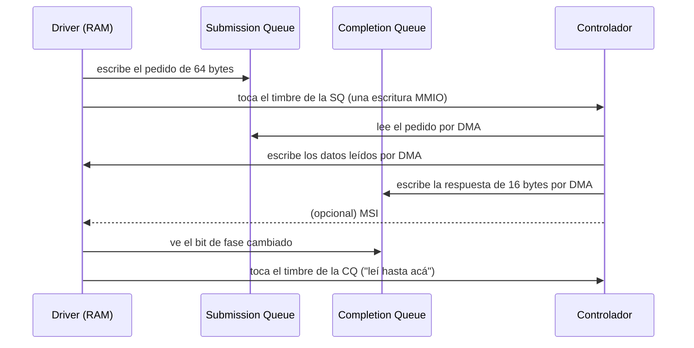

# NVMe

> El disco de hoy no se maneja con registros: se le **dejan pedidos en una cola que vive en la RAM**, se toca un timbre, y él escribe las respuestas en otra cola.

*Non-Volatile Memory Express.* Lo interesante no es que sea rápido: es **el patrón**. Colas en memoria, timbres, y el [[Aparato|aparato]] haciendo [[DMA|DMA]] a la memoria del huésped. Una placa de red moderna y una GPU se manejan igual. Si entendés NVMe, entendiste la forma del hardware de los últimos veinte años.

## Qué problema resuelve

El modelo viejo era **un registro por operación**: escribís el sector en un registro, el comando en otro, y esperás mirando un tercero. Eso tiene tres problemas que no se arreglan haciendo el aparato más rápido.

1. **Cada pedido cuesta varios viajes al aparato.** Un acceso [[MMIO|MMIO]] no se cachea y no se puede reordenar: son cientos de nanosegundos cada uno. Con un SSD que responde en decenas de microsegundos, el [[Driver|driver]] empieza a ser el cuello de botella.
2. **Hay un solo juego de registros, así que hay un pedido a la vez.** No se puede pedir mil cosas y que el aparato las ordene como le convenga.
3. **Un solo juego de registros es un solo candado.** Ocho núcleos pidiendo al mismo disco se serializan en el driver, no en el disco.

La salida es invertir quién va a buscar los datos. **El pedido no viaja al aparato: el aparato viene a buscarlo.** El driver escribe en RAM —que es barata de escribir— y lo único que cruza el [[Bus|bus]] es un aviso de una palabra.

## Cómo funciona

Una cola son **dos anillos en RAM**, y no uno:

| | Quién escribe | Quién lee | Qué lleva |
|---|---|---|---|
| **Submission Queue** (SQ) | el driver | el aparato | pedidos de 64 bytes |
| **Completion Queue** (CQ) | el aparato | el driver | respuestas de 16 bytes |

Y **dos timbres** (*doorbells*) por cola, que sí son registros del aparato: uno donde el driver dice "escribí hasta acá", otro donde dice "leí hasta acá".



Tres detalles que no se ven en el dibujo y son los que rompen todo:

- **El bit de fase.** ¿Cómo sabe el driver que una entrada de la CQ es nueva? No alcanza con "hay algo escrito", porque lo de la vuelta anterior también está escrito. Hay un bit que **alterna en cada vuelta del anillo**: si vale lo contrario que la última vez, es nueva.
- **El aparato tiene que poder alcanzar esa memoria.** Las colas viven en la RAM del huésped y el aparato las lee por [[DMA]] — así que pasan por el [[IOMMU|IOMMU]], y si no están declaradas no llegan.
- **La separación entre timbres la dice el aparato**, en un campo de su registro de capacidades (`CAP.DSTRD`). Suponer que es 4 anda en [[QEMU]] y falla en silencio donde no lo sea.

El [[MSI]] es un **opcional**: con las colas ya se puede sondear la CQ. La interrupción sirve para no gastar núcleo esperando, no para enterarse.

## Cómo lo hace Linux

El driver es `drivers/nvme/host/pci.c` (la parte que habla con el bus) más `drivers/nvme/host/core.c` (la parte que no depende de [[PCIe]]). Las funciones tienen los nombres del patrón: `nvme_alloc_queue`, `nvme_submit_cmd`, `nvme_process_cq`, `nvme_pci_enable`.

**Las colas son por núcleo**, y esa es la razón de ser del diseño. Linux las cuelga de `blk-mq` (*multi-queue block layer*): una cola de hardware por CPU, así dos núcleos que piden a la vez no comparten candado ni línea de [[Cache|caché]].

```bash
ls /sys/class/nvme/nvme0/            # model, serial, firmware_rev, cntlid
cat /sys/class/nvme/nvme0/model
ls /sys/block/nvme0n1/mq/            # una carpeta por cola de hardware
grep nvme /proc/interrupts           # nvme0q0, nvme0q1, ...: un MSI-X por cola
```

Y con `nvme-cli` se le mandan comandos de administración a mano — los mismos que manda un driver escrito desde cero:

```bash
sudo nvme list                       # los discos y sus namespaces
sudo nvme id-ctrl /dev/nvme0         # el comando Identify, opcode 0x06
sudo nvme id-ns /dev/nvme0n1         # cuántos bloques y de qué tamaño
sudo nvme smart-log /dev/nvme0
```

Un **namespace** es la división del disco que hace el propio controlador: `/dev/nvme0` es el controlador y `/dev/nvme0n1` es su primer namespace. No es una partición — está más abajo que la tabla de particiones.

## Cómo lo hace Kornelia

**Acá está la demostración concreta de D4.** El kernel no tiene driver de NVMe; el driver lo escribió el agente, y usa **los verbos y nada más**. Vive en `scripts/client.py:2008#class Nvme`.

| | |
|---|---|
| **Decisiones** | D4 (el agente escribe sus drivers), D8 ([[IOMMU]] encendido y vacío), D19/D20 (el cargador que trae el resto del disco) |
| **Verbos que usa** | `describe`, `mem.claim`, `mem.read`, `mem.write`, `dma.allow`, `release` — y `core.claim` + `exec` para saltar a lo que cargó |
| **Verbos que NO usa** | `irq.install`: sondea el bit de fase. La interrupción es un lujo, no un requisito |

Qué hace cada verbo en el driver:

- **`describe`** dice dónde se configura PCIe (la ventana ECAM). No dice qué hay conectado: eso lo recorre el agente. El kernel publica dónde se pregunta, no la respuesta (P4).
- **`mem.claim`** para tres cosas distintas: la ventana de configuración del bus, los 16 KiB de registros del controlador (16 y no 4, porque los timbres viven a partir de `0x1000`), y una página por cada anillo.
- **`mem.write`** sobre el espacio de configuración para prenderle dos bits al aparato: *memory space* y *bus master*. Sin el segundo **no puede leer sus propias colas**.
- **`mem.read`/`mem.write` con `width`** para los registros. `CAP` se lee de 8 bytes, `CSTS` de 4. Leerlos con el ancho equivocado devuelve ceros en x86 y mata la máquina en ARM: ver [[MMIO]].
- **`dma.allow`** por cada página que el aparato va a tocar. Con el IOMMU encendido y vacío (D8), una cola no declarada simplemente no existe para el controlador.
- **`release`** al final. Lo que el agente toma, el agente devuelve.

Hay una función que junta tres pasos a propósito, `scripts/client.py:2099#def shared_page`: reclamar, **limpiar** y declarar. Van juntos siempre porque olvidarse de cualquiera de los dos últimos produce el mismo síntoma —el aparato "no contesta"— por causas opuestas.

**Qué se quitó.** No hay capa de bloques, ni planificador de I/O, ni `blk-mq`, ni `/dev/nvme0n1`, ni sistema de archivos ([[53-Sin-sistema-de-archivos]]). Lo que en Linux son cinco capas entre `read()` y el silicio, acá es el agente escribiendo un comando de 64 bytes en una página que reclamó. La capa no se reemplazó: se dejó vacía (P2).

**Y llega hasta el final:** el driver lee el bloque 0, comprueba una cabecera, trae el payload **directo a un reclamo del agente por DMA** (`scripts/client.py:2392#def read_into`, sin que los bytes pasen por el cable), verifica una suma, reclama un núcleo y salta ahí con `exec`. Eso es D19 de punta a punta. El portón lo corre en las dos arquitecturas contra un `-device nvme` de verdad.

> [!info] Se busca por clase, no por modelo
> El controlador se encuentra por sus tres bytes de clase —`scripts/client.py:1890#NVME_CLASS = (0x01, 0x08, 0x02)`, o sea "almacenamiento / no volátil / NVMe"— y no por fabricante y modelo. Es P4 aplicado al bus: el aparato dice **qué hace**, y por eso el mismo driver anda contra cualquier NVMe y no solo contra el de QEMU.

## Cómo se ve roto

| Síntoma | Causa |
|---|---|
| Se toca el timbre y el aparato nunca contesta. | Las colas no están declaradas en el IOMMU. El aparato las "lee" y no llega nada. |
| Contesta enseguida, con una respuesta que nadie pidió. | La página de la CQ no se limpió: una entrada vieja tiene el bit de fase puesto y se lee como nueva. |
| Anda la primera vuelta del anillo y después se traba. | No se está alternando el bit de fase al dar la vuelta, o no se toca el timbre de la CQ y la cola se llena. |
| El controlador ignora la dirección de las colas. | Se escribieron `ASQ`/`ACQ` con el controlador ya prendido: esos registros solo se leen en la transición de apagado a prendido. |
| Rechaza crear la cola de pedidos de datos. | Se creó antes que la de respuestas. La de pedidos se crea diciendo a cuál contesta, así que el orden no es opcional. |
| Anda en QEMU y falla en otra placa, en silencio. | Se supuso que los timbres están separados por 4 bytes en vez de leer `CAP.DSTRD`. |
| El aparato no lee nada aunque todo esté bien. | Falta el bit de *bus master* en su espacio de configuración: no tiene permiso de iniciar accesos. |
| Se lee el disco y salen ceros, y parece que anduvo. | Un disco nuevo **es** ceros. Leer ceros de un disco de ceros se ve igual que no leer nada: hay que escribir algo reconocible antes. Ver [[58-Una-prueba-que-no-puede-pasar-por-accidente]]. |

## Práctica

- [[P12-Mirar-las-colas-de-un-NVMe-de-verdad]] — *(mirar)* `nvme id-ctrl`, `/sys/block/nvme0n1/mq/` y `grep nvme /proc/interrupts` en tu Debian: contar las colas y ver que hay una por núcleo.
- [[P05-Leer-un-registro-de-un-aparato-de-verdad]] — *(construir)* leer `CAP` y `VS` del controlador y decodificarlos a mano; equivocarle el ancho para ver los dos síntomas.

## Recordar #flashcards/conceptos

¿Qué es una cola NVMe?::Dos anillos en RAM: la submission queue, donde el driver escribe pedidos de 64 bytes, y la completion queue, donde el aparato escribe respuestas de 16. El aparato las lee y las escribe por DMA.

¿Qué es un doorbell?::Un registro del aparato donde el driver escribe hasta dónde llegó en un anillo. Es lo único que cruza el bus por pedido: el pedido en sí viaja por DMA cuando el aparato va a buscarlo.

¿Para qué sirve el bit de fase?::Para distinguir una respuesta nueva de la vuelta anterior del anillo. Alterna en cada vuelta, así que "hay algo escrito" no alcanza: tiene que valer lo contrario que la última vez.

¿Por qué NVMe tiene una cola por núcleo?::Porque un solo juego de registros es un solo candado. Con una cola por CPU, dos núcleos que piden a la vez no comparten candado ni línea de caché — en Linux eso es `blk-mq`.

En Kornelia, ¿qué verbos usa el driver de NVMe?::`describe` para dónde se configura PCIe, `mem.claim` para registros y colas, `mem.read`/`mem.write` con `width` para los registros, `dma.allow` para que el aparato alcance las colas, y `release`. No usa `irq.install`: sondea el bit de fase.

¿Por qué el driver de NVMe demuestra D4?::Porque el kernel no tiene ni una línea de NVMe y el driver anda igual, contra un controlador de verdad, en las dos arquitecturas. La superficie de once verbos alcanza para escribir un driver: no hay un verbo `disco`, hay memoria, permiso de DMA y registros.

## Ver también

- [[NVMe]] · [[Driver]] · [[PCIe]]
- [[MMIO]] — los timbres son MMIO; el resto del pedido no.
- [[IOMMU]] — por qué una cola sin declarar no existe para el aparato.
- [[51-El-blob-y-la-ventana-de-rescate]] — para qué se quería leer un disco (D19).
- [[Falsos-amigos#9]] — driver, módulo, [[Firmware|firmware]] y blob no son lo mismo.
