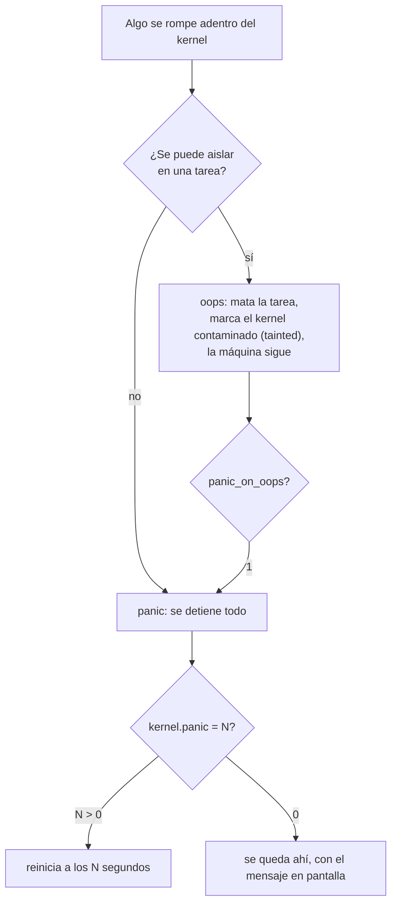

# Oops y panic

> Las dos formas en que Linux dice "algo se rompió acá adentro". Un `oops` mata la tarea y sigue —inestable—; un `panic` detiene todo.

Esta nota es el contraste central del libro: **cuando el código del kernel se rompe, alguien tiene que decidir qué hacer, y esa decisión no la toma el hardware.** Linux decidió una cosa. Kornelia decide otra.

## Qué problema resuelve

Cuando un programa de usuario se rompe, el kernel tiene una salida elegante: lo mata, avisa con una señal, y el sistema sigue como si nada. Hay alguien arriba que puede limpiar.

Cuando se rompe **el kernel** no hay nadie arriba. Y el estado es incierto: puede haber un candado tomado que ya nadie va a soltar, una lista a medio enlazar, un [[DMA]] en vuelo. Así que la pregunta no es "cómo se recupera" —muchas veces no se puede— sino **"cuánto se puede seguir mintiendo sobre que la máquina anda"**.

Linux tiene dos respuestas porque el costo del error es distinto en cada dirección: parar una máquina que podía seguir es una caída innecesaria; seguir en una máquina rota es **corrupción de datos en disco**.

## Cómo funciona



Un `oops` **no** es recuperación: es contención. Los candados que la tarea tenía siguen tomados, la memoria que había reservado se pierde, y el kernel queda marcado como *contaminado* (`tainted`) — que es la forma que tiene Linux de decir "a partir de acá no me hago cargo". Por eso mucha gente en producción pone `panic_on_oops=1`: prefiere una caída limpia a una máquina zombi escribiendo en disco.

Y dos primos que se confunden todo el tiempo:

| | Qué pasó | Quién lo detecta | ¿Se sobrevive? |
|---|---|---|---|
| **soft lockup** | Una tarea se quedó girando en el kernel sin ceder, con las **interrupciones habilitadas**. | Un hilo por núcleo (`watchdog/N`) que deja de ser planificado. | Sí: se detecta y se avisa. |
| **hard lockup** | Lo mismo, pero con las **interrupciones deshabilitadas**. | Solo el **NMI**, que es la interrupción que no se puede tapar. | No. |

Esa tabla es exactamente el problema del segundo escalón de [[39-Plazos-y-cortes]]: si el código se tapó los oídos, el único que puede llegar es el que no se puede tapar.

## Cómo lo hace Linux

Todo esto se lee en `dmesg`, y la tabla de mensajes está en [[Indice-de-sintomas]]. Lo que falta acá es **cómo se lee un volcado**.

```
BUG: unable to handle kernel paging request at ffffffffc0123456
Oops: 0002 [#1] SMP PTI
CPU: 2 PID: 1337 Comm: insmod Tainted: G           OE     6.1.0-18-amd64
RIP: 0010:mi_funcion+0x1a/0x40 [mi_modulo]
RSP: 0018:ffffb1e2c0debc38 EFLAGS: 00010246
RAX: 0000000000000000 RBX: ffff8881040a8000 RCX: 0000000000000000
Call Trace:
 <TASK>
 mi_init+0x2b/0x1000 [mi_modulo]
 do_one_initcall+0x44/0x200
 do_init_module+0x4a/0x210
 __do_sys_finit_module+0x93/0xf0
 do_syscall_64+0x58/0xc0
```

Cómo se lee, campo por campo:

- **`Oops: 0002`** — el *error code* del [[Fault|fault]] de x86. El bit 1 en uno significa **escritura**; el bit 0 en cero, que la página no estaba presente. O sea: escritura a memoria no mapeada.
- **`[#1]`** — es el primer oops desde que arrancó. Un `[#2]` significa que ya venía roto.
- **`Tainted: G OE`** — las letras dicen por qué. `O` = hay un módulo fuera del árbol cargado; `E` = un módulo sin firmar. Si aparece una `D`, el kernel **ya murió antes**.
- **`RIP: 0010:mi_funcion+0x1a/0x40`** — dónde estaba: byte 0x1a de una función que mide 0x40. El `0010` es el selector `CS`, y los dos bits de abajo en cero dicen **anillo 0** ([[Modo-privilegiado]]).
- **`Call Trace:`** — el camino de funciones, y **se lee de abajo hacia arriba**: abajo está quién empezó (una [[Syscall|syscall]]), arriba quién explotó. Es al revés de lo que sugiere el orden de lectura, y es el error más común al mirar el primero.

Las herramientas:

```bash
dmesg -T -l err,crit,alert,emerg
journalctl -k -b -1            # el dmesg del arranque ANTERIOR: donde vive el panic
cat /proc/sys/kernel/panic_on_oops  /proc/sys/kernel/panic
cat /proc/sys/kernel/watchdog_thresh
./scripts/decode_stacktrace.sh vmlinux < oops.txt   # del árbol de Linux: nombres y líneas
```

`journalctl -k -b -1` es el truco que más sirve: un panic no alcanza a escribir en disco, pero si el sistema tiene `pstore` o `kdump` configurado, el rastro queda. Sin eso, lo único que hay es la foto de la pantalla — que es literalmente cómo se depura un panic todavía hoy.

## Cómo lo hace Kornelia

| | |
|---|---|
| **Decisiones** | D7 (faults estructurados), D11 (el kernel no deshace, pero cuenta) |
| **Principios** | **P5 — los faults son datos, no muerte**; P4 |
| **Dónde vive** | `kernel-core/src/fault.rs:123#pub fn report`, `kernel-x86_64/src/main.rs:354#D7: los faults son datos` |

**El fault del agente no produce nada parecido a un oops: vuelve como respuesta por el cable**, con causa, `pc`, dirección tocada y los registros nombrados como los nombra esta máquina. Es la misma información que Linux imprime en un oops, pero **estructurada y dirigida a quien puede hacer algo con ella** — que es el punto de P3: el agente escribió ese código y va a escribir el siguiente. Ver [[Fault]].

La comparación fila por fila:

| | Linux | Kornelia |
|---|---|---|
| El código de usuario se rompe | `SIGSEGV`, muere el proceso | Respuesta con el fault adentro; el agente sigue conectado |
| El código privilegiado se rompe | `oops`: muere la tarea, la máquina queda inestable | El agente declaró `raw`: el fault vuelve igual, porque el punto de recuperación está armado antes de saltar |
| No hay forma de seguir | `panic` | El núcleo se detiene. **Y no es que Kornelia sea inmune** |
| Dónde queda el rastro | `dmesg`, `pstore`, `kdump` | Por el cable, y en `describe` |

> [!warning] Kornelia también tiene un `panic`, y hoy es un agujero honesto
> El `panic_handler` de Rust en este kernel **se detiene en silencio**: `cli; hlt` en un bucle. El comentario del código dice por qué —"todavía no hay canal para reportarlos"— pero el resultado es que un panic del kernel se ve exactamente igual que una máquina muerta. P5 dice "los faults son datos", y esto **no** es un fault del agente: es el kernel rompiéndose.

Lo que sí está resuelto es el reporte por texto cuando algo falla y no hay otra forma de mirar: `fault::report` escribe la causa y los registros por el cable (`kernel-core/src/fault.rs:131#FAULT: {} (raw {}, detail`), **con un candado** para que dos núcleos que fallan a la vez no entrelacen el texto (`kernel-core/src/fault.rs:120#static PRINTING`). Es un candado de girar y está bien que lo sea: quien lo espera ya se estaba deteniendo, y si un núcleo se colgó adentro del reporte de un fault, que el otro no escriba encima es lo que más ayuda a entender qué pasó.

Y una diferencia de fondo con `oops`, que es D11: **el kernel no deshace nada.** Linux, al matar una tarea, libera lo que puede. Acá no hay nada que liberar porque no hay nadie a quien matar — hay un agente, y lo que quedó a medio hacer es suyo. El rollback verdadero es imposible, no caro.

## Cómo se ve roto

| Síntoma | Causa |
|---|---|
| La máquina se reinicia sola y no queda nada en `dmesg`. | Panic con `kernel.panic = N`. El rastro está en `journalctl -k -b -1`, o en ningún lado si no hay `pstore`/`kdump`. |
| Aparece un `[#2]`, `[#3]`… | Ya hubo oops antes. Nada de lo que veas ahora es confiable: buscá el `[#1]`. |
| `Call Trace` con puros `?` adelante. | Entradas que el desenrollador **adivinó** de la pila y no pudo confirmar. Se ignoran: mirá las que no tienen `?`. |
| El `Call Trace` no explica nada. | Lo estás leyendo al revés. **De abajo hacia arriba.** |
| `soft lockup - CPU#N stuck for 22s` y la máquina responde. | Una tarea gira en el kernel sin ceder, con las interrupciones habilitadas. |
| `hard LOCKUP` o silencio absoluto. | Interrupciones deshabilitadas. Solo el NMI llega. |
| En Kornelia: la máquina queda muda y no vuelve. | Puede ser un panic del kernel (silencioso, arriba) o código `raw` que enmascaró y no volvió. Se distinguen: lo segundo no ocurre si el `exec` fue `supervised`. |

## Práctica

- [[P02-Provocar-y-leer-un-oops-en-una-VM]] — *(romper, **solo en la VM**)* cargar un módulo que desreferencia un puntero nulo, leer el oops entero, y decodificar el `Call Trace`. Después probar `panic_on_oops=1` y ver la diferencia.
- [[P09-Provocar-un-fault-y-leerlo-como-dato]] — *(construir)* el mismo error del otro lado: en Kornelia vuelve como respuesta y el agente sigue hablando.

## Recordar #flashcards/conceptos

¿Diferencia entre un `oops` y un `panic`?::El `oops` mata la tarea y la máquina sigue —inestable y marcada como contaminada—. El `panic` detiene todo porque no hay forma de seguir.

¿Un `oops` es recuperación?::No, es contención. Los candados que la tarea tenía quedan tomados y su memoria se pierde. Por eso en producción se suele poner `panic_on_oops=1`: mejor una caída limpia que una máquina zombi escribiendo en disco.

¿Cómo se lee un `Call Trace`?::De **abajo hacia arriba**: abajo está quién empezó (típicamente una syscall), arriba quién explotó. Las líneas con `?` adelante son entradas adivinadas de la pila y se ignoran.

¿Diferencia entre soft lockup y hard lockup?::El soft lockup gira con las interrupciones **habilitadas** y lo detecta un hilo watchdog; se sobrevive. El hard lockup las tiene **deshabilitadas** y solo lo detecta el NMI; no se sobrevive.

¿Qué significa `RIP: 0010:mi_funcion+0x1a/0x40`?::Que estaba en el byte 0x1a de una función que mide 0x40 bytes. El `0010` es el selector `CS`, y sus dos bits de abajo en cero dicen que corría en anillo 0.

¿Cuál es el contraste central con Kornelia?::Que el fault del agente **vuelve como respuesta por el cable**, con causa, pc, dirección y registros, en vez de morir en un log (P5). Es la misma información de un oops, estructurada y dirigida a quien escribió el código.

¿Kornelia es inmune a un panic?::No. Su `panic_handler` hoy se detiene en silencio (`cli; hlt`), porque cuando corre todavía no hay canal para reportar. P5 habla de los faults **del agente**, no del kernel rompiéndose.

## Ver también

- [[Fault]] · [[Modo-privilegiado]] · [[Interrupcion]]
- [[Indice-de-sintomas]] — la tabla de mensajes de `dmesg` y qué significan de verdad.
- [[Falsos-amigos#2]] — por qué P5 dice "los faults son datos" y no "los aborts son datos".
- [[Fault]] · [[39-Plazos-y-cortes]]
