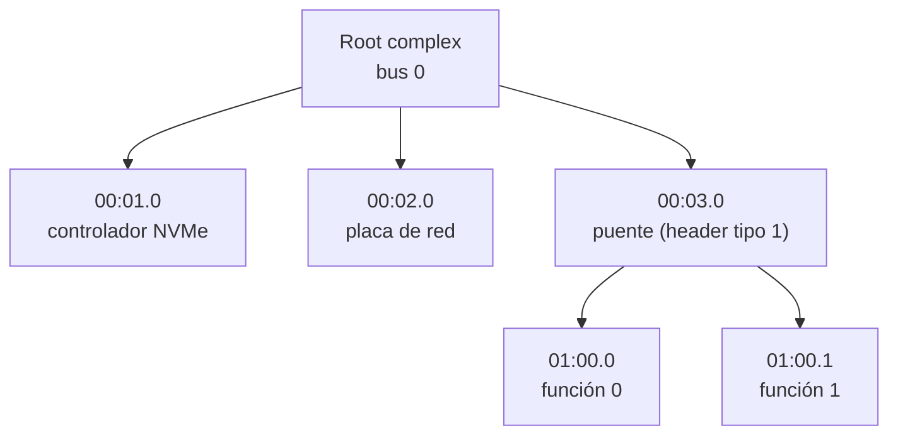

# PCIe

> El [[Bus|bus]] donde vive casi todo el hardware de una máquina moderna, y sobre todo: **el acuerdo por el que un [[Aparato|aparato]] que nadie conoce puede contar quién es**.

*Peripheral Component Interconnect Express.* Lo importante para un kernel no es la electrónica —líneas serie punto a punto, paquetes, un conmutador en el medio— sino que **todos los aparatos contestan las mismas preguntas en los mismos lugares**. Eso es lo que hace posible un kernel que no tenga horneado nada de la máquina (P4).

## Qué problema resuelve

Antes de PCI, un aparato aparecía en las direcciones que decía su manual, pedía la IRQ que tenía puesta en un jumper, y el sistema tenía que **saberlo de antemano**. Instalar una placa era editar un archivo de configuración y rezar que no chocara con otra.

Eso tiene tres agujeros y ninguno se arregla arriba:

1. **No hay forma de enterarse de qué hay conectado.** Solo se puede probar direcciones a ver si alguien contesta, y probar direcciones al azar cuelga máquinas.
2. **Dos aparatos pueden querer el mismo rango**, y el que pierde no avisa: contesta a medias.
3. **Un [[Driver|driver]] no puede saber si el aparato que tiene enfrente es el suyo.**

PCI resuelve las tres con la misma idea: cada aparato tiene un **espacio de configuración** —chico, de formato fijo, en un lugar que no depende del aparato— donde declara quién es y qué necesita. Recién después se le asignan direcciones. Ver [[17-PCIe-buses-funciones-y-BARs]].

## Cómo funciona

Un aparato se nombra con tres números: **bus, dispositivo y función** (*BDF*). Hasta 256 buses, 32 dispositivos por bus, 8 funciones por dispositivo. La **función** es la unidad real: una placa con dos puertos de red son dos funciones, cada una con su configuración y su driver.



Un **puente** es lo que hace que el árbol sea árbol: su configuración dice qué números de bus quedan de su lado, y ahí abajo hay que volver a mirar.

### Los 256 bytes de formato fijo

El principio y el final del espacio de configuración son iguales en todo aparato PCI que haya existido. Los desplazamientos que importan:

| Offset | Qué hay |
|---|---|
| `0x00` | Fabricante (2 bytes) y modelo (2 bytes). **Todos unos quiere decir que ahí no hay nadie.** |
| `0x04` | *Command* y *status*. En command, el bit 1 es "respondé a accesos de memoria" y el bit 2 es "podés ser maestro del bus" —o sea, hacer [[DMA]]. |
| `0x08` | Revisión y **clase**: tres bytes que dicen *qué hace* el aparato, no quién lo fabricó. |
| `0x0E` | Tipo de encabezado. Tipo 0 = aparato común; tipo 1 = puente. El bit 7 dice si es multifunción. |
| `0x10`–`0x24` | Los seis [[BAR|BARs]]: dónde aparecen sus registros. |
| `0x34` | Puntero a la lista de **capacidades**: una lista enlazada de cosas opcionales (MSI, MSI-X, PCIe nativo, gestión de energía). |
| `0x3C` | Línea y pin de interrupción del camino viejo (INTx). |

Buscar por clase y no por fabricante es lo que hace que un driver ande contra hardware que no existía cuando se escribió. En Kornelia el driver de [[NVMe]] busca los tres bytes `01.08.02` —"almacenamiento / no volátil / NVMe"— y nada más: `scripts/client.py:1614#NVME_CLASS = (0x01, 0x08, 0x02)`.

### La enumeración

No hay una lista: hay que recorrer. Para cada BDF posible se leen los primeros 4 bytes; si salen todos unos, ese lugar está vacío —nadie contestó y el bus devuelve eso en vez de fallar—. Si hay alguien, se lee su clase, sus BARs, y si es un puente se baja al bus que abre. Es un recorrido en profundidad, y es lo primero que hace cualquier sistema.

### ECAM: dónde se pregunta

En PCI original la configuración se leía por dos puertos de I/O de x86 (`0xCF8`/`0xCFC`): un registro de dirección y uno de datos. PCIe lo reemplazó por **ECAM** (*Enhanced Configuration Access Mechanism*), que es [[MMIO]]: una ventana en el espacio de memoria donde la dirección se arma con los números del aparato.

```
dirección = base + (bus << 20) + (dispositivo << 15) + (función << 12) + offset
```

Cada función ocupa 4 KiB —los 256 bytes de PCI más 3840 de espacio extendido— así que cada bus ocupa 1 MiB. Un `mem.read` en esa ventana es una lectura de configuración.

**¿Y de dónde sale `base`?** No se adivina: la máquina lo dice. Donde hay [[ACPI]], en la tabla **MCFG** (`kernel-core/src/acpi.rs:660#unsafe fn read_mcfg`); donde no la hay, en el nodo `pci-host-ecam-generic` del [[Device-tree|device tree]] (`kernel-core/src/fdt.rs:382#pci-host-ecam-generic`). Dos dialectos, el mismo dato.

## Cómo lo hace Linux

Linux enumera en el arranque (`drivers/pci/probe.c`) y deja el resultado en `sysfs`. Los drivers **no** buscan: declaran una tabla de pares fabricante/modelo o de clases con `MODULE_DEVICE_TABLE`, se registran con `pci_register_driver`, y el núcleo del subsistema les llama `probe()` cuando aparece algo que coincide.

```bash
lspci -nn                       # con los ids numéricos entre corchetes
lspci -v -s 00:01.0             # BARs, capacidades, IRQ, driver en uso
sudo lspci -xxx -s 00:01.0      # los 256 bytes crudos, en hexadecimal
ls /sys/bus/pci/devices/0000:00:01.0/
cat /sys/bus/pci/devices/0000:00:01.0/class
sudo setpci -s 00:01.0 COMMAND  # leer un registro de configuración a mano
```

En `/sys/bus/pci/devices/*/` está todo lo que se lee del formato fijo, un archivo por campo, más `config` (los bytes crudos) y `resource` (los BARs ya resueltos). Ver [[P01-Preguntarle-a-Linux-que-maquina-es]].

## Cómo lo hace Kornelia

| | |
|---|---|
| **Decisiones** | D4 (el agente escribe sus drivers), D25 (al [[Firmware|firmware]] se le pide todo antes de `ExitBootServices`) |
| **El verbo** | `describe {what:["pcie"]}` → `base`, `segment`, `bus_start`, `bus_end` |
| **Dónde vive** | `kernel-core/src/protocol.rs:596#if q.pcie`, `kernel-core/src/acpi.rs:660#unsafe fn read_mcfg`, `boot-uefi/src/lib.rs:497#unsafe fn add_pcie_window` |

**El kernel publica dónde se pregunta, no la respuesta.** No enumera, no arma una lista de aparatos, no tiene tabla de drivers. Da la ventana ECAM y se corre: el recorrido lo hace el agente con `mem.claim` sobre la ventana y `mem.read` adentro (`scripts/client.py:1617#def pcie_scan`). Esa función es lo más parecido a `lspci` que hay acá, y está del lado del cliente, no del kernel (D4).

**Qué se quitó:** el emparejamiento driver-aparato, `probe()`, los ids de módulo, la reasignación de recursos y `sysfs` entero. La capa no se reemplazó por otra más chica: se dejó vacía (P2). Lo que queda es una dirección y once verbos.

> [!warning] El caso real: publicar una dirección inalcanzable
> El mapa de memoria de [[UEFI]] **no es lo único que la máquina dice de sí misma**. En x86_64 el firmware informa la ventana ECAM en el mapa, como reservada; en **aarch64 no la informa**, y la MCFG sí. Con lo cual el kernel servía por `describe pcie` una dirección que él mismo hacía inalcanzable: fuera del mapa, `mem.claim` la rechaza, y fuera del alcance del identity map, ni siquiera está mapeada. El kernel siendo la razón por la que no se puede usar un aparato es exactamente lo que prohíbe **P1**. La ventana se suma al mapa **donde el mapa se arma**, dentro de la ventana de D25 y antes de que nadie lo lea, así entra sola en todo lo que se calcula a partir de él —empezando por hasta dónde llega el identity map. Y como el dato no sale de UEFI sino de la MCFG, quien lo agrega es quien sabe qué es: se marca no cacheable, porque son registros (P4).

## Cómo se ve roto

| Síntoma | Causa |
|---|---|
| `describe` informa PCIe pero `mem.claim` de esa base devuelve `unmapped`. | La ventana no está en el mapa de memoria. Ver el recuadro de arriba: es el bug de aarch64. |
| Todo el bus se lee como todos unos. | La base de ECAM está mal, o el rango se mapeó cacheable, o se está leyendo con el ancho equivocado. Ver [[MMIO]]. |
| Aparece el aparato pero no responde en su BAR. | Falta prender el bit 1 del *command*: sin él la función no contesta a accesos de memoria. |
| El aparato responde en su BAR pero no hace ningún DMA. | Falta el bit 2 del *command*, *bus master*. Sin ese permiso no puede iniciar accesos por su cuenta. |
| Se ven aparatos en el bus 0 y ninguno más. | No se bajó por los puentes: un encabezado de tipo 1 dice qué buses quedan de su lado y hay que recorrerlos aparte. |
| Un aparato multifunción aparece con una sola función. | Solo se miró la función 0 sin revisar el bit 7 del tipo de encabezado. |
| Anda con ACPI y no arranca con `acpi=off`. | La MCFG no está y no se leyó el nodo `pci-host-ecam-generic` del device tree. El portón de este proyecto bootea aarch64 sin ACPI justamente por esto. |

## Práctica

- [[P13-Recorrer-el-bus-PCIe]] — *(construir)* enumerar el bus a mano en Kornelia con `describe`, `mem.claim` y `mem.read`, y comparar la lista con la que da `lspci` en la misma máquina de [[QEMU]].
- [[P01-Preguntarle-a-Linux-que-maquina-es]] — *(mirar)* `lspci -v`, `sudo lspci -xxx` y `/sys/bus/pci/devices/`: encontrar los mismos 256 bytes desde tres lados.

## Recordar #flashcards/conceptos

¿Qué identifica a un aparato en PCIe?::Tres números: bus, dispositivo y función (BDF). La función es la unidad real —una placa con dos puertos son dos funciones, cada una con su configuración y su driver.

¿Qué es el espacio de configuración?::256 bytes de formato fijo, iguales en todo aparato PCI, donde declara quién es (fabricante, modelo, clase) y qué necesita (los BARs). Es lo que permite enumerar sin saber de antemano qué hay conectado.

¿Cómo se sabe que un lugar del bus está vacío?::Se leen los primeros 4 bytes y salen **todos unos**. Nadie contestó y el bus devuelve eso en vez de fallar.

¿Qué es ECAM?::La ventana de MMIO donde PCIe expone el espacio de configuración: dirección = base + (bus<<20) + (dev<<15) + (fn<<12) + offset. Cada función ocupa 4 KiB, cada bus 1 MiB.

¿Quién dice dónde está la ventana ECAM?::La máquina. La tabla MCFG de ACPI donde hay ACPI, y el nodo `pci-host-ecam-generic` del device tree donde no la hay. El kernel no la adivina (P4).

En Kornelia, ¿el kernel enumera el bus?::No. Publica **dónde se pregunta** (`describe {what:["pcie"]}`) y el recorrido lo hace el agente con `mem.claim` y `mem.read` (D4).

## Ver también

- [[BAR]] — el campo del espacio de configuración donde el aparato dice cuánto espacio necesita.
- [[MMIO]] · [[DMA]] · [[IOMMU]] · [[NVMe]] · [[MSI]]
- [[15-Enumerar-sin-adivinar-ACPI]] · [[16-El-otro-dialecto-device-tree]] · [[18-Lo-que-la-maquina-no-dice]]
