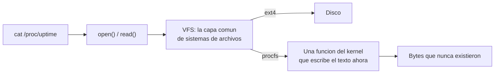

# Procfs y sysfs

> Archivos que **no existen en ningún disco**: cuando los leés, el kernel arma la respuesta en ese momento. Es la superficie por la que Linux se describe a sí mismo.

`/proc` y `/sys` son sistemas de archivos **virtuales**. `cat /proc/uptime` no lee bytes de ninguna parte: llama a una función del kernel que calcula el número y lo escribe. El archivo es una interfaz disfrazada de archivo.

## Qué problema resuelve

Un kernel sabe cosas que nadie más sabe: cuánta memoria hay y dónde, qué [[Aparato|aparatos]] están enchufados, cuántas interrupciones llegaron por cada vector, qué tiene mapeado cada proceso. Y el espacio de usuario **no puede leer eso**: está del otro lado del privilegio.

Hacen falta, entonces, una puerta y un formato. Y ahí aparece la incomodidad de verdad: **una puerta nueva por cada dato es una [[Syscall|llamada al sistema]] nueva por cada dato**. Cada una hay que diseñarla, versionarla y mantenerla para siempre, y una vez que existe no se puede sacar.

La idea de `/proc` es no agregar puertas: **usar la que ya está**. `open`, `read`, `close` ya existen, ya tienen permisos, ya andan con `cat`, `grep` y cualquier lenguaje. Un dato nuevo del kernel es un archivo nuevo, y no cuesta nada.

## Cómo funciona



La pieza que lo hace posible es el **VFS**: la capa que define qué es un sistema de archivos. Cualquiera que implemente esas operaciones **es** un sistema de archivos, aunque del otro lado no haya un disco sino una función. `procfs` y `sysfs` son eso.

De ahí salen las rarezas que confunden la primera vez:

- El tamaño es `0`, porque hasta que no leas no hay nada que medir.
- `ls -l` miente sobre las fechas.
- El contenido **cambia entre dos lecturas seguidas**, sin que nadie haya escrito.
- Escribir en algunos de esos archivos **configura el kernel**: `echo 1 > /proc/sys/...`.

### `/proc` y `/sys` no tienen el mismo criterio

Es la distinción que hay que llevarse:

| | `/proc` | `/sys` |
|---|---|---|
| Cuándo | 1992, copiando a Plan 9. | 2002, con el modelo de dispositivos de Linux 2.6. |
| Qué contiene | Todo lo que fue apareciendo. | El árbol de dispositivos, buses y [[Driver|drivers]]. |
| Formato | **Libre.** Cada archivo inventó el suyo. | **Un valor por archivo**, casi siempre un número o una palabra. |
| Para quién | Un humano con una terminal. | Un programa (`udev`, `systemd`). |
| Cómo se lee | `grep`, `awk`, y saber la forma de ese archivo en particular. | `cat` y listo. |
| La estructura | Plana y arbitraria. | Un árbol con enlaces simbólicos que expresan las relaciones reales. |

`/proc/interrupts` es una tabla de ancho variable con una columna por núcleo. `/proc/cpuinfo` son párrafos separados por líneas en blanco, y **cambia de forma según la arquitectura**. `/proc/meminfo` son pares con unidades pegadas. Nada de eso es parseable en general: es parseable *archivo por archivo*, y los parsers se rompen cuando el kernel agrega una columna.

`/sys` nació justamente de eso: un archivo, un valor, sin unidades, sin encabezados. La estructura la lleva **el árbol de directorios**, no el texto.

Y hay un tercero, `/proc/sys`, que a pesar del nombre es de la familia de `/sys`: un valor por archivo, y escribible. Es lo que toca `sysctl`. Ver [[Falsos-amigos]].

## Cómo lo hace Linux

Los que usa este libro:

| Ruta | Qué contesta |
|---|---|
| `/proc/iomem` | El mapa de memoria física: qué rango es RAM, cuál es el [[BAR]] de qué aparato. Ver [[MMIO]]. |
| `/proc/interrupts` | Cuántas interrupciones llegaron, por vector y por núcleo, con el nombre del [[Handler|handler]]. Ver [[Interrupcion]]. |
| `/proc/cpuinfo` | Qué procesador hay y qué capacidades tiene (`flags`). |
| `/proc/self/maps` | Qué tiene mapeado **este** proceso y con qué permisos. Ver [[MMU]]. |
| `/proc/vmstat` | Contadores del subsistema de memoria, incluidos los page [[Fault|faults]]. |
| `/sys/bus/pci/devices/` | Un directorio por aparato [[PCIe]], con `vendor`, `device`, `class`, `resource0`. Ver [[PCIe]]. |
| `/sys/kernel/iommu_groups/` | Qué aparatos comparten grupo de aislamiento. Ver [[IOMMU]]. |
| `/sys/firmware/acpi/tables/` | Las tablas de [[ACPI]] **crudas**, para volcarlas con `iasl`. Ver [[ACPI]]. |
| `/sys/firmware/devicetree/base/` | El [[Device-tree|device tree]], un directorio por nodo. Ver [[Device-tree]]. |

```bash
sudo cat /proc/iomem | head -30
cat /proc/interrupts
cat /proc/self/maps
ls /sys/bus/pci/devices/
cat /sys/bus/pci/devices/0000:00:02.0/{vendor,device,class}
ls /sys/kernel/iommu_groups/
```

`/proc/PID/` es la mitad más vieja y la que le da el nombre: **un directorio por proceso**. `/proc/self` es un enlace al tuyo. Que exista `/proc/self` y no una llamada al sistema `getmyinfo()` es la tesis entera del diseño.

## Cómo lo hace Kornelia

Lo mismo, con **un solo verbo**: `describe`. Y no hay sistema de archivos en ningún lado (D10) — no se quitó `/proc`, se quitó la abstracción "archivo" y `describe` quedó siendo la única puerta.

| | |
|---|---|
| **Decisiones** | D16 (`describe` es consultable, no un volcado fijo), D10 (sin sistema de archivos) |
| **Las trece secciones** | `memory` · `tables` · `claims` · `cpus` · `interrupts` · `pcie` · `cores` · `channel` · `handlers` · `exec` · `iommu` · `clock` · `cable` |

Se pide con `describe {what:["memory","pcie"]}` y vuelve solo eso. Tres cosas de ese diseño no son detalles:

**1. Sin `what`, contesta un índice, no todo.** Devuelve la arquitectura, **la lista de las trece secciones**, y unos pocos números de resumen: cuántas regiones de memoria hay, si el [[Firmware|firmware]] dejó ACPI o device tree. Es `ls /sys`, no `cat` de todo `/sys`. Esa es D16: volcar todo ahoga al cliente chico, y resumir le saca información al grande, así que **el cliente pide la profundidad que quiere** y el kernel no adivina a quién le habla.

**2. Una sección que no conoce es un error, no un silencio:** `kernel-core/src/protocol.rs:361#unknown section in what`. El comentario de al lado dice por qué: *contestar solo con lo que se reconoció, callado, sería mentir por omisión*. Si pedís `iomu` en vez de `iommu` y el kernel te contesta alegremente con las otras doce secciones, tu programa concluye que esta máquina no tiene [[IOMMU]]. Ver [[18-Lo-que-la-maquina-no-dice]].

**3. Lo que se publica incluye lo que la máquina no puede.** `describe {what:["exec"]}` trae `cancel`, que dice si el segundo escalón para cortar un núcleo existe en esta máquina —en aarch64 no, porque el GIC de [[QEMU]] no tiene los registros que harían falta— y `describe {what:["clock"]}` dice **que no se sabe** la frecuencia cuando nadie la informa, en vez de calcular un tiempo falso. Publicar una carencia es P4 aplicado al revés.

Y el contador de bytes que el cable perdió está en `describe {what:["cable"]}`, porque antes existía y **nadie lo podía ver**: el portón exige que sea cero.

### Por qué una sola puerta y no una superficie

Linux tiene miles de archivos en `/proc` y `/sys` porque **el que mira es una persona con una terminal**, y para una persona el costo de una interfaz es acordarse del nombre. Un archivo más no le cuesta nada, y `cat` y `grep` ya están instalados. La superficie enorme es una ventaja: cada dato tiene su lugar y se encuentra tanteando.

Acá el que mira es **un programa** (P3, D1), y para un programa el costo es al revés. Mil archivos con mil formatos son mil parsers, y cada uno se rompe cuando el kernel agrega una columna. Un agente no tantea: pide lo que quiere y necesita que la respuesta tenga forma.

Por eso el kernel entero son **once verbos** y la descripción es **uno**, con secciones nombradas y respuesta en CBOR (D6) — un formato binario con estructura, no texto para leer. La diferencia con `/proc` no es de tamaño: es que `/proc` es una **superficie por la que se navega** y `describe` es una **consulta que se contesta**.

Que además haya trece secciones y no una, y que se pidan por nombre, es el mismo razonamiento de `/sys` sobre `/proc` llevado hasta el final: la estructura la lleva el pedido, no el texto de la respuesta.

## Cómo se ve roto

| Síntoma | Causa |
|---|---|
| `ls -l /proc/uptime` dice 0 bytes. | Normal: no hay nada hasta que leas. El tamaño de un archivo virtual no significa nada. |
| Dos lecturas seguidas dan cosas distintas. | Normal, y es el punto. Si necesitás una foto coherente, una sola lectura: entre dos hay una carrera. |
| Tu parser de `/proc/interrupts` se rompió al actualizar. | Formato libre: apareció un núcleo más, o un vector nuevo. `/proc` no promete forma. |
| `/proc/cpuinfo` no tiene los campos que esperabas. | Cambia según la arquitectura. Es texto para un humano, no un esquema. |
| Un archivo de `/sys` existe pero leerlo da `-EINVAL`. | Ese atributo no aplica a ese aparato. La presencia del archivo no promete un valor. |
| `/proc/iomem` sale todo en ceros. | Falta privilegio: sin root, las direcciones se ocultan. `sudo`. |
| Le pediste a `describe` una sección y no vino, y el resto sí. | En Kornelia no puede pasar: es `unknown section in what`. Si te pasó con `/proc`, el archivo no existe y `cat` falló mientras tu script seguía. |
| El agente concluye que la máquina no tiene IOMMU. | Escribió mal el nombre de la sección. Por eso el kernel contesta error: contestar callado sería mentir por omisión. |

## Práctica

- [[P01-Preguntarle-a-Linux-que-maquina-es]] — *(mirar)* `/proc/iomem`, `/proc/interrupts`, `/sys/bus/pci/devices/`, y encontrar el mismo aparato por los tres caminos.
- [[P08-describe-contra-proc]] — *(mirar)* poner lado a lado `describe {what:["memory"]}` y `/proc/iomem` de la misma VM, y contar cuántos parsers hace falta escribir para cada uno.

## Recordar #flashcards/conceptos

¿Qué hay del otro lado de un archivo de `/proc`?::Una función del kernel que arma la respuesta en el momento de la lectura. No hay bytes guardados en ningún lado: el archivo es una interfaz disfrazada de archivo, y lo hace posible el VFS.

¿Por qué existe `/proc` en vez de una llamada al sistema por cada dato?::Porque `open`/`read`/`close` ya existen, ya tienen permisos y ya andan con `cat` y `grep`. Un dato nuevo del kernel es un archivo nuevo y no cuesta nada; una llamada al sistema nueva hay que mantenerla para siempre.

¿Cuál es la diferencia de criterio entre `/proc` y `/sys`?::`/proc` es histórico, de formato libre, y está pensado para un humano con una terminal. `/sys` es **un valor por archivo**, sin encabezados ni unidades, y la estructura la lleva el árbol de directorios: está pensado para un programa.

¿Por qué el tamaño de un archivo de `/proc` es 0?::Porque hasta que no lo leas no hay contenido que medir. Y por lo mismo, dos lecturas seguidas pueden dar cosas distintas sin que nadie haya escrito.

¿Cuántas secciones tiene `describe` y qué pasa si pedís una que no existe?::Trece (`memory`, `tables`, `claims`, `cpus`, `interrupts`, `pcie`, `cores`, `channel`, `handlers`, `exec`, `iommu`, `clock`, `cable`). Si pedís otra, contesta `unknown section in what`: responder solo con lo que reconoció sería mentir por omisión.

¿Qué contesta `describe` sin `what`?::Un índice: la arquitectura, la lista de las trece secciones y unos números de resumen. Es `ls /sys`, no `cat` de todo. Eso es D16 — el cliente pide la profundidad que quiere y el kernel no adivina a quién le habla.

¿Por qué Linux tiene una superficie enorme y Kornelia una sola puerta?::Porque el que mira cambió. Para una persona, un archivo más no cuesta nada y la superficie grande se navega tanteando. Para un programa, mil formatos son mil parsers que se rompen solos: necesita pedir lo que quiere y que la respuesta tenga forma.

## Ver también

- [[MMIO]] · [[MMU]] · [[Interrupcion]] · [[NVMe]]
- [[18-Lo-que-la-maquina-no-dice]] · [[ACPI]] · [[Device-tree]]
- [[53-Sin-sistema-de-archivos]] · [[09-Que-cuesta-una-abstraccion]] · [[Falsos-amigos]]
