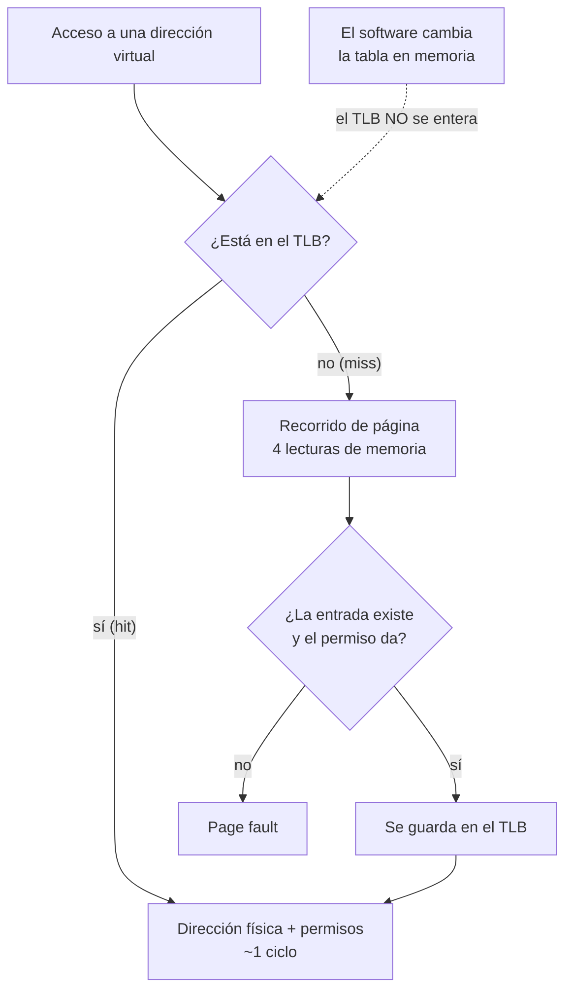

# TLB

> La caché de traducciones de la [[MMU]]. Y la única caché del procesador que **el software tiene que mantener a mano**: cambiar la tabla en memoria no la entera.

*Translation Lookaside Buffer.* Es la caché que casi ningún libro nombra en el índice y que cuelga máquinas: si te acordás de una sola cosa de esta nota, que sea la segunda línea de arriba.

## Qué problema resuelve

Un [[MMU|recorrido de página]] cuesta cuatro lecturas de memoria. Sin caché de traducciones, **cada acceso a memoria costaría cinco**: cuatro para averiguar la dirección y uno para el dato. Y esas cuatro lecturas pegan en estructuras que están en RAM, que es el escalón lento de la [[Jerarquia-de-memoria|jerarquía]].

O sea que la MMU, que existe para ser barata, sería el cuello de botella de la máquina entera. El TLB guarda las traducciones que ya se hicieron, y con eso un acceso vuelve a costar aproximadamente uno.

El precio de esa caché es el problema de esta nota: **el silicio no observa las escrituras a la tabla de páginas**. Para el procesador, una entrada de tabla es memoria común. Si la cambiás, él sigue usando lo que se acuerda.

## Cómo funciona

El TLB es una caché asociativa chica —decenas o pocos cientos de entradas— donde la llave es el número de página virtual y el valor es el marco físico **más los permisos y los atributos**. Que los permisos viajen adentro es lo que hace que cambiar un permiso también requiera invalidar, no solo cambiar un mapeo.



La flecha punteada es toda la nota.

### Las instrucciones que lo mantienen

| | x86_64 | aarch64 |
|---|---|---|
| Una página | `invlpg [dir]` | `tlbi vae1, Xn` |
| Todo | recargar `CR3` (`mov cr3, cr3`) | `tlbi vmalle1` |
| Todo, en **todos** los núcleos | no existe: hay que mandar IPIs | `tlbi vmalle1is` (`is` = *inner shareable*) |
| Etiquetas por dueño | PCID (12 bits en `CR3`) | ASID (8 o 16 bits en `TTBR`) |

### Las barreras que ARM exige y x86 no

En aarch64 una invalidación suelta no alcanza. Van tres cosas alrededor:

```asm
dsb ishst      // que la escritura a la tabla se vea ANTES de invalidar
tlbi vmalle1is // invalidar, en todos los núcleos del dominio
dsb ish        // esperar a que la invalidación termine de propagarse
isb            // que nada de lo que sigue se haya adelantado
```

En x86_64 no hace falta nada de esto: el modelo de memoria es fuerte y tanto `invlpg` como escribir `CR3` son instrucciones serializantes. **Ese es el problema:** el mismo código sin barreras anda perfecto en x86 y falla en ARM de forma intermitente. x86 no es más correcto, es más tapador. Ver [[42-Ordenamiento-de-memoria]].

### El shootdown

En x86 la invalidación es **local al núcleo que la ejecuta**. Si otro núcleo tiene la misma traducción guardada, sigue con la vieja. Entonces el que cambia la tabla tiene que mandarle una interrupción entre procesadores (IPI) a cada núcleo que pueda tenerla, y **esperar a que todos confirmen**. Eso es el *TLB shootdown*, y es de las cosas más caras que hace un kernel: una operación de memoria que se convierte en una ronda de mensajes.

ARM lo resuelve en el silicio: el sufijo `is` propaga la invalidación por el interconnect a todos los núcleos del dominio compartido. Una instrucción en vez de una ronda de IPIs.

### ASID y PCID, por arriba

Si el TLB solo guarda `virtual → física`, cambiar de [[Espacio-de-direcciones|espacio de direcciones]] obliga a **tirarlo entero**, porque las traducciones del anterior ahora son mentira. Un cambio de contexto quedaría seguido de una lluvia de misses.

La solución es agregarle al par una etiqueta de dueño: ASID en ARM, PCID en x86. Las entradas de dos dueños conviven, y cambiar de dueño no tira nada. El costo se mueve a otro lado: las etiquetas son pocas (256 o 65.536), así que hay que reciclarlas, y reciclar una sí obliga a invalidar.

> [!info] No es la única caché de traducciones
> El procesador también cachea los **niveles intermedios** del recorrido (*paging-structure caches*). Por eso cambiar una entrada de nivel alto no se arregla con un `invlpg` de una página: hay que tirar más. Y el [[IOMMU|IOMMU]] tiene su propio TLB, con sus propias invalidaciones, que se piden por registros o por una cola de comandos.

## Cómo lo hace Linux

El punto de entrada es `flush_tlb_mm_range` y compañía, en `arch/x86/mm/tlb.c`. Lo interesante está en `flush_tlb_multi`, que decide a qué núcleos mandarles el IPI mirando `mm_cpumask` —el conjunto de núcleos que alguna vez corrieron ese espacio de direcciones— en vez de mandarle a todos.

Cosas que se pueden mirar sin escribir código:

```bash
grep -E "TLB|CAL" /proc/interrupts        # la fila "TLB shootdowns", por núcleo
grep -o 'pcid\|invpcid' /proc/cpuinfo | sort -u
perf stat -e dTLB-load-misses,iTLB-load-misses,dTLB-loads ls
cpuid -1 | grep -i -A5 "TLB"              # cuántas entradas tiene tu TLB
```

La fila `TLB` de `/proc/interrupts` sube de verdad cuando la máquina trabaja: son los shootdowns ocurriendo. Y las páginas grandes existen en buena parte para bajar la presión sobre esta caché — una entrada de TLB que cubre 2 MiB vale por 512:

```bash
cat /sys/kernel/mm/transparent_hugepage/enabled
grep -i anonhugepages /proc/meminfo
```

Del lado de ARM, el asignador de ASIDs vive en `arch/arm64/mm/context.c` y las macros de invalidación con sus barreras en `arch/arm64/include/asm/tlbflush.h`. El comentario de ese archivo explica la secuencia `dsb ishst` / `tlbi` / `dsb ish` / `isb` mejor que casi cualquier otra fuente.

## Cómo lo hace Kornelia

| | |
|---|---|
| **Decisiones** | D12 (identity map, bloques de 1 GiB), D27 (el bit de usuario por bloque) |
| **Dónde vive** | `kernel-x86_64/src/paging.rs:97#Recargar CR3 tira todo el TLB` y `kernel-aarch64/src/paging.rs:122#tlbi vmalle1is` |

Casi todo lo que hace complicado al TLB **no aparece acá**, y por razones que se pueden nombrar:

- **No hay ASID ni PCID**, porque no hay procesos (D13) ni cambios de contexto: hay una sola tabla y no se cambia nunca. El ASID igual existe en el silicio, y se nota en un detalle: al releer `TTBR0_EL1` para confirmar el `install` hay que enmascarar los bits de arriba, que llevan el ASID y no dirección (`kernel-aarch64/src/paging.rs:199#TTBR0_EL1 llevan el ASID, no direccion.`).
- **La presión sobre el TLB queda en casi nada**, porque el identity map se hace con bloques de 1 GiB: una entrada cubre un gigabyte entero (D12).
- **No hay shootdown por IPI.** No hace falta invalidar en otros núcleos por un cambio de espacio de direcciones, porque no hay tal cambio.

Pero el TLB **igual hay que mantenerlo a mano**, en dos lugares exactos:

1. **Al extender el identity map en caliente.** Cuando el agente reclama un rango que cae más arriba de lo que las tablas cubren, el kernel lo mapea y reintenta (P1). Antes de eso la traducción guardada dice "acá no hay nada", así que hay que tirarla: en x86 recargando `CR3` —más de lo necesario, pero pasa una vez por [[Aparato|aparato]]—, y en aarch64 con la secuencia entera de cuatro instrucciones (`kernel-aarch64/src/paging.rs:121#dsb ishst`). El comentario del código dice explícitamente que **las barreras no son adorno**.
2. **Al prender o apagar el bit de usuario de un bloque.** D27 hace que `mem.claim` marque los bloques del agente como alcanzables sin privilegio. Eso es un cambio de **permiso**, y el permiso viaja adentro de la entrada del TLB, así que también hay que invalidar (`kernel-x86_64/src/paging.rs:310#Lo que el CPU se acuerde de antes ya no vale`, `kernel-aarch64/src/paging.rs:336#Lo que el CPU se acuerde de antes ya no vale.`). Que este caso exista es la mejor demostración de que el TLB no cachea direcciones: cachea entradas.

> [!question] Duda para anotar si te queda picando
> Las dos invalidaciones de aarch64 no son la misma instrucción: la de `map_device` es `tlbi vmalle1is` (llega a todos los núcleos) y la de los permisos de D27 es `tlbi vmalle1` (local al que la ejecuta). Con núcleos reclamados corriendo código del agente, ¿alcanza la local? Es exactamente la clase de pregunta que va a `dudas/`.

## Cómo se ve roto

El TLB es traicionero porque **casi todos sus síntomas son intermitentes**: la traducción vieja sobrevive hasta que algo la desaloja, y qué la desaloja depende de lo que corrió mientras tanto.

| Síntoma | Causa |
|---|---|
| Cambiaste una entrada de la tabla y el procesador sigue usando la vieja. | No invalidaste. El silicio no observa las escrituras a la tabla. |
| Reclamaste memoria y `exec supervised` igual da [[Fault|fault]] de permiso ahí. | Cambió el bit de usuario en la tabla, pero la entrada del TLB guardó el permiso viejo. |
| Anda en x86_64 y falla en aarch64, a veces. | Faltan las barreras alrededor del `tlbi`. x86 serializa solo y esconde el error. |
| Anda en el núcleo que hizo el cambio y falla en otro. | Invalidación local: en x86 falta el shootdown por IPI; en aarch64 falta el sufijo `is`. |
| Mapeaste un [[BAR]] nuevo y leerlo devuelve basura o falla. | La traducción guardada para ese rango decía "no hay nada" y sigue diciéndolo. |
| Cambiaste una entrada de nivel alto y una `invlpg` de esa página no alcanzó. | Las cachés de estructuras intermedias. Hay que tirar más que una página. |
| El mismo programa es mucho más lento al pasar de cierto tamaño de datos. | No es un bug: te saliste de lo que cubre el TLB y cada acceso paga un recorrido. |

## Práctica

- [[P03-Ver-las-tablas-de-paginas]] — *(mirar)* el otro lado: la tabla que el TLB cachea.
- [[P14-Medir-el-TLB-y-un-shootdown]] — *(mirar)* `perf stat -e dTLB-load-misses` sobre un barrido que crece, y la fila `TLB` de `/proc/interrupts` subiendo mientras la máquina trabaja.

## Recordar #flashcards/conceptos

¿Por qué existe el TLB?::Porque un recorrido de página cuesta cuatro lecturas de memoria, así que sin él cada acceso costaría cinco. Con TLB vuelve a costar aproximadamente uno.

¿Qué invalida una entrada del TLB?::Nada automáticamente. Hay que invalidarla a mano (`invlpg` / `tlbi`) porque el procesador no observa las escrituras a la tabla de páginas: para él son memoria común.

¿Por qué ARM exige barreras alrededor del `tlbi` y x86 no?::Porque `invlpg` y escribir `CR3` son serializantes y el modelo de memoria de x86 es fuerte. En ARM hay que garantizar a mano que la escritura a la tabla se vea antes de invalidar (`dsb ishst`), que la invalidación termine (`dsb ish`) y que nada se haya adelantado (`isb`).

¿Qué es un TLB shootdown?::Que el núcleo que cambia la tabla les mande un IPI a los demás para que invaliden su copia, y espere confirmación. En x86 hace falta porque `invlpg` es local; en ARM lo hace el silicio con el sufijo `is`.

¿Para qué sirven ASID y PCID?::Para etiquetar las entradas del TLB con su dueño, así cambiar de espacio de direcciones no obliga a tirar la caché entera.

¿Por qué cambiar un permiso también obliga a invalidar?::Porque la entrada del TLB no guarda solo la dirección física: guarda también los permisos y los atributos. Es lo que le pasa a Kornelia con el bit de usuario de D27.

## Ver también

- [[MMU]] · [[Tabla-de-paginas]] · [[Pagina]] · [[Cache]] · [[Jerarquia-de-memoria]]
- [[42-Ordenamiento-de-memoria]] — por qué x86 esconde bugs que ARM muestra.
- [[Falsos-amigos]] — el TLB no es una caché de datos: es de traducciones, y no es coherente.
