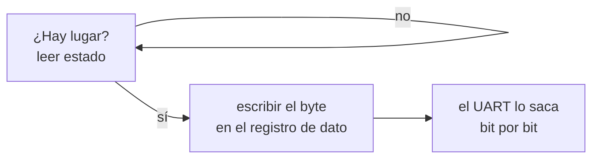

# UART

> El chip que convierte un byte en pulsos por un cable. Es el único aparato con el que un kernel puede hablar **antes de saber nada de la máquina**.

*Universal Asynchronous Receiver/Transmitter.* Cuatro registros, ninguna enumeración, ningún descubrimiento: por eso es lo primero que se hace andar en un kernel y lo último que se apaga.

## Qué problema resuelve

El problema no es la comunicación: es el **huevo y la gallina** del arranque.

Para usar cualquier aparato moderno hay que recorrer el bus, leer tablas, mapear [[MMIO|registros]], instalar handlers. Todo eso es código que puede fallar. Y si falla, hay que **contarlo por algún lado** — que es exactamente el aparato que todavía no se hizo andar.

El UART rompe el círculo porque no hay que descubrir nada:

- En x86 sus registros están en direcciones fijas por convención desde 1981 (`0x3F8`).
- En ARM no son fijos por arquitectura pero sí por placa, y son un puñado de escrituras.
- No necesita interrupciones: se puede sondear.
- No necesita [[46-DMA-el-aparato-lee-memoria-solo|DMA]], así que no necesita [[47-IOMMU-VT-d-y-SMMUv3|IOMMU]] ni tablas ni permisos.

Un aparato que se usa sin descubrirlo es el único que sirve **antes** de descubrir nada.

## Cómo funciona

Un byte no viaja entero: el UART lo saca **bit por bit**, con un bit de arranque adelante y uno o dos de parada atrás, a una velocidad acordada de antemano (*baud*). "Asincrónico" quiere decir justo eso: no hay un cable de reloj, los dos lados tienen que estar de acuerdo en la velocidad o lo que llega es basura.

Del lado del software son cuatro clases de registro, y las dos familias que este libro usa tienen las cuatro con nombres distintos:

| Para qué | 16550 (x86, puertos de E/S) | PL011 (ARM, MMIO) |
|---|---|---|
| **Dato** — por acá entra y sale el byte | `DATA` = `0x3F8 + 0` | `UARTDR` = base `+ 0x00` |
| **Estado** — ¿llegó algo? ¿puedo escribir? | `LSR` = `+ 5` | `UARTFR` = `+ 0x18` |
| **Control** — velocidad, bits, paridad | `LCR` = `+ 3`, `MCR` = `+ 4` | `UARTLCR_H`, `UARTCR` |
| **Interrupciones** — avisame cuando llegue | `IER` = `+ 1` | `UARTIMSC` = `+ 0x38` |

Escribir un byte es siempre lo mismo: **mirar el registro de estado hasta que diga que hay lugar, y recién ahí escribir el de dato**. Si no se mira, el byte anterior se pisa y se pierde sin ruido.



### Sondear contra timbre

Hay dos formas de recibir, y la diferencia es un núcleo entero:

- **Sondeo** (*polling*): preguntar "¿llegó algo?" para siempre. Anda sin instalar nada, y quema el 100% de un núcleo.
- **Timbre**: prenderle al UART el bit de "avisá cuando llegue un byte" y **dormir** ([[Interrupcion|interrupción]]). El núcleo no gasta nada hasta que hay trabajo.

El timbre trae una obligación que no se ve venir: **el que atiende tiene que vaciar la cola del UART**. El chip mantiene el timbre sonando mientras haya un byte sin leer, así que un [[Handler|handler]] que solo diga "ya te oí" hace que suene de nuevo, inmediatamente, para siempre. La máquina no se cuelga: avanza cero.

> [!info] El `0x3F8` no es MMIO
> En x86 el UART vive en el **espacio de puertos de E/S**, un espacio de direcciones aparte con instrucciones propias (`in`, `out`) y 65.536 direcciones. Es anterior al MMIO y sobrevive por compatibilidad. ARM y RISC-V nunca lo tuvieron: ahí el UART **es** memoria. Ver [[MMIO]].

## Cómo lo hace Linux

Dos drivers, uno por familia: `drivers/tty/serial/8250/8250_port.c` y `drivers/tty/serial/amba-pl011.c`. Los aparatos aparecen como `/dev/ttyS0` (16550) y `/dev/ttyAMA0` (PL011).

```bash
dmesg | grep -iE 'ttyS|ttyAMA'          # a que direccion e IRQ lo encontro
grep -E 'ttyS|serial|uart' /proc/interrupts
setserial -g /dev/ttyS0                 # puerto, IRQ y tipo de chip
sudo cat /proc/tty/driver/serial         # una linea por puerto, con bytes tx/rx
```

Y lo interesante para este libro es que **Linux tiene el mismo problema del huevo y la gallina, y lo resuelve igual**: hay una consola de emergencia que imprime antes de que el driver de verdad exista.

```
console=ttyS0,115200n8    # a donde va la consola del kernel
earlycon                  # imprimir ya, con una direccion que sale de ACPI/DT
earlyprintk=serial,ttyS0,115200   # la version vieja de x86, con la direccion horneada
```

`earlycon` sin argumentos saca la dirección de la tabla **SPCR** de [[15-Enumerar-sin-adivinar-ACPI|ACPI]] o del `stdout-path` del [[16-El-otro-dialecto-device-tree|device tree]]. `earlyprintk` la lleva escrita a mano. Los dos existen porque un kernel que se cuelga durante el arranque sin haber podido imprimir nada es indepurable.

## Cómo lo hace Kornelia

| | |
|---|---|
| **Decisiones** | D5 (el cordón umbilical, no el transporte), D4 (el único driver del kernel), D17 (se contesta por donde llegó), D26 (el serie va crudo) |
| **Dónde vive** | `kernel-x86_64/src/uart.rs:6#const COM1: u16 = 0x3F8;` y `kernel-aarch64/src/uart.rs:19#const BUILT_IN: u64 = 0x0900_0000;`; el buzón en `kernel-core/src/serial.rs:42#const SIZE: usize = 64 * 1024 + 1;` |

**Es el único driver que el kernel lleva adentro**, y el comentario lo dice con todas las letras: `kernel-x86_64/src/uart.rs:4#y por eso es el único que el kernel lleva adentro (D4)`. Todo lo demás lo escribe el agente ([[Driver]]).

**Es lo primero que se hace, antes de pedirle la máquina al firmware:** `kernel-x86_64/src/main.rs:273#uart::init();`, con el comentario *"si lo que sigue falla, hace falta poder contarlo"*.

### Arranca con una dirección horneada y se muda

Acá está la aplicación más limpia de P4 que tiene el proyecto. Hay una dirección escrita a mano porque **hay que poder hablar antes de leer ninguna tabla**: si el arranque se cuelga leyendo ACPI, lo único que queda para contarlo es el cable.

Pero es el punto de partida, no la respuesta. Apenas la tabla SPCR (`kernel-core/src/acpi.rs:579#unsafe fn read_spcr`) dice dónde tiene la máquina su consola, el kernel **se muda** ahí: `kernel-aarch64/src/uart.rs:49#pub unsafe fn move_to`. La mudanza va temprano y con la menor cantidad posible de cosas ya hechas (`kernel-core/src/lib.rs:74#move_to_reported_serial(p, &machine, &hw);`), porque si la dirección nueva fuera mala el cordón se pierde ahí mismo.

Y **si se mudó o no se publica**: `kernel-aarch64/src/uart.rs:35#pub fn from_machine`. Es la diferencia entre "anda" y "anda **porque la máquina dijo dónde**", que es lo único que hace que ande en otra placa.

### El cable es el cordón, no el transporte (D5)

El UART es lentísimo. La decisión no es "el protocolo va por serie": es que el serie es el canal que **nunca se abandona**. El transporte rápido lo escribe el agente, y el kernel ya tiene el verbo para dárselo (`listen`, D28) — pero el cable sigue estando, y por él se contesta cuando no hay otro lado (D17).

### Qué sale por ahí

- **ASCII puro** (regla 4 del proyecto). El kernel manda **bytes**, no texto: los acentos salen rotos porque nadie del otro lado acordó una codificación.
- **Y en inglés**: `kernel-core/src/lib.rs:422#== agent-centric kernel ==`. Lo que el kernel *dice* es parte del protocolo, y el operador que este proyecto supone es un agente (D1).
- **Hasta la marca.** `kernel-core/src/lib.rs:111#u.line(protocol::MARKER);` es lo último legible: de ahí en adelante lo que sale es CBOR (D6), y cualquier texto posterior es basura para el cliente.

### El timbre y el buzón

El núcleo que atiende **duerme** entre pedidos: el UART tiene el bit de "avisá cuando llegue" prendido (`kernel-aarch64/src/uart.rs:85#pub fn enable_rx_interrupt`) y el handler deja los bytes en un anillo, del que el bucle los saca al despertar. Ver [[38-Dormir-en-vez-de-girar]].

Cuántos bytes aguanta ese anillo y **cuántos se perdieron** son estado de la máquina, así que se publican: `describe {what:["cable"]}`, en `kernel-core/src/protocol.rs:1975#fn write_cable`. El portón exige que el contador sea cero.

## Cómo se ve roto

> [!danger] El anillo más chico que el pedido más grande
> El protocolo dice aceptar pedidos de 64 KiB; el buzón donde el handler dejaba los bytes tenía 4 KiB. El razonamiento escrito era que los bytes llegan de a poco y el bucle los saca enseguida — cierto **hasta que el kernel empezó a hacer cosas lentas** (programar el IOMMU espera a que se vacíe una cola de comandos) con bytes llegando mientras tanto. **El síntoma no se parece a la causa:** un `mem.write` de 4 KiB colgaba la máquina. Se perdían bytes en el medio, el pedido quedaba incompleto, y el kernel esperaba para siempre el resto de un CBOR que ya no venía. Y el contador de bytes perdidos existía pero **nadie podía verlo**. Ahora se publica, y el portón exige que sea cero. Está en el [[Indice-de-sintomas]].

| Síntoma | Causa |
|---|---|
| No sale **nada**, ni el primer byte. | La dirección horneada no es la de esta placa; o en ARM, sus registros no están mapeados como dispositivo. |
| Salen caracteres raros donde iban acentos. | Se mandó texto y no bytes. Por el cable va ASCII puro (regla 4). |
| El cliente ve basura CBOR después del banner. | Alguien escribió texto **después** de la marca `-- CBOR --`. Todo lo posterior es binario. |
| Un `mem.write` grande cuelga la máquina. | El anillo se llenó y se perdieron bytes: el pedido queda incompleto y el kernel espera el resto para siempre. |
| El núcleo gira al 100% y no atiende nada. | El handler no vació la cola del UART. El chip sostiene el timbre mientras quede un byte sin leer. |
| Llega el principio de un pedido y nunca el resto. | Se pidió solo "llegó un byte" y no "llegó algo y dejó de llegar": un pedido que no llena la cola espera un byte que no viene. |
| Se pierde el byte `0x01` y el CBOR se rompe. | QEMU con `mon:stdio` se lo come como escape. **El serie va crudo** (D26): `-serial stdio`, y se sale con `Ctrl-C`. |
| Un test que dependía de tiempos deja de andar al instrumentarlo. | Escribir una letra **desde un handler** mueve el timing lo suficiente para cambiar el fenómeno. Para eso conviene dejar el dato en un estático y publicarlo por `describe`. |

## Práctica

- [[P13-Hablar-por-el-cable-serie]] — *(construir)* hablarle a Kornelia con `client.py --console`, mirar `describe {what:["cable"]}`, y pegarle un pedido grande para ver el contador de perdidos.
- [[P01-Preguntarle-a-Linux-que-maquina-es]] — *(mirar)* `dmesg | grep ttyS`, `/proc/interrupts` y `setserial -g`: qué dirección e IRQ encontró Linux, y de dónde las sacó.

## Recordar #flashcards/conceptos

¿Por qué el UART es lo primero que se hace andar en un kernel?::Porque es el único aparato que se usa **sin descubrir nada**: registros en direcciones conocidas, sin enumeración, sin DMA, sin interrupciones si no se quieren. Todo lo demás que se haga andar después necesita un lugar donde contar que falló.

¿Qué significa la "A" de UART?::Asincrónico: no hay cable de reloj entre los dos lados. La velocidad (*baud*) se acuerda de antemano en un registro de control, y si no coinciden lo que llega es basura.

¿Por qué Kornelia arranca con la dirección del UART horneada si eso viola P4?::Porque hay que poder hablar **antes** de leer ninguna tabla. Es el punto de partida, no la respuesta: apenas la tabla SPCR dice dónde está la consola, el kernel se muda ahí — y publica si la dirección en uso salió de la máquina o sigue siendo la horneada.

¿Por qué el handler del timbre tiene que vaciar la cola del UART?::Porque el chip mantiene el timbre sonando mientras quede un byte sin leer. Un handler que solo reconozca la interrupción hace que vuelva a sonar de inmediato, para siempre: la máquina no se cuelga pero no avanza.

¿Qué es el cordón umbilical y qué **no** es (D5)?::Es el canal que nunca se abandona y por el que se contesta si no hay otro. **No** es el transporte: es lentísimo, y el transporte rápido lo escribe el agente.

Un `mem.write` de 4 KiB colgaba la máquina. ¿Por qué?::Porque el anillo donde el handler dejaba los bytes era más chico que el pedido más grande que el protocolo promete aceptar. Se perdían bytes en el medio y el kernel esperaba para siempre el resto de un CBOR incompleto.

## Ver también

- [[Indice-de-sintomas]] · [[Interrupcion]] · [[Handler]] · [[Driver]] · [[MMIO]]
- [[38-Dormir-en-vez-de-girar]] — cómo se pasa de sondear a dormir.
- [[00-Como-mirar-una-maquina]] — depurar un núcleo mudo marcando el camino con letras por el cable.
- [[Falsos-amigos#3]] — el anillo del cable es un *buffer circular*, no un anillo de privilegio.
