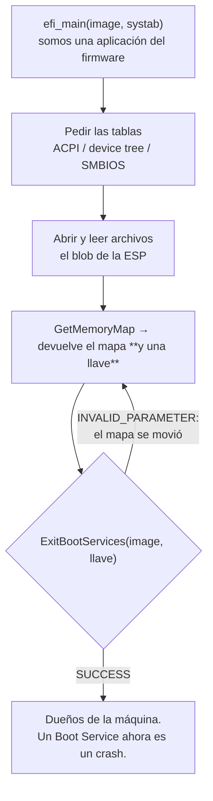

# UEFI

> El [[Firmware|firmware]] moderno, que en vez de saltar a un sector de disco **carga un ejecutable** y le presta la máquina con una biblioteca de servicios adentro.

*Unified Extensible Firmware Interface.* Lo importante no es que reemplazó al BIOS: es que mientras tu código arranca, **no sos dueño de la máquina, sos una aplicación del firmware** — y hay un momento exacto, uno solo, en que eso cambia.

## Qué problema resuelve

El BIOS entregaba la máquina de la forma más cruda posible: leía 512 bytes del primer sector del disco, los ponía en memoria y saltaba. En 512 bytes no entra un cargador, así que todos los sistemas operativos terminaron escribiendo un cargador de dos o tres etapas, cada uno con su propio código para leer discos y sistemas de archivos, cada uno en 16 bits reales, cada uno distinto.

UEFI corta eso por lo sano con dos decisiones:

1. **El firmware ya sabe leer discos.** Trae drivers de bloque, FAT32 y red. No hace falta volver a escribirlos por cuarta vez.
2. **Lo que carga es un archivo ejecutable normal**, con nombre y todo, en 64 bits, con memoria plana. `kernel.efi` es un programa, no un sector.

El costo es el que da nombre a la mitad de esta nota: durante ese rato, **la máquina no es tuya**. Y los servicios que te presta viven en memoria que se va a liberar.

## Cómo funciona

### Las dos mitades de los servicios

| | **Boot Services** | **Runtime Services** |
|---|---|---|
| Qué ofrecen | Asignar memoria, el mapa de memoria física, abrir archivos, protocolos, consola, timers. | Hora, variables no volátiles (`efivars`), reiniciar la máquina. |
| Hasta cuándo | Hasta `ExitBootServices`. Llamarlos después es un crash. | Para siempre, si el kernel les deja su memoria mapeada. |
| Dónde vive su memoria | Tipos `BootServicesCode/Data`: pasan a libres **al salir**. | Tipos `RuntimeServicesCode/Data`: nunca se tocan. |

### La partición y el ejecutable

- **La ESP** (*EFI System Partition*) es una partición común, formateada en **FAT32**, donde viven los ejecutables de arranque. Se monta como cualquier otra: en Debian está en `/boot/efi`, y adentro hay `EFI/debian/grubx64.efi`, `EFI/BOOT/BOOTX64.EFI`. FAT32 se eligió por aburrido: es el sistema de archivos que todo el mundo ya sabía leer.
- **El ejecutable es PE**, el formato de Windows — el mismo de un `.exe`, no un ELF. Es una herencia de que Intel diseñó UEFI mirando a Windows, y tiene una consecuencia que costó cara en este proyecto: el *target* de Rust es `x86_64-unknown-uefi`, y ahí `extern "C"` **no es la convención de Linux sino la de Windows** (RCX, RDX, R8, R9, más 32 bytes de pila reservada). Ver [[27-La-ABI-la-pone-el-target-no-el-silicio]].

### `ExitBootServices`: la puerta que se cierra una vez



El detalle que hace todo rígido es **la llave**. `GetMemoryMap` devuelve, junto con el mapa, un número que identifica esa versión del mapa. `ExitBootServices` exige esa llave, y la rechaza si el mapa cambió entremedio. Y **pedir memoria cambia el mapa**. O sea: entre pedir el mapa y salir no se puede asignar nada, ni abrir un archivo, ni imprimir por la consola del firmware.

Por eso la salida es un bucle: si el firmware contesta `INVALID_PARAMETER` —una interrupción suya que asignó memoria alcanza— hay que volver a pedir el mapa y reintentar.

## Cómo lo hace Linux

Linux arranca por UEFI de dos maneras. La normal es con GRUB, que es él mismo una aplicación UEFI en la ESP; la otra es el *EFI stub*, un pedazo de código pegado adelante del kernel que lo convierte en una aplicación UEFI directa, sin cargador (`drivers/firmware/efi/libstub/`). El que llama a `ExitBootServices` es `efi_exit_boot_services`, y adentro está el mismo baile de la llave.

Después del arranque, Linux **sí** sigue usando los Runtime Services:

```bash
ls /boot/efi/EFI/                     # la ESP montada: los ejecutables de arranque
sudo efibootmgr -v                    # el orden de arranque, en variables del firmware
ls /sys/firmware/efi/efivars/ | head  # las variables, como archivos
sudo cat /sys/firmware/efi/runtime-map/0/type
file /boot/efi/EFI/BOOT/BOOTX64.EFI   # "PE32+ executable ... EFI application"
```

Ese último comando es el más didáctico de la lista: dice `PE32+`, o sea Windows, sobre un archivo de Debian.

## Cómo lo hace Kornelia

| | |
|---|---|
| **Decisiones** | D25 (todo antes de salir, una sola vez), D24 (UEFI es un eje propio de la frontera), D18/D19/D20 (el blob) |
| **Dónde vive** | `boot-uefi/src/lib.rs:385#pub unsafe fn take_machine`, `boot-uefi/src/lib.rs:452#exit_boot_services`, `boot-uefi/src/lib.rs:737#unsafe fn load_blob` |

Todo UEFI vive en un crate solo, `boot-uefi/`, **compartido por las dos arquitecturas**: UEFI de 64 bits tiene exactamente la misma forma en x86_64 y en aarch64, así que se escribe una vez (D24). Ese crate no puede llevar `asm!` ni `target_arch`, y lo verifica `scripts/check-boundary.sh`.

Las estructuras están transcriptas a mano de la especificación —regla 5: sin dependencias externas— y un campo corrido no daría error de compilación sino basura. Hay dos redes: `assert!(offset_of!(...))` verifica las posiciones **en tiempo de compilación**, y cada tabla trae una firma de 64 bits que se comprueba **en tiempo de ejecución** antes de creerle al puntero.

### D25: la ventana, y por qué el blob se carga tan temprano

`take_machine` hace, en este orden y sin nada en el medio: buscar las tablas (`boot-uefi/src/lib.rs:590#unsafe fn find_tables`), **cargar el blob**, pedir el mapa, salir. El blob va **antes** del mapa, y eso es lo que más cuesta entender:

> El blob se ejecuta **al final del arranque**, mucho después. Se carga **al principio**, porque lo único que sabe leer FAT32 es el firmware.

O sea que el orden no lo decide la lógica del kernel sino la lógica de la ventana: abrir un archivo puede mover la memoria, y la llave que `ExitBootServices` exige tiene que ser la del mapa más reciente. Si el blob se cargara después de pedir el mapa, la llave quedaría vieja y la salida fallaría. Sin esto, D18 y D19 serían imposibles: no hay segunda oportunidad para leer un archivo.

Del mismo problema sale una decisión que parece rara: el blob se lee a un **arreglo estático** de 256 KiB y no a memoria pedida al firmware (`boot-uefi/src/lib.rs:347#const MAX_BLOB`). Por dos razones que van juntas — pedir memoria mueve el mapa, y un estático vive adentro de la imagen, que el mapa informa como memoria del kernel, así que `mem.claim` no se lo puede entregar al agente por accidente.

Y si el archivo no entra, no se ejecuta nada. Se pregunta si quedó archivo afuera en vez de suponer: **medio cargador es peor que ninguno**, porque salta a código cortado en la mitad de una instrucción.

**Qué se quitó:**

- **Los Runtime Services no se usan nunca.** El campo existe sólo para que los desplazamientos den bien (`boot-uefi/src/lib.rs:87#runtime_services`). Nada de `efivars`, nada de pedirle la hora al firmware: el reloj sale de un contador del silicio ([[37-El-reloj-contadores-y-no-saber-la-frecuencia]]).
- **No hay cargador intermedio.** `kernel.efi` es la aplicación UEFI; no hay GRUB.
- **No hay sistema de archivos en el kernel** (D20): el único que lee la ESP es el firmware, dentro de la ventana. Después, para el kernel, no hay discos hasta que el agente escriba un driver.
- **`ExitBootServices` no falla de forma fatal.** Si algo sale mal, `take_machine` devuelve una máquina *muda* con el motivo escrito, porque el cordón umbilical sigue vivo y hay que poder contar qué pasó (P5).

## Cómo se ve roto

| Síntoma | Causa |
|---|---|
| `ExitBootServices` devuelve `INVALID_PARAMETER`. | La llave está vieja: algo asignó memoria entre el `GetMemoryMap` y la salida. Hay que volver a pedir el mapa. Se reintenta tres veces. |
| El kernel arranca, imprime y muere al querer leer un archivo. | Se llamó un Boot Service después de salir. La memoria donde vivía ese código ahora es libre. |
| El blob no aparece nunca, y en la ESP está. | Se intentó cargarlo después de `ExitBootServices`. El firmware es lo único que sabe leer FAT32 (D25). |
| Los cuatro argumentos de una llamada llegan nulos. | La ABI del target `*-unknown-uefi` es la de Windows: RCX, RDX, R8, R9. Los argumentos estaban ahí, en otros cuatro registros. Ver [[27-La-ABI-la-pone-el-target-no-el-silicio]]. |
| El firmware no encuentra el ejecutable. | Nombre o ruta: sin entrada en las variables de arranque, se busca `EFI/BOOT/BOOTX64.EFI` (o `BOOTAA64.EFI`). |
| Una estructura de UEFI devuelve basura coherente. | Un campo corrido en la transcripción. Por eso están los `offset_of!` en tiempo de compilación y las firmas en tiempo de ejecución. |
| El blob salta a código cortado. | Entró justo en el buffer y quedó archivo afuera. Se pregunta si hay más antes de ejecutar. |

## Práctica

- [[P14-Mirar-la-ESP-y-poner-un-blob]] — *(construir)* montar la ESP, ver `file` diciendo `PE32+`, y dejar un `blob.bin` al lado del `kernel.efi` de Kornelia.
- [[P01-Preguntarle-a-Linux-que-maquina-es]] — *(mirar)* `efibootmgr -v` y `/sys/firmware/efi/efivars/`.

## Recordar #flashcards/conceptos

¿Qué diferencia hay entre Boot Services y Runtime Services?::Los Boot Services (memoria, archivos, mapa) mueren en `ExitBootServices`; los Runtime Services (hora, variables, reset) siguen vivos si el kernel les deja la memoria mapeada. Kornelia no usa ninguno de los segundos.

¿Qué es la ESP y por qué es FAT32?::La partición donde viven los ejecutables de arranque. FAT32 se eligió por aburrido: es el sistema de archivos que todos los firmwares y todos los sistemas ya sabían leer.

¿Por qué `ExitBootServices` puede fallar y hay que reintentar?::Porque exige la llave del mapa **más reciente**, y cualquier cosa que asigne memoria —incluida una interrupción del propio firmware— cambia el mapa e invalida la llave.

¿Por qué Kornelia carga el blob al principio si lo ejecuta al final?::Porque lo único que sabe leer FAT32 es el firmware, y después de `ExitBootServices` no hay segunda oportunidad. El orden lo impone la ventana (D25), no la lógica del kernel.

¿Por qué el blob se lee a un arreglo estático y no a memoria pedida al firmware?::Porque pedir memoria mueve el mapa e invalida la llave, y porque un estático vive dentro de la imagen —memoria del kernel—, así que `mem.claim` no se lo puede entregar al agente por accidente.

¿Por qué un `kernel.efi` es un PE y no un ELF?::Porque UEFI adoptó el formato ejecutable de Windows. De ahí sale que `extern "C"` en el target `*-unknown-uefi` sea la convención de llamada de Windows y no la de Linux.

## Ver también

- [[Firmware]] · [[ACPI]] · [[Device-tree]] · [[ELF-y-PE]]
- [[12-Que-te-da-UEFI-y-que-te-saca]] · [[51-El-blob-y-la-ventana-de-rescate]]
- [[Falsos-amigos]] — "blob" significa tres cosas distintas y esta nota toca dos.
