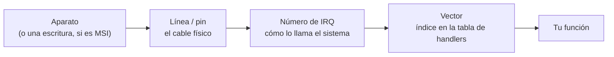

# Falsos amigos

Términos que **suenan igual y no lo son**, o que significan dos cosas distintas según
quién los diga. Casi toda la confusión inicial en sistemas vive acá, y no es culpa tuya:
son cuarenta años de vocabulario acumulado sin nadie que lo ordenara.

Cuando algo no cierra, buscá acá antes que en el [[Glosario]].

---

## 1. Núcleo, kernel y core

En inglés son dos palabras; en español, una. Es la peor de todas y aparece en cada página.

| Se dice | Es | En este libro |
|---|---|---|
| **kernel** | El programa privilegiado que administra la máquina. | Siempre **kernel**. Nunca "núcleo" con este sentido. |
| **core** / núcleo de CPU | Una unidad de ejecución del procesador. Una máquina de 8 cores corre 8 cosas de verdad a la vez. | Siempre **núcleo**. |
| **core dump** | Una copia de la memoria de un programa muerto. | Se dice *volcado*. El nombre viene de la [[01-El-reloj-y-el-transistor|memoria de núcleos de ferrita]] de los años 50, que era literalmente donuts de hierro. No tiene nada que ver con los otros dos. |

`core.claim` en el protocolo de Kornelia reclama **un procesador**, no el kernel.

---

## 2. Interrupción, excepción, trap, fault, abort

Cinco palabras para cosas que se parecen. Se distinguen por **quién las causa** y **si se
puede volver**.

| Palabra | Quién la causa | ¿Se puede seguir? | Ejemplo |
|---|---|---|---|
| **Interrupción** | Algo **de afuera**, asincrónico. No tiene relación con la instrucción que estabas ejecutando. | Sí: se atiende y se vuelve a la misma instrucción. | Llegó un byte por el cable serie. |
| **Excepción** | La instrucción misma, sincrónico. Es el término paraguas de las tres que siguen. | Depende. | — |
| **Trap** | Una instrucción que **pide** ser interrumpida a propósito. | Sí, y se vuelve a la **siguiente**. | `syscall`, `int 0x80`, `svc`, un breakpoint. |
| **Fault** | Una instrucción que **no se pudo completar**, pero el estado quedó como antes de intentarla. | Sí, si arreglás la causa: se reintenta **la misma** instrucción. | Fallo de página: la dirección no está mapeada. El kernel la mapea y reintenta. |
| **Abort** | Algo se rompió y **no se sabe dónde quedó**. | No de forma confiable. | Error del bus, corrupción de memoria, doble fallo. |

> [!important] La diferencia entre fault y abort es de qué se puede recuperar
> Un fault se puede reintentar porque el silicio garantiza que no alcanzó a cambiar nada.
> Un abort no. Por eso [[32-Los-faults-como-datos|P5 dice "los faults son datos"]] y no
> "los aborts son datos": no es una elección de diseño, es lo que el silicio permite.

Y una más, que no entra en la tabla:

- **NMI** (*non-maskable interrupt*) — una interrupción que **no se puede tapar**. Existe
  para el caso en que el código dijo "no me interrumpan" y hay que interrumpirlo igual.
  Es el segundo escalón para [[39-Plazos-y-cortes|cortar un núcleo que se tapó los oídos]].

Detalle histórico que confunde: en x86 el **número** que identifica una excepción y el que
identifica una interrupción de aparato viven en la **misma tabla** (la IDT), del 0 al 255.
Los primeros 32 son excepciones; el resto los reparte el sistema. En ARM están separados
por construcción. Ver [[30-Capturar-un-fault-IDT-y-vectores]].

---

## 3. Anillo: tres cosas distintas

| Se dice | Es |
|---|---|
| **Anillo de privilegio** (*ring 0…3*) | El nivel de permiso del código en x86. Anillo 0 es el kernel, anillo 3 es el usuario. Los anillos 1 y 2 existen y casi nadie los usa. |
| **Buffer circular** (*ring buffer*) | Una estructura de datos: un arreglo donde el final vuelve al principio. El buzón del cable serie de Kornelia es uno, y [[UART|ser más chico que el pedido más grande le costó caro al proyecto]]. |
| **Anillo de colas** | En aparatos modernos (NVMe, tarjetas de red), la cola en memoria por la que el driver y el aparato se hablan. Es un buffer circular, pero se lo nombra distinto. Ver [[48-Colas-en-memoria-el-patron-de-NVMe]]. |

Y el equivalente del primero en otras arquitecturas, que **no se llama anillo**:

| Arquitectura | Cómo se llama | Niveles |
|---|---|---|
| x86_64 | Anillo (*ring*) | 0 (kernel) … 3 (usuario) — **el número baja al subir el privilegio** |
| aarch64 | Nivel de excepción (*EL*) | EL0 (usuario) … EL3 (firmware) — **el número sube al subir el privilegio** |
| RISC-V | Modo | U (usuario), S (supervisor), M (máquina) |

Que en x86 el privilegio alto sea el número **bajo** y en ARM el **alto** es una fuente
inagotable de errores al leer código de las dos. Ver [[06-El-silicio-tiene-modos]].

---

## 4. Direcciones: física, virtual, de bus, IOVA

Cuatro nombres para "un número que apunta a algo", y confundirlos es la causa clásica de
que un [[46-DMA-el-aparato-lee-memoria-solo|DMA]] escriba en el lugar equivocado.

| Nombre | Quién la usa | Qué significa |
|---|---|---|
| **Virtual** | El código, siempre. | El número que pone tu programa. La [[20-Tablas-de-paginas-de-verdad|MMU]] la traduce. |
| **Física** | La MMU, después de traducir. | Dónde está de verdad en los chips de RAM. |
| **De bus** / **DMA** | El **aparato**, no el procesador. | Lo que el aparato tiene que escribir en su registro para apuntar a esa memoria. En PCs suele coincidir con la física; en placas embebidas, a veces no. |
| **IOVA** | El aparato, cuando hay [[47-IOMMU-VT-d-y-SMMUv3|IOMMU]]. | Una dirección virtual **del aparato**. El IOMMU la traduce igual que la MMU traduce la del procesador. |

> [!warning] Un aparato no ve la memoria como la ve el procesador
> Es la idea que más cuesta y la que hace falta para entender el IOMMU. El aparato tiene su
> propia vista, con su propia tabla de traducción, y por omisión en Kornelia **está vacía**:
> sin declarar nada, ningún aparato llega a la memoria (D8).

---

## 5. Segmento

| Se dice | Es |
|---|---|
| **Segmento de x86** | Un registro (`CS`, `DS`, `SS`, `FS`, `GS`) que apunta a una entrada de la GDT. En 64 bits casi no se usa para direccionar, pero **sigue mandando el privilegio**: los bits bajos de `CS` son el anillo. Kornelia lo usa así en [[25-Como-se-baja-de-privilegio]]. |
| **Segmento de un ejecutable** | Un pedazo de un archivo ELF o PE que se carga en memoria con ciertos permisos (código, datos, solo lectura). No tiene ninguna relación con el anterior. |
| **Segmentación** (el concepto viejo) | Un esquema de memoria previo a la paginación, donde la memoria se dividía en segmentos de tamaño variable. Muerto en la práctica. La palabra sobrevive en `SIGSEGV`. |

`SIGSEGV` —"violación de segmento"— casi nunca tiene que ver con segmentos: es un fallo de
página que el kernel decidió no arreglar. El nombre quedó del esquema viejo.

---

## 6. Proceso, hilo, tarea

| Palabra | Significado general | Lo que significa en Linux |
|---|---|---|
| **Proceso** | Un programa corriendo con su propio espacio de memoria. | Un grupo de `task_struct` que comparten espacio de memoria. |
| **Hilo** (*thread*) | Una línea de ejecución dentro de un proceso; comparte memoria con sus hermanos. | Un `task_struct`. |
| **Tarea** (*task*) | Vago; depende del sistema. | **Un hilo.** El `task_struct` de Linux es un hilo, no un proceso — a pesar del nombre. |

Adentro de Linux **la distinción entre proceso e hilo casi no existe**: hay tareas que
comparten más o menos cosas. `fork()` y `pthread_create()` llaman a la misma función
(`clone()`) con banderas distintas. Es una de las ideas más elegantes del diseño de Linux
y no se nota desde afuera.

En Kornelia no hay ninguna de las tres (D13): hay **un** agente, que se multiplica
reclamando núcleos. Ver [[28-Que-es-un-proceso-y-que-queda-sin-procesos]].

---

## 7. Memoria virtual (y lo que la gente quiere decir)

| Se dice | Se quiere decir |
|---|---|
| **Memoria virtual**, en un libro de sistemas | El mecanismo de traducción de direcciones. Existe aunque tengas RAM de sobra. |
| **Memoria virtual**, en el Panel de Control de Windows | El archivo de intercambio (*swap*): usar disco cuando falta RAM. |
| **Memoria volátil** | Que se borra al cortar la luz. No tiene nada que ver con `volatile`. |
| **`volatile`** (en C o Rust) | "No optimices este acceso": el compilador no puede reordenarlo ni suprimirlo, porque la dirección es un [[45-Un-registro-no-es-RAM|registro de un aparato]] y leerla dos veces **no** da lo mismo que leerla una. |

El swap es una **consecuencia** de la memoria virtual, no su definición. Kornelia tiene
memoria virtual ([[22-Identity-map-la-mentira-mas-simple|mapeada uno a uno]]) y no tiene
swap ni la va a tener.

---

## 8. Caché, TLB, buffer

Los tres guardan algo para no ir a buscarlo, y se rompen distinto.

| | Qué guarda | Cuándo miente |
|---|---|---|
| **Caché de datos/instrucciones** | Copias de memoria, por línea (típico: 64 bytes). | Cuando escribís un registro de aparato y la escritura se queda en la caché. Por eso el MMIO se marca **no-cacheable** (D12). |
| **TLB** | Traducciones ya hechas de virtual a física. | Cuando cambiás la tabla de páginas: el procesador **no se entera**. Hay que invalidarlo a mano. Ver [[21-TLB-invalidacion-y-barreras]]. |
| **Buffer de escritura** | Escrituras que todavía no llegaron a destino. | Cuando el orden importa: le escribís a un aparato "arrancá" antes de que llegue el dato. Se arregla con una **barrera**. |

Los tres son invisibles cuando andan y muy difíciles de ver cuando no. Y **x86 los esconde
mejor que ARM**, que es exactamente por qué este proyecto insiste en compilar las dos
(D22/D23): x86 tiene modelo de memoria fuerte y perdona barreras faltantes que ARM castiga.

---

## 9. Driver, módulo, firmware, blob

| Palabra | Es | Corre en |
|---|---|---|
| **Driver** | El código que sabe hablarle a un aparato. | El kernel (o, en Kornelia, el agente). |
| **Módulo** | Un pedazo de kernel que se carga y descarga sin reiniciar. Un mecanismo, no un contenido: la mayoría de los módulos son drivers, pero un driver puede estar compilado adentro del kernel y no ser módulo. | El kernel. |
| **Firmware** | Código que ya venía en la máquina o en el aparato. UEFI es firmware. | Antes del kernel, o adentro del aparato. |
| **Blob** | Un pedazo de código o datos que el sistema trata como opaco: no lo entiende, lo carga y lo ejecuta o se lo pasa a alguien. En Kornelia es [[51-El-blob-y-la-ventana-de-rescate|`blob.bin`]]: lo que el agente dejó para que corra en el próximo arranque. |

Peyorativamente, "blob binario" es un driver sin código fuente. En este proyecto la palabra
**no** tiene ese sentido: el blob es *lo que el agente escribió*.

---

## 10. Cosas que se dicen "asignar"

| Se dice | Es |
|---|---|
| **Asignar** (*allocate*) | Buscar un pedazo libre y entregarlo. Un `malloc` decide **cuál**. |
| **Reclamar** (*claim*) | En Kornelia: pedir un rango **que el agente eligió**. El kernel no decide cuál (P2): no hay asignador, hay un registro de quién reclamó qué. |
| **Mapear** | Hacer que una dirección virtual apunte a una física. No consigue memoria: la hace alcanzable. |
| **Reservar** | Marcar que algo **no** se puede usar. Lo hace el firmware con las regiones que necesita. |

Que Kornelia tenga `mem.claim` y no `mem.alloc` es una decisión, no un sinónimo. Ver
[[23-Asignadores-y-por-que-aca-no-hay]].

---

## 11. Palabra, byte, y el desastre de los tamaños

| Palabra | Cuántos bits | Dónde |
|---|---|---|
| **Byte** | 8 | En todas partes hoy. En máquinas viejas hubo de 6, 7 y 9. |
| **Word** (*palabra*) | **Depende, y no de lo que creés** | En la documentación de Intel, una *word* son **16 bits** para siempre, porque el 8086 era de 16 — así que `dword` son 32 y `qword` son 64. En ARM una *word* son 32. En un libro genérico, "palabra" es "el ancho natural del procesador". |
| **Página** | Típico 4096 bytes | La unidad de la traducción de direcciones. Hay páginas grandes (2 MiB, 1 GiB). |

Cuando leas `mov word ptr [rax], 0` en x86, son dos bytes. Es la razón por la que este
libro dice **"4 bytes"** y no "una palabra".

---

## 12. IRQ, línea, vector, MSI

Cuatro nombres del camino de una interrupción, en orden desde el aparato:

- **Línea** es física: un cable que sube o baja.
- **IRQ** es el número que el sistema le puso a esa línea. En un PC viejo eran 16 y estaban
  repartidos por convención (IRQ 0 = reloj, IRQ 4 = serie).
- **Vector** es el índice en la tabla del procesador. El mapeo IRQ→vector lo decide el
  sistema, y es donde se confunde todo al leer código.
- **MSI** rompe el modelo: no hay cable. El aparato **escribe un dato en una dirección**, y
  eso se convierte en interrupción. Ver [[35-MSI-interrupciones-sin-cable]].

---

## Recordar #flashcards/falsos-amigos

¿Diferencia entre un fault y un abort?::El fault no alcanzó a cambiar nada, así que la misma instrucción se puede reintentar. El abort dejó el estado incierto y no se puede volver de forma confiable. Por eso P5 dice "los faults son datos": es lo que el silicio permite.

¿Por qué `core.claim` no reclama un kernel?::Porque "core" es un núcleo de procesador. En español "núcleo" traduce las dos cosas; en este libro *kernel* es el programa y *núcleo* es el procesador.

En x86 el privilegio más alto es el anillo…::0. Y en aarch64 el más alto de los que usa un kernel es EL1, con EL0 para el usuario: los números van al revés que en x86.

¿Qué es una IOVA?::Una dirección virtual **del aparato**: lo que el aparato pide, que el IOMMU traduce a física. Un aparato no ve la memoria como la ve el procesador.

¿Qué es un `task_struct` en Linux, un proceso o un hilo?::Un hilo. Adentro de Linux la distinción proceso/hilo casi no existe: hay tareas que comparten más o menos cosas, y `fork()` y `pthread_create()` son la misma llamada con banderas distintas.

¿Cuántos bits tiene una *word* en la documentación de Intel?::16, para siempre, porque el 8086 era de 16 bits. De ahí `dword` = 32 y `qword` = 64.

¿Por qué el MMIO se marca no-cacheable?::Porque una escritura a un registro de aparato que se queda en la caché no llega al aparato, y una lectura repetida devolvería la copia vieja en vez del valor nuevo del registro.
